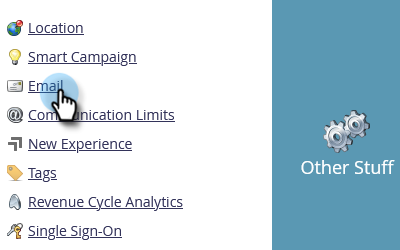

# Einrichtungsschritte {#setup-steps}

**Willkommen bei Adobe Marketo Engage!**

Bevor Sie eintauchen, müssen Sie einige Schritte ausführen.

Zu diesen Schritten gehören:

* Branding von Landingpage-URLs und E-Mail-Links zur Verbesserung von Vertrauen und Zustellbarkeit
* Konfigurieren von Protokollen für Marketo Engage
* CRM synchronisieren
* Hinzufügen von Trackingcode zu Ihrer Unternehmens-Website

>[!NOTE]
>
>Sie müssen diese Schritte nur ausführen, wenn Ihr Unternehmen (neu **Marketo)**. Andernfalls ist die Einrichtung möglicherweise bereits abgeschlossen.

Einige Schritte erfordern Hilfe von Ihrem IT-Team.

## Sicherstellen der E-Mail-Zustellbarkeit {#ensure-email-deliverability}

>[!NOTE]
>
>Sind Sie Launch Pack-Kunde? Sie können diesen Schritt überspringen. Ihr Berater stellt Ihnen während Ihres Auftaktgesprächs eine Anleitung zur Einrichtung des IT-Systems zur Verfügung.

Es gibt verschiedene Maßnahmen, mit denen Sie sicherstellen können, dass die E-Mails so viele Personen wie möglich erreichen.

* **Markenzeichen für Tracking-Links**. Sie können einen CNAME auswählen, um Ihre eigene Domain (anstelle der von Marketo) in den Links zu verwenden, die Sie in E-Mails von Marketo einschließen. Dies stärkt das Domain-Branding und erhöht das Vertrauen und die Zustellbarkeit bei Ihren Empfängern.
* **Fügen Sie Marketo auf die Zulassungsliste setzen zu Ihrer Unternehmens-E-Mail-** hinzu. Es gilt als Best Practice, Test-E-Mails an Testkonten zu senden, bevor E-Mails an tatsächliche Personen gesendet werden. Durch die Zulassungsauflistung von Marketo können Sie verhindern, dass diese Test-E-Mails blockiert oder als Spam gekennzeichnet werden.
* **Einrichten von SPF und DKIM**. Diese Technologien stellen sicher, dass Ihre Marketo-E-Mails keine Spam-Mails sind. Um zu verhindern, dass die Spam-Filter der Empfänger Ihre Marketo-E-Mails ablehnen, führen Sie die folgenden Schritte aus, um [einen SPF und DKIM für Ihre E-Mail-Zustellbarkeit einzurichten](/help/marketo/product-docs/email-marketing/deliverability/set-up-spf-and-dkim-for-your-email-deliverability.md).
* **Richten Sie einen MX-Eintrag für Ihre Domain ein.** Mit einem MX-Eintrag können Sie E-Mails an die Domain empfangen, von der Sie E-Mails senden, um Antworten und automatische Antworten zu verarbeiten. Wenn Sie von Ihrer Unternehmens-Domain aus senden, haben Sie dies wahrscheinlich bereits konfiguriert. Andernfalls können Sie für gewöhnlich so einrichten, dass der MX-Eintrag Ihrer Unternehmens-Domain zugeordnet wird.
* **Empfohlene Einstellungen für die Absenderadresse.** Sie müssen in allen E-Mail-Kampagnen eine gültige, vorhandene und funktionierende E-Mail-Domain in der Absenderadresse verwenden. Es kann von Vorteil sein, eine Subdomain Ihrer Unternehmens-Domain zu konfigurieren, anstatt von Ihrer Unternehmens-Domain aus zu senden. Dadurch wird sichergestellt, dass Probleme aus Ihrem Unternehmens-Mailstream sich nicht auf Ihren Marketo-Mailstream auswirken und umgekehrt. Darüber hinaus führt der Versand von E-Mails von `something@nonexistentdomain.com` dazu, dass E-Mails gefiltert oder blockiert werden. Jede Domain, die in der Absenderadresse verwendet wird, muss über ein gültiges und funktionierendes Postmaster@- und abuse@-Konto verfügen.

Wenn Sie Google-Programme zum Hosten Ihrer Unternehmens-E-Mail verwenden, können Sie unter Ihrer Domain keine abuse@ oder postmaster@-E-Mails erstellen. Um dies zu umgehen, müssen Sie Gruppen mit den Namen „Missbrauch“ und „Postmaster“ erstellen. Benutzer, die Mitglieder dieser Gruppen sind, erhalten E-Mails, die an diese Adressen gesendet werden (z. B. <postmaster@domain.com>). Detaillierte Anweisungen zum Erstellen von Gruppen finden Sie [hier](https://support.google.com/a/answer/33343#adminconsole){target="_blank"}.

Wählen Sie einen CNAME für E-Mail-Tracking-Links aus (wählen Sie einen CNAME aus _der sich_ von dem in Schritt 3 ausgewählten Landingpage-CNAME unterscheidet). Einige Beispiele:

* Go2.[CompanyDomain].com
* em.[CompanyDomain].com
* Wow.[CompanyDomain].com

Der erste Teil ist der E-Mail-Tracking-CNAME, `[EmailTrackingCNAME]`. Sie müssen es der IT-Abteilung geben.

>[!CAUTION]
>
>E-Mail- und Landingpage-CNAME müssen unterschiedlich sein. Vermeiden Sie auch CNAMEs wie „track“ oder „link“. Er wird oft als Spam gekennzeichnet

Um Ihren Marketo-Tracking-Link zu finden, gehen Sie in den Bereich **[!UICONTROL Admin]**.

Klicken Sie auf **[!UICONTROL E-Mail]**.

Kopieren Sie den [!UICONTROL Tracking-Link] aus Ihren E-Mail-Einstellungen.

Der [!UICONTROL Tracking-Link] hat die folgende Form: `mkto-[a-z][4 digits].com`.

Das ist dein `[MktoTrackingLink]`. Speichern Sie es. In Schritt 5 müssen Sie es der IT-Abteilung geben.

„Von“-Domains erfassen. Erstellen Sie eine Liste aller „Von“-Domains (wie in, `[Sender]@[FromDomain].com`), die Sie für den Versand von E-Mails aus Marketo verwenden möchten. Für die meisten gibt es nur einen.

Beispiel: &quot;marketo.com&quot;, &quot;info.marketo.com,“. Dies sind `[FromDomain1]`, `[FromDomain2]` usw. Speichern Sie sie. In Schritt 5 müssen Sie sie der IT-Abteilung geben.

Sie haben jetzt alle Informationen, die Sie benötigen, um Ihre Anfrage an IT zu senden!

## Anpassen der Landingpage-URLs mit einem CNAME {#customize-your-landing-page-urls-with-a-cname}

>[!NOTE]
>
>Sind Sie Launch Pack-Kunde? Sie können diesen Schritt überspringen. Ihr Berater stellt Ihnen während Ihres Auftaktgesprächs eine Anleitung zur Einrichtung des IT-Systems zur Verfügung.

>[!NOTE]
>
>**Administratorberechtigungen erforderlich**

Wählen Sie einen CNAME für Ihre Landingpages aus. Einige Beispiele:

    * **GO**.[CompanyDomain].com
    * **www2**.[CompanyDomain].com
    * **lp**.[CompanyDomain].com

>[!TIP]
>
>Halten Sie es kurz! Kürzere URLs sind leichter zu merken. Wir schlagen „go“ als Domain vor.

Der erste Teil (fett gedruckt) ist der `[LandingPageCNAME]`. Sie benötigen ihn in Schritt 5.

Um die Munchkin-ID abzurufen, die Sie durch Ihren Landingpage-CNAME ersetzen, gehen Sie in den Bereich **Admin** .

Klicken Sie **Mein Konto**.

Kopieren Sie die [!UICONTROL Kontozeichenfolge] aus den Landingpage-Einstellungen.

Das ist der `[Munchkin ID]`. Speichern Sie es. In Schritt 5 müssen Sie es der IT-Abteilung geben.

Konfigurieren Sie Ihre Domain-Einstellungen so, dass Landingpages die Domain Ihres Unternehmens anstelle von Marketo (wo sie gehostet werden) verwenden.

## IT-Abteilung zum Konfigurieren von Protokollen auffordern {#ask-it-to-configure-protocols}

>[!NOTE]
>
>Sind Sie Launch Pack-Kunde? Sie können diesen Schritt überspringen. Ihr Berater stellt Ihnen während Ihres Auftaktgesprächs eine Anleitung zur Einrichtung des IT-Systems zur Verfügung.

Sobald Sie alle erforderlichen Informationen gesammelt haben, können Sie eine Anfrage an IT senden. Sie können den unten stehenden Text als Vorlage verwenden und den fett gedruckten Text durch Ihre eigenen Informationen ersetzen.

[Fügen Sie einen Link zu diesem Artikel hinzu](/help/marketo/getting-started/initial-setup/configure-protocols-for-marketo.md).

Fügen Sie diesen Text in die E-Mail ein und ersetzen Sie die fett gedruckten Platzhalter:

>[!NOTE]
>
>Siehe Schritte 3 und 4 oben, um den Text zu bestimmen, der die Platzhalter ersetzen soll. Denken Sie daran, dass `[LandingPageCNAME]` und `[EmailTrackingCNAME]` unterschiedlich sein müssen.

`----------------------------------------------`

Sehr geehrter IT-Administrator,

Unser Marketing-Team nutzt jetzt die Marketo-Plattform, um mit unseren Mitarbeitern zu kommunizieren. Um eine optimale Zustellbarkeit für E-Mails zu gewährleisten, müssen wir die folgenden Änderungen vornehmen:

`1)` Fügen Sie für unsere Landingpages einen DNS-Eintrag (CNAME) für **[LandingPageCNAME)]**.**[CompanyDomain]**.com, verweist auf **[Munchkin ID]**.mktoweb.com.

`2)` Fügen Sie für unsere Tracking-Links in E-Mails einen DNS-Eintrag (CNAME) für **[EmailTrackingCNAME)]**.**[CompanyDomain]**.com, verweist auf **[MktoTrackingLink]**.

auf die Zulassungsliste setzen `3)` Marketo.

    * Wenn wir IP-Adressen in unserer E-Mail-Zulassungsliste verwenden, fügen Sie die unten aufgeführten IPs hinzu:
    199.15.212.0/22
    
    192.28.144.0/20
    
    192.28.160.0/19
    
    185.28.196.0/22
    
    130.248.172.0/24
    
    130.248.173.0/24
    
    103.237.104.0/22
    
    94.236.119.0/26

>[!NOTE]
>
>Wenden Sie sich an den Marketo-Support , wenn Sie eine gekürzte Liste von IPs zu einer für Ihre Umgebung spezifischen Zulassungsliste benötigen.

    * Wenn unser Anti-Spam-System Von Domains verwendet, fügen Sie diese hinzu:

**`[FromDomain1]`**
**`[FromDomain2]`**

`4)` Wir müssen SPF und DKIM einrichten, damit Marketo autorisiert ist, signierte E-Mails in unserem Namen zu senden.

`a.` Um SPF einzurichten, fügen Sie bitte die folgende Zeile zu unseren DNS-Einträgen hinzu:

IN TXT **[Von Domain]**: v=spf1 mx ip4:**[Unternehmens-IP(s)]**
 include: mktomail.com ~all

Wenn wir bereits einen SPF-Eintrag in unserem DNS-Eintrag haben, fügen Sie einfach Folgendes hinzu:

include:mktomail.com

`[`Ersetzen Sie **Von Domain** durch Ihre E-Mail von Domain (z. B.: company.com) und **CorpIP** durch die IP-Adresse Ihres E-Mail-Servers (z. B.: 255.255.255.255).  Wenn Sie E-Mails von mehreren Domains über Marketo senden möchten, sollten Ihre IT-Mitarbeiter diese Zeile für jede Domain hinzufügen (in einer Zeile).`]`

`b.` Für DKIM erstellen Sie DNS-Ressourceneinträge für jede Domain, die wir einrichten möchten. Nachfolgend finden Sie die Host-Einträge und TXT-Werte für jede Domain, die wir signieren werden:

**`[DKIMDomain1]`**: Der Host-Eintrag lautet **`[HostRecord1]`** und der TXT-Wert **`[TXTValue1]`**.

**`[DKIMDomain2]`**: Der Host-Eintrag lautet **`[HostRecord2]`** und der TXT-Wert **`[TXTValue2]`**.

`[`Kopieren Sie **HostRecord** und **TXTValue** für jede **DKIMDomain**, die Sie eingerichtet haben, nachdem Sie den [Anweisungen hier](/help/marketo/product-docs/email-marketing/deliverability/set-up-a-custom-dkim-signature.md). Vergessen Sie nicht, jede Domain unter **Admin > E-Mail > DKIM** zu überprüfen, nachdem Ihr IT-Personal diesen Schritt abgeschlossen hat.`]`

`5)` Wir müssen sicherstellen, dass es einen gültigen MX-Eintrag für unsere FROM-Domains **`[FromDomain1]`**, **`[FromDomain2]`** usw. gibt. Können Sie das bestätigen? Falls nicht, konfigurieren Sie bitte die Zuordnung zu Ihrem MX-Eintrag für die Unternehmens-Domain. Dadurch wird sichergestellt, dass wir Antworten/Autoresponder auf unsere Marketo-Mailings verarbeiten können.

Lassen Sie es mich wissen, wenn Sie diese Schritte abgeschlossen haben, damit ich den Einrichtungsprozess mit Marketo abschließen kann.

Vielen Dank! Du bist der Beste!

Mit freundlichen Grüßen

**`[Your Name]`**

`----------------------------------------------`

Senden Sie die E-Mail an IT. Uns ist bewusst, dass es einige Zeit dauern kann, bis die IT diese Aufgaben erledigt. Sie können mit dem nächsten Schritt fortfahren, aber denken Sie daran, zu diesem Schritt zurückzukehren, um Ihre Marketo Engage-Einrichtung abzuschließen.

## Marketo-Setup abschließen, nachdem es abgeschlossen ist {#complete-your-marketo-setup-after-it-finishes}

Nachdem die IT-Abteilung ihre Aufgaben abgeschlossen hat, führen Sie die folgenden Schritte aus, um Ihre Landingpage und E-Mail-CNAMEs hinzuzufügen und das Signieren mit DKIM zu aktivieren.

Gehen Sie zum Bereich **[!UICONTROL Admin]**, um Ihren Landingpage-CNAME hinzuzufügen

Wählen Sie Landingpages aus und klicken Sie **[!UICONTROL Bearbeiten]** im Bereich [!UICONTROL Einstellungen].

Geben Sie den neuen Domain-Namen in das Feld **[!UICONTROL Domain-Name für Landingpages“]**. Dieses sollte im folgenden Format vorliegen:

`[LandingPageCNAME].[CompanyDomain].com`

Geben **[!UICONTROL im Feld]** die URL ein, zu der Benutzer wechseln sollen, wenn keine Landingpage verfügbar ist. Wenn Sie über keine Ausweichseite verfügen, können Sie die Startseite Ihres Unternehmens verwenden. Geben Sie **[!UICONTROL Feld]** Startseite“ Ihre Unternehmens-Website ein.

Wählen Sie im Bereich [!UICONTROL Admin] die Option **[!UICONTROL E-Mail]** aus, um Ihren E-Mail-CNAME hinzuzufügen

Scrollen Sie nach unten zu [!UICONTROL Branding-Domains]. Wählen Sie Ihre Domain aus und klicken Sie auf **[!UICONTROL Bearbeiten]**.

Geben Sie im Feld Domain Ihre E-Mail-Tracking-Domain ein. Dieses sollte im folgenden Format vorliegen:

`[EmailTrackingCNAME].[CompanyDomain].com`. Klicken Sie auf **[!UICONTROL Speichern]**.

## CRM integrieren {#integrate-your-crm}

Dies ist wahrscheinlich der aufregendste Teil Ihres Setups. Es ist an der Zeit, Marketo mit all den Leads und Kontakten zu füllen, die Sie in Ihrem CRM gespeichert haben!

Wählen Sie je nach CRM, das Ihr Unternehmen verwendet, eine der folgenden Optionen aus.

* [Integrieren von Marketo Engage mit [!DNL Salesforce.com]](/help/marketo/product-docs/crm-sync/salesforce-sync/understanding-the-salesforce-sync.md)
* [Integrieren von Marketo Engage mit [!DNL Microsoft Dynamics]](/help/marketo/product-docs/crm-sync/microsoft-dynamics-sync/understanding-the-microsoft-dynamics-sync.md)

  >[!NOTE]
  >
  >Sie benötigen die Unterstützung des CRM-Administrators Ihres Unternehmens, um diese Schritte auszuführen.

## Hinzufügen von Trackingcode zu Ihrer Website {#add-tracking-code-to-your-website}

>[!NOTE]
>
>Sind Sie ein [!DNL Launch Pack]? Sie können diesen Schritt überspringen. Ihr Berater stellt Ihnen [!DNL Munchkin] Code-Anweisungen in Ihrem Dokument mit den IT-Einrichtungsanweisungen zur Verfügung.

Marketo Engage verfügt über eine benutzerdefinierte Tracking-JavaScript ([!DNL Munchkin] genannt), mit der Sie Personenaktivitäten auf jeder Web-Seite verfolgen können. [!DNL Munchkin] ist für die Integration Ihrer Website in Marketo erforderlich. Führen Sie die folgenden Schritte aus[&#x200B; um  [!DNL Munchkin] Trackingcode zu Ihrer Website hinzuzufügen](/help/marketo/product-docs/administration/additional-integrations/add-munchkin-tracking-code-to-your-website.md){target="_blank"}.

>[!NOTE]
>
>Um den Trackingcode hinzuzufügen, sind Kenntnisse in HTML erforderlich.

## Leistungserwartungen {#performance-expectations}

Was können Sie von Marketo in puncto Leistung erwarten? Er kann je nach Größe und Komplexität Ihrer Marketing-Kampagnen variieren. Sie können jedoch Leistungsstufen erwarten, die den Werten in der Spalte „Standard“ in mehreren Tabellen in der [Marketo Engage-Produktbeschreibung entsprechen](https://helpx.adobe.com/de/legal/product-descriptions/adobe-marketo-engage---product-description.html){target="_blank"}. Die Spalten „Performance“ und „Performance Plus“ beziehen sich auf Leistungspakete, die [höhere Leistungsstufen“ &#x200B;](https://nation.marketo.com/t5/product-documents/marketo-engage-performance-tiers/ta-p/328835){target="_blank"}.

>[!MORELIKETHIS]
>
>* [Konfigurieren von Protokollen für Marketo Engage](/help/marketo/getting-started/initial-setup/configure-protocols-for-marketo.md)
>
>* [Benutzereinrichtung](/help/marketo/getting-started/initial-setup/user-setup.md)
