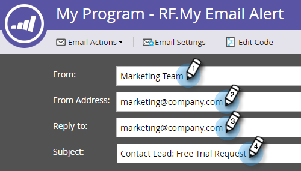
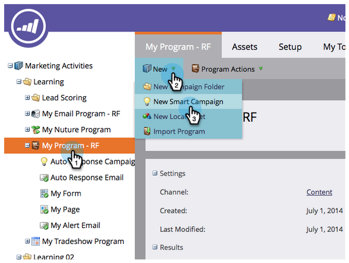
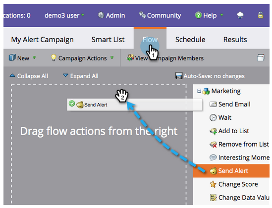

# Warnung des Vertriebsmitarbeiters {#alert-the-sales-rep}

## Auftrag: Warnung des Vertriebsmitarbeiters, wenn eine Person ein Formular auf Ihrer Website ausfüllt{#mission-alert-the-sales-rep-when-a-person-fills-out-a-form-on-your-web-site}

Um Warnungen automatisch an Vertriebsmitarbeiter zu senden, benötigen Sie lediglich eine Warn-E-Mail und eine E-Mail-Kampagne. Hier ist, wie man das macht.

>[!PREREQUISITES]
>
>[Landingpage mit einem Formular](/help/marketo/getting-started/quick-wins/landing-page-with-a-form.md)

## Schritt 1: Warnungs-E-Mail {#step-create-an-alert-email} erstellen

1. Gehen Sie zum Bereich **Marketing-Aktivitäten**.

   

1. Wählen Sie **Mein Programm**, das Sie in der [Landingpage mit einem Formular](/help/marketo/getting-started/quick-wins/landing-page-with-a-form.md) Quick win erstellt haben, und klicken Sie dann unter **Neu** auf **Neues lokales Element**.

   

1. Klicken Sie auf **E-Mail**.

   

1. **Benennen Sie** die E-Mail &quot;Meine E-Mail-Warnung&quot;, wählen Sie eine Vorlage und klicken Sie auf  **Erstellen**.

   

1. Geben Sie die **Aus Name**, **Aus E-Mail**, **Antwort auf** und **Betreff** ein, die Ihr Verkaufsteam sehen soll.

   

1. Klicken Sie mit der Dublette, um den E-Mail-Text zu bearbeiten.

   

1. Geben Sie den E-Mail-Inhalt ein.

   

1. Platzieren Sie den Cursor an der Stelle, an der Sie die Kontaktinformationen der Person einfügen möchten, und klicken Sie auf das Symbol **Token einfügen**.

   

1. Suchen Sie nach dem `{{SP_Send_Alert_Info}}` **Token** und klicken Sie auf **Einfügen**.

   

   >[!NOTE]
   >
   >{{SP_Send_Alert_Info}} ist ein spezielles Token für Warn-E-Mails. Weitere Informationen finden Sie unter [Verwenden Sie das Token für Warnhinweisinformationen senden](/help/marketo/product-docs/email-marketing/general/using-tokens/use-the-send-alert-info-token.md).

1. Klicken Sie auf **Speichern**.

   

1. Schließen Sie die Registerkarte/das Fenster des E-Mail-Editors.

   

1. Klicken Sie unter **E-Mail-Aktionen** auf **Genehmigen**.

   

## Schritt 2: Warnauslöser-Kampagne {#step-create-an-alert-trigger-campaign} erstellen

1. Wählen Sie **Mein Programm**, das zuvor erstellt wurde, und klicken Sie dann unter **Neu** auf **Neue Smart-Kampagne**.

   

1. **Benennen Sie** die Kampagne &quot;Meine Kampagne für Warnung&quot;und klicken Sie auf  **Erstellen**.

   

1. Suchen Sie unter der Registerkarte **Intelligente Liste** den Auslöser **Ausfüllen des Formulars** und ziehen Sie ihn auf die Arbeitsfläche.

   

1. Wählen Sie das zuvor erstellte Formular aus.

   

1. Suchen Sie unter der Registerkarte **Fluss** die Fließaktion **Warnung senden** und ziehen Sie sie auf die Arbeitsfläche.

   

1. Wählen Sie **Meine Benachrichtigungs-E-Mail**, die zuvor erstellt wurde, und lassen Sie **Senden an** als **Sales Owner** stehen.

   

1. Geben Sie Ihre E-Mail-Adresse in das Feld **An andere E-Mails** ein.

   

1. Wechseln Sie zur Registerkarte **Plan** und klicken Sie auf die Schaltfläche **Aktivieren**.

   

   >[!TIP]
   >
   >Stellen Sie die **Qualifizierungsregeln** auf **jedes Mal** ein (durch Bearbeiten der Smart-Kampagne), damit dieselbe Person Warnhinweise mehrmals auslösen kann.

1. Klicken Sie im Bestätigungsbildschirm auf **Aktivieren**.

   

## Schritt 3: Testen Sie es! {#step-test-it-out}

1. Wählen Sie Ihre Landingpage aus und klicken Sie auf **Ansicht Genehmigte Seite**.

   

   >[!NOTE]
   >
   >Vergessen Sie nicht, Landingpages zu genehmigen; sie gehen erst nach Genehmigung live.

1. Füllen Sie das Formular aus und klicken Sie auf **Senden**.

   

1. Sie sollten Ihre E-Mail in Kürze erhalten. Nachdem Sie überprüft haben, ob alles ordnungsgemäß funktioniert, entfernen Sie Ihre E-Mail-Adresse aus dem Fluss Warnung senden (siehe Schritt 2.7 oben).

   >[!NOTE]
   >
   >Klicken Sie auf die Registerkarte **Personeninfo** in Marketing, um die Kontaktinformationen anzuzeigen.

## Auftrag abgeschlossen! {#mission-complete}

  

[Auftrag 7: E-Mail personalisieren](personalize-an-email.md)

[Mission 9: Lead-Daten aktualisieren ►](update-person-data.md)
