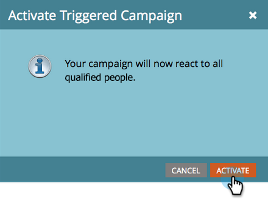

# Vertriebsmitarbeiter benachrichtigen {#alert-the-sales-rep}

## Auftrag: Warnung des Vertriebsmitarbeiters, wenn ein Benutzer ein Formular auf Ihrer Website ausfüllt {#mission-alert-the-sales-rep-when-a-person-fills-out-a-form-on-your-web-site}

Um Warn-E-Mails automatisch an Vertriebsmitarbeiter zu senden, benötigen Sie lediglich eine Warn-E-Mail und eine E-Mail-Kampagne. Hier ist, wie man das macht.

>[!PREREQUISITES]
>
>[Landingpage mit einem Formular](/help/marketo/getting-started/quick-wins/landing-page-with-a-form.md){target="_blank"}

## Schritt 1: Erstellen einer Warnhinweis-E-Mail {#step-create-an-alert-email}

1. Wechseln Sie zum Bereich **[!UICONTROL Marketingaktivitäten]** .

   

1. Wählen Sie **Mein Programm** aus, das Sie auf der [Landingpage mit einem Schnellgewinn für Formular](/help/marketo/getting-started/quick-wins/landing-page-with-a-form.md){target="_blank"} erstellt haben, und klicken Sie dann unter **[!UICONTROL Neu]** auf **[!UICONTROL Neues lokales Asset]**.

   

1. Klicken Sie auf **[!UICONTROL E-Mail]**.

   

1. **Name** der E-Mail &quot;Mein E-Mail-Warnhinweis&quot;, wählen Sie eine Vorlage aus und klicken Sie auf **[!UICONTROL Erstellen]**.

   

1. Geben Sie die Werte **Von Name**, **Von E-Mail**, **[!UICONTROL Antwort auf]** und **[!UICONTROL Betreff]** ein, die Ihr Verkaufsteam sehen soll.

   

1. Doppelklicken Sie auf , um den E-Mail-Text zu bearbeiten.

   

1. Geben Sie den E-Mail-Inhalt ein.

   

1. Platzieren Sie den Cursor an die Stelle, an der Sie die Kontaktinformationen der Person einfügen möchten, und klicken Sie auf das Symbol **Token einfügen** .

   

1. Suchen und wählen Sie den `{{SP_Send_Alert_Info}}` **[!UICONTROL Token]** aus und klicken Sie auf **[!UICONTROL Einfügen]**.

   

   >[!NOTE]
   >
   >{{SP_Send_Alert_Info}} ist ein spezielles Token für Warn-E-Mails. Weitere Informationen finden Sie unter [Verwenden des Tokens &quot;Warnhinweisinformationen senden&quot;](/help/marketo/product-docs/email-marketing/general/using-tokens/use-the-send-alert-info-token.md){target="_blank"}{target="_blank"} .

1. Klicken Sie auf **[!UICONTROL Speichern]**.

   

1. Klicken Sie auf das Dropdown-Menü **[!UICONTROL E-Mail-Aktionen]** und wählen Sie **[!UICONTROL Genehmigen und schließen]** aus.

   

## Schritt 2: Erstellen einer Warnhinweis-Trigger-Kampagne {#step-create-an-alert-trigger-campaign}

1. Wählen Sie **Mein zuvor erstelltes Programm** und klicken Sie dann unter **[!UICONTROL Neu]** auf **[!UICONTROL Neue Smart-Kampagne]** .

   

1. **Nennen** Sie die Kampagne &quot;Meine Warnungskampagne&quot;und klicken Sie auf **[!UICONTROL Erstellen]**.

   

1. Suchen Sie auf der Registerkarte **[!UICONTROL Smart List]** den Trigger **[!UICONTROL Fills Out Form]** und ziehen Sie ihn auf die Arbeitsfläche.

   

1. Wählen Sie das zuvor erstellte Formular aus.

   

1. Suchen Sie auf der Registerkarte **[!UICONTROL Fluss]** die Flussaktion **[!UICONTROL Warnung senden]** und ziehen Sie sie auf die Arbeitsfläche.

   

1. Wählen Sie &quot;**[!UICONTROL Meine Benachrichtigungs-E-Mail]**&quot;, die zuvor erstellt wurde, und belassen Sie &quot;**[!UICONTROL Senden an]**&quot;als &quot;**[!UICONTROL Vertriebsmitarbeiter]**&quot;.

   

1. Geben Sie Ihre E-Mail-Adresse in das Feld **[!UICONTROL An andere E-Mails]** ein.

   

1. Gehen Sie zur Registerkarte **[!UICONTROL Plan]** und klicken Sie auf die Schaltfläche **[!UICONTROL Aktivieren]** .

   

   >[!TIP]
   >
   >Setzen Sie die **[!UICONTROL Qualifikationsregeln]** auf **[!UICONTROL jedes Mal]** (durch Bearbeiten der Smart-Kampagne), damit dieselbe Person Warnhinweise mehrmals Trigger.

1. Klicken Sie auf dem Bestätigungsbildschirm auf **[!UICONTROL Aktivieren]** .

   

## Schritt 3: Testen Sie es! {#step-test-it-out}

1. Wählen Sie Ihre Landingpage aus und klicken Sie auf **[!UICONTROL Genehmigte Seite anzeigen]**.

   

   >[!NOTE]
   >
   >Vergessen Sie nicht, Landingpages zu validieren. Sie werden erst live geschaltet, wenn sie genehmigt wurden.

1. Füllen Sie das Formular aus und klicken Sie auf **[!UICONTROL Senden]**.

   

1. Sie sollten Ihre E-Mail in Kürze erhalten. Nachdem Sie überprüft haben, ob alles wie gewünscht funktioniert, entfernen Sie Ihre E-Mail-Adresse aus dem Fluss Warnhinweis senden (siehe Schritt 2.7 oben).

   >[!NOTE]
   >
   >Klicken Sie in Marketo auf die Registerkarte **[!UICONTROL Persönliche Informationen]** , um die Kontaktinformationen anzuzeigen.

## Auftrag abgeschlossen! {#mission-complete}

  

[Auftrag 7: E-Mail personalisieren](/help/marketo/getting-started/quick-wins/personalize-an-email.md)

[Mission 9: Aktualisieren der Daten des Benutzers ► ►](/help/marketo/getting-started/quick-wins/update-person-data.md)
