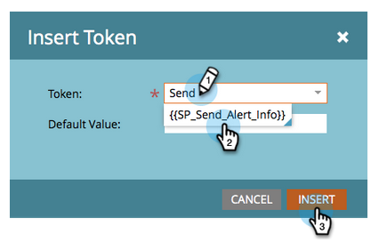

# Vertriebsmitarbeiter benachrichtigen {#alert-the-sales-rep}

## Auftrag: Warnung des Vertriebsmitarbeiters, wenn ein Benutzer ein Formular auf Ihrer Website ausfüllt {#mission-alert-the-sales-rep-when-a-person-fills-out-a-form-on-your-web-site}

Um Warn-E-Mails automatisch an Vertriebsmitarbeiter zu senden, benötigen Sie lediglich eine Warn-E-Mail und eine E-Mail-Kampagne. Hier ist, wie man das macht.

>[!PREREQUISITES]
>
>[Landing Page mit Formular](/help/marketo/getting-started/quick-wins/landing-page-with-a-form.md){target="_blank"}

## Schritt 1: Erstellen einer Warnhinweis-E-Mail {#step-create-an-alert-email}

1. Navigieren Sie zu **[!UICONTROL Marketingaktivitäten]** Bereich.

   

1. Auswählen **Mein Programm** , die Sie in der [Landingpage mit einem Formular](/help/marketo/getting-started/quick-wins/landing-page-with-a-form.md){target="_blank"} Schnellsieg, dann unter **[!UICONTROL Neu]** click **[!UICONTROL Neues lokales Asset]**.

   

1. Klicks **[!UICONTROL Email]**.

   

1. **Name** die E-Mail &quot;Meine E-Mail-Warnung&quot;, wählen Sie eine Vorlage aus und klicken Sie auf **[!UICONTROL Erstellen]**.

   

1. Geben Sie die **Aus Name**, **Aus E-Mail**, **[!UICONTROL Antwort]**, und **[!UICONTROL Betreff]** die Sie von Ihrem Verkaufsteam sehen wollen.

   

1. Doppelklicken Sie, um den E-Mail-Text zu bearbeiten.

   

1. Geben Sie den E-Mail-Inhalt ein.

   

1. Platzieren Sie den Cursor an die Stelle, an der Sie die Kontaktinformationen der Person einfügen möchten, und klicken Sie auf die **Token einfügen** Symbol.

   

1. Suchen und Auswählen `{{SP_Send_Alert_Info}}` **[!UICONTROL Token]** und klicken **[!UICONTROL Einfügen]**.

   

   >[!NOTE]
   >
   >{{SP_Send_Alert_Info}} ist ein spezielles Token für Warnhinweis-E-Mails. Siehe [Verwenden des Tokens &quot;Send Alert Info&quot;](/help/marketo/product-docs/email-marketing/general/using-tokens/use-the-send-alert-info-token.md){target="_blank"}{target="_blank"} , um mehr zu erfahren.

1. Klicks **[!UICONTROL Speichern]**.

   

1. Klicken Sie auf **[!UICONTROL E-Mail-Aktionen]** und wählen Sie **[!UICONTROL Genehmigen und schließen]**.

   

## Schritt 2: Erstellen einer Warnhinweis-Trigger-Kampagne {#step-create-an-alert-trigger-campaign}

1. Auswählen **Mein Programm** zuvor erstellt, dann unter **[!UICONTROL Neu]** click **[!UICONTROL Neue intelligente Kampagne]**.

   

1. **Name** die Kampagne &quot;Meine Warnungskampagne&quot;und klicken Sie auf **[!UICONTROL Erstellen]**.

   

1. Unter dem **[!UICONTROL Smart List]** Registerkarte, suchen und ziehen Sie die **[!UICONTROL Formular ausfüllen]** Trigger zur Arbeitsfläche.

   

1. Wählen Sie das zuvor erstellte Formular aus.

   

1. Unter dem **[!UICONTROL Fluss]** Registerkarte, suchen und ziehen Sie die **[!UICONTROL Warnhinweis senden]** Flussaktion zur Arbeitsfläche.

   

1. Auswählen **[!UICONTROL Meine Benachrichtigungs-E-Mail]** zuvor erstellt und verlassen **[!UICONTROL Senden an]** as **[!UICONTROL Sales Owner]**.

   

1. Geben Sie Ihre E-Mail-Adresse in **[!UICONTROL zu anderen E-Mails]** -Feld.

   

1. Navigieren Sie zu **[!UICONTROL Zeitplan]** und klicken Sie auf **[!UICONTROL Aktivieren]** Schaltfläche.

   

   >[!TIP]
   >
   >Legen Sie die **[!UICONTROL Qualifikationsregeln]** nach **[!UICONTROL jedes Mal]** (durch Bearbeiten der Smart-Kampagne), damit dieselbe Person Warnhinweise mehrmals Trigger.

1. Klicks **[!UICONTROL Aktivieren]** auf dem Bestätigungsbildschirm.

   

## Schritt 3: Testen Sie es! {#step-test-it-out}

1. Wählen Sie Ihre Landingpage aus und klicken Sie auf **[!UICONTROL Genehmigte Seite anzeigen]**.

   

   >[!NOTE]
   >
   >Vergessen Sie nicht, Landingpages zu validieren. Sie werden erst live geschaltet, wenn sie genehmigt wurden.

1. Füllen Sie das Formular aus und klicken Sie auf **[!UICONTROL Einsenden]**.

   

1. Sie sollten Ihre E-Mail in Kürze erhalten. Nachdem Sie überprüft haben, ob alles wie gewünscht funktioniert, entfernen Sie Ihre E-Mail-Adresse aus dem Fluss Warnhinweis senden (siehe Schritt 2.7 oben).

   >[!NOTE]
   >
   >Klicken Sie auf **[!UICONTROL Personeninformationen]** in Marketo, um die Kontaktinformationen anzuzeigen.

## Aufgabe abgeschlossen! {#mission-complete}

  

[◄ Aufgabe 7: E-Mail personalisieren](/help/marketo/getting-started/quick-wins/personalize-an-email.md)

[Mission 9: Aktualisieren der Daten des Benutzers ► ►](/help/marketo/getting-started/quick-wins/update-person-data.md)
