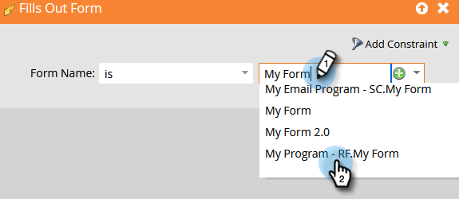

# Benachrichtigen von Vertriebspersonal {#alert-the-sales-rep}

## Mission: Benachrichtigen Sie den Vertriebsmitarbeiter, wenn eine Person ein Formular auf Ihrer Website ausfüllt {#mission-alert-the-sales-rep-when-a-person-fills-out-a-form-on-your-web-site}

Um Warnhinweis-E-Mails automatisch an Vertriebsmitarbeiter zu senden, benötigen Sie lediglich eine Benachrichtigungs-E-Mail und eine E-Mail-Kampagne. So geht das.

>[!PREREQUISITES]
>
>[Landingpage mit einem Formular](/help/marketo/getting-started/quick-wins/landing-page-with-a-form.md){target="_blank"}

## Schritt 1: Erstellen einer Benachrichtigungs-E-Mail {#step-create-an-alert-email}

1. Navigieren Sie zum Bereich **[!UICONTROL Marketing-Aktivitäten]**.

   

1. Wählen Sie **Mein Programm** aus, das Sie in der [Landingpage mit einem Formular](/help/marketo/getting-started/quick-wins/landing-page-with-a-form.md){target="_blank"} Quick Win erstellt haben, und klicken Sie dann unter **[!UICONTROL Neu]** auf **[!UICONTROL Neues lokales Asset]**.

   

1. Klicken Sie auf **[!UICONTROL E-Mail]**.

   

1. **Name** die E-Mail „Mein E-Mail-Warnhinweis“, wählen Sie eine Vorlage aus und klicken Sie auf **[!UICONTROL Erstellen]**.

   

1. Geben Sie **Absendername**, **Absender-E-Mail**, **[!UICONTROL Antwort-]** und **[!UICONTROL Betreff]** ein, die Ihr Vertriebsteam sehen soll.

   

1. Doppelklicken Sie, um den E-Mail-Text zu bearbeiten.

   

1. Geben Sie den E-Mail-Inhalt ein.

   

1. Platzieren Sie den Cursor an der Stelle, an der die Kontaktinformationen der Person eingefügt werden sollen, und klicken Sie auf das Symbol **Token einfügen**.

   

1. Suchen Sie das `{{SP_Send_Alert_Info}}` (**[!UICONTROL ), wählen Sie es aus]** klicken Sie auf **[!UICONTROL Einfügen]**.

   

   >[!NOTE]
   >
   >{{SP_Send_Alert_Info}} ist ein spezielles Token für Benachrichtigungs-E-Mails. Weitere [&#x200B; finden Sie unter „Verwenden des Tokens &#x200B;](/help/marketo/product-docs/email-marketing/general/using-tokens/use-the-send-alert-info-token.md){target="_blank"}{target="_blank"} Warnhinweisinfo senden .

1. Klicken Sie auf **[!UICONTROL Speichern]**.

   

1. Klicken Sie auf das Dropdown-Menü **[!UICONTROL E-Mail-Aktionen]** und wählen Sie **[!UICONTROL Genehmigen und schließen]**.

   

## Schritt 2: Erstellen einer Trigger-Warnmeldungskampagne {#step-create-an-alert-trigger-campaign}

1. Wählen Sie **Mein Programm** zuvor erstellt aus und klicken Sie dann unter **[!UICONTROL Neu]** auf **[!UICONTROL Neue Smart-Kampagne]**.

   

1. **Name** die Kampagne „Meine Benachrichtigungskampagne“ und klicken Sie auf **[!UICONTROL Erstellen]**.

   

1. Suchen Sie auf **[!UICONTROL Registerkarte]** Smart-Liste“ den Trigger **[!UICONTROL Formular ausfüllen]** und ziehen Sie ihn auf die Arbeitsfläche.

   

1. Wählen Sie das zuvor erstellte Formular aus.

   

1. Suchen Sie auf **[!UICONTROL Registerkarte]** Fluss“ die Flussaktion **[!UICONTROL Warnhinweis senden]** und ziehen Sie sie auf die Arbeitsfläche.

   

1. Wählen Sie **[!UICONTROL Meine Warnhinweis-E]** Mail), die Sie zuvor erstellt haben, und **[!UICONTROL Senden an]** als **[!UICONTROL Vertriebsverantwortlichen]**.

   

1. Geben Sie Ihre E-Mail-Adresse in das Feld **[!UICONTROL Zu anderen E-Mails]** ein.

   

1. Wechseln Sie zur Registerkarte **[!UICONTROL Zeitplan]** und klicken Sie auf die Schaltfläche **[!UICONTROL Aktivieren]**.

   

   >[!TIP]
   >
   >Legen Sie die **[!UICONTROL Qualifizierungsregeln]** auf **[!UICONTROL Jedes Mal]** fest (durch Bearbeiten der Smart-Kampagne), damit dieselbe Person mehrmals Trigger-Warnhinweise empfangen kann.

1. Klicken Sie auf dem Bestätigungsbildschirm auf **[!UICONTROL Aktivieren]**.

   

## Schritt 3: Testen Sie es! {#step-test-it-out}

1. Wählen Sie Ihre Landingpage aus und klicken Sie auf **[!UICONTROL Genehmigte Seite anzeigen]**.

   

   >[!NOTE]
   >
   >Vergessen Sie nicht, Landingpages zu genehmigen. Diese werden erst veröffentlicht, nachdem sie genehmigt wurden.

1. Füllen Sie das Formular aus und klicken Sie auf **[!UICONTROL Senden]**.

   

1. Sie sollten Ihre E-Mail in Kürze erhalten. Nachdem Sie sich vergewissert haben, dass alles ordnungsgemäß funktioniert, entfernen Sie Ihre E-Mail-Adresse aus dem Fluss Warnhinweis senden (siehe Schritt 2.7 oben).

   >[!NOTE]
   >
   >Klicken Sie in Marketo auf **[!UICONTROL Personeninformationen]**, um die Kontaktinformationen anzuzeigen.

## Aufgabe abgeschlossen! {#mission-complete}

  

[◄ Mission 7: Personalisieren einer E-Mail](/help/marketo/getting-started/quick-wins/personalize-an-email.md)

[Mission 9: Aktualisieren der ► von Personendaten](/help/marketo/getting-started/quick-wins/update-person-data.md)
