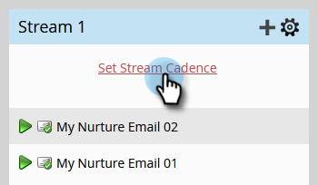

# Schrittweises Lead-Nurturing {#drip-drip-nurture}

## Mission: Erziehung der Menschen, die an Ihrer letzten Messe teilgenommen haben {#mission-nurture-the-people-who-attended-your-recent-tradeshow}

Sie können einfach ein fortschrittliches und hoch entwickeltes Pflegesystem in Marketo erstellen. So!

>[!PREREQUISITES]
>
>* [Einrichten und Hinzufügen einer Person](/help/marketo/getting-started/quick-wins/get-set-up-and-add-a-person.md){target="_blank"}
>* [Eine Personenliste importieren](/help/marketo/getting-started/quick-wins/import-a-list-of-people.md){target="_blank"}

## Schritt 1: Erstellen eines Interaktionsprogramms {#step-create-an-engagement-program}

1. Wechseln Sie zum Bereich **[!UICONTROL Marketingaktivitäten]** .

   

1. Wählen Sie den Ordner **Lernen** aus, klicken Sie auf die Dropdownliste **[!UICONTROL Neu]** und wählen Sie **[!UICONTROL Neues Programm]** aus.

   

1. Geben Sie einen **[!UICONTROL Namen]** ein und wählen Sie **[!UICONTROL Interaktion]** für den **[!UICONTROL Programmtyp]** aus.

   

1. Stellen Sie sicher, dass das Feld **[!UICONTROL Kanal]** den Wert **[!UICONTROL Struktur]** aufweist und klicken Sie auf **[!UICONTROL Erstellen]**.

   

   Sie haben jetzt ein Interaktionsprogramm erstellt.

## Schritt 2: E-Mail erstellen {#step-create-an-email}

1. Wählen Sie Ihr Interaktionsprogramm aus, klicken Sie auf **[!UICONTROL Neu]** und wählen Sie **[!UICONTROL Neues lokales Asset]** aus.

   

1. Klicken Sie auf **[!UICONTROL E-Mail]**.

   

1. Geben Sie einen **[!UICONTROL Namen]** ein, wählen Sie die zu verwendende **[!UICONTROL Vorlage]** aus und klicken Sie auf **[!UICONTROL Erstellen]**.

   

   >[!NOTE]
   >
   >Siehst du den E-Mail-Editor nicht? Das Fenster wurde möglicherweise durch Ihren Browser gesperrt. Aktivieren Sie Popups von `app.marketo.com` in Ihrem Browser und klicken Sie in der oberen Menüleiste auf **[!UICONTROL Entwurf bearbeiten]** .

1. Geben Sie einen Betreff ein.

   

1. Wählen Sie den Bereich der zu bearbeitenden E-Mail aus, klicken Sie auf das Zahnradsymbol und wählen Sie **[!UICONTROL Bearbeiten]** aus.

   

1. Bearbeiten Sie Ihre E-Mail und klicken Sie auf **[!UICONTROL Speichern]**.

   

1. Klicken Sie unter **[!UICONTROL E-Mail-Aktionen]** auf **[!UICONTROL Genehmigen und schließen]**.

   

   >[!NOTE]
   >
   >Denken Sie daran, Ihre E-Mails zu validieren, oder Sie können sie später nicht aktivieren.

1. Erstellen Sie nun eine weitere E-Mail, indem Sie die Aktionen in den Schritten 2-7 wiederholen.

   

## Schritt 3: Hinzufügen von Inhalten zu Ihrem Stream {#step-add-content-to-your-stream}

Jetzt ist es an der Zeit, mithilfe der von Ihnen erstellten E-Mails einen Inhaltsstream für Ihr Interaktionsprogramm zu erstellen.

1. Wählen Sie Ihr Interaktionsprogramm aus und klicken Sie auf die Registerkarte **[!UICONTROL Streams]** .

   

1. Klicken Sie im Stream auf die Schaltfläche **[!UICONTROL Inhalt hinzufügen]** .

   

   >[!TIP]
   >
   >Sie können auch das Symbol **+** verwenden.

1. Behalten Sie den Typ &quot;E-Mail&quot; bei. Wählen Sie die beiden von Ihnen erstellten E-Mails aus.

   

## Schritt 4: Aktivieren des Stream-Inhalts {#step-activate-stream-content}

1. Aktivieren Sie alle Inhalte gleichzeitig, indem Sie auf das Zahnradsymbol für den Stream klicken und dann auf **[!UICONTROL Alle Inhalte aktivieren]** klicken.

   

   >[!NOTE]
   >
   >Sie können Inhalte nicht aktivieren, ohne sie zuvor genehmigt zu haben.

   Tolle Arbeit! Ein weiterer Schritt und das Interaktionsprogramm ist fertig.

## Schritt 5: Festlegen der Stream-Kadenz {#step-set-the-stream-cadence}

1. Klicken Sie auf **[!UICONTROL Stream-Kadenz festlegen]**.

   

1. Bearbeiten Sie die Einstellungen entsprechend dem gewünschten Zeitplan und klicken Sie auf **[!UICONTROL Speichern]**.

   

   Ihr Interaktionsprogramm ist vollständig festgelegt. Fügen wir nun eine Testperson zu Ihrem Programm hinzu.

   >[!NOTE]
   >
   >Die Testperson ist die Person, die Ihr Interaktionsprogramm auf seine Richtigkeit überprüft, bevor es an Kunden gesendet wird.

## Schritt 6: Hinzufügen einer Testperson zum Interaktionsprogramm {#step-add-a-test-person-to-your-engagement-program}

1. Wechseln Sie zum Bereich **[!UICONTROL Datenbank]** .

   

1. Suchen Sie nach Ihrer Testperson.

   

   >[!NOTE]
   >
   >Stellen Sie sicher, dass die Testperson über eine gültige E-Mail-Adresse verfügt, damit Sie den Empfang von E-Mails beim Testen bestätigen können.

1. Klicken Sie mit der rechten Maustaste auf die Person und klicken Sie dann auf **[!UICONTROL Programme]** und **[!UICONTROL Dem Interaktionsprogramm hinzufügen..]**.

   

1. Wählen Sie Ihr **[!UICONTROL Programm]** und Ihren **[!UICONTROL Stream]** aus und klicken Sie dann auf **[!UICONTROL Jetzt ausführen]**.

   

1. Auftrag abgeschlossen!

1. Sie sollten die E-Mail zum angegebenen Zeitpunkt und in der von Ihnen angegebenen Häufigkeit erhalten.

   >[!NOTE]
   >
   >Erfahren Sie mehr über [Interaktionsprogramme](/help/marketo/product-docs/email-marketing/drip-nurturing/creating-an-engagement-program/understanding-engagement-programs.md){target="_blank"}.

## Auftrag abgeschlossen! {#mission-complete}

  

[Mission 5: Import einer Personenliste](/help/marketo/getting-started/quick-wins/import-a-list-of-people.md)

[Auftrag 7: E-Mail personalisieren ►](/help/marketo/getting-started/quick-wins/personalize-an-email.md)
