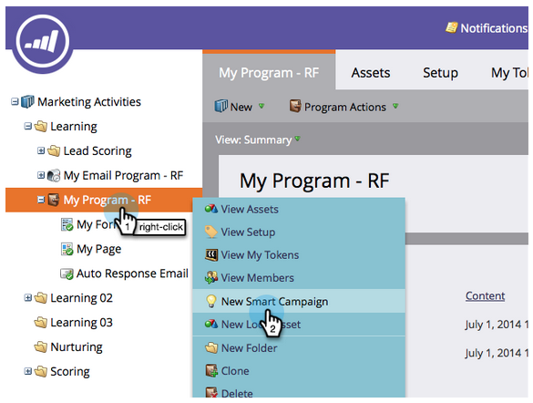
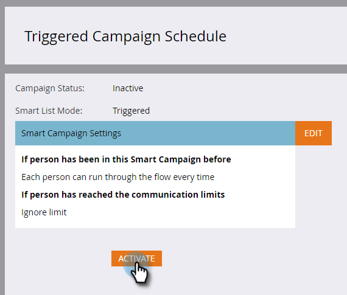

# Automatische E-Mail-Antwort {#email-auto-response}

## Auftrag: Senden Sie eine Dankesemail, wenn eine Person ein Formular ausfüllt {#mission-send-out-a-thank-you-email-when-a-person-fills-out-a-form}

>[!PREREQUISITES]
>
>* [Einrichten und Hinzufügen einer Person](/help/marketo/getting-started/quick-wins/get-set-up-and-add-a-person.md)
>* [Landingpage mit einem Formular](/help/marketo/getting-started/quick-wins/landing-page-with-a-form.md)

## Schritt 1: E-Mail erstellen {#step-create-an-email}

1. Gehen Sie zum Bereich Marketing-Aktivitäten.

   

1. Wählen Sie im linken Menü &quot;Mein Programm&quot;aus, klicken Sie auf die Dropdownliste &quot;Neu&quot;und wählen Sie &quot;Neues lokales Asset&quot;.

   

1. Klicken Sie auf E-Mail.

   

1. Benennen Sie Ihre E-Mail mit &quot;Auto Response Email&quot;, wählen Sie eine Vorlage und klicken Sie auf Erstellen.

   

   Ein E-Mail-Editor wird in einem neuen Fenster oder auf einer neuen Registerkarte geöffnet. Wenn Popups blockiert sind, klicken Sie auf der Asset-Zusammenfassungsseite auf Entwurf **bearbeiten** , um auf die E-Mail zuzugreifen.

1. Geben Sie eine Betreffzeile ein und klicken Sie dann mit der Dublette auf den bearbeitbaren Bereich der E-Mail.

   

   _Über dem E-Mail-Editor wird ein Rich-Text-Editor geöffnet._

1. Markieren Sie den vorhandenen E-Mail-Inhalt.

   

1. Geben Sie Ihren E-Mail-Inhalt ein und klicken Sie auf Speichern.

   

1. Ihre Änderungen werden automatisch gespeichert. Schließen Sie die Registerkarte/das Fenster des E-Mail-Editors.

   

1. Wählen Sie Ihre neue E-Mail aus. Klicken Sie unter &quot;E-Mail-Aktionen&quot;auf Genehmigen.

   

## Schritt 2: Erstellen einer intelligenten Kampagne {#step-create-a-smart-campaign}

1. Klicken Sie mit der rechten Maustaste auf **Mein Programm** und dann auf **Neue Smart-Kampagne**.

   

1. **Benennen** Sie Ihre intelligente Kampagne &quot;Auto Response Kampagne&quot; und klicken Sie auf **Erstellen**.

   

1. Wechseln Sie zur Registerkarte **Intelligente Liste** .

   

   Wir richten diese Kampagne so ein, dass sie immer dann ausgeführt wird, wenn ein Benutzer das in [**Landingpage mit einem Formular**](/help/marketo/getting-started/quick-wins/landing-page-with-a-form.md) erstellte Formular ausfüllt.

1. Ziehen Sie den **Auslöser &quot;Ausfüllbares Formular** &quot;auf die linke Arbeitsfläche.

   

1. Wählen Sie **Mein Formular** in der Dropdownliste aus. Klicken Sie auf die Registerkarte **Fluss** .

   

1. Ziehen Sie die Aktion &quot;E-Mail **-Textfluss** senden&quot;auf die linke Arbeitsfläche.

   

1. Wählen Sie Ihre **E-Mail** für automatische Antworten aus und gehen Sie zur Registerkarte **Plan** .

   

1. Klicken Sie auf **Bearbeiten**.

   

1. Wählen Sie **jedes Mal** aus und klicken Sie auf **Speichern**.

   

1. Klicken Sie auf **Aktivieren**.

   

1. Klicken Sie im Bestätigungsbildschirm auf **Aktivieren** .

   

>[!NOTE]
>
>Sobald diese Kampagne aktiv ist, wird sie jedes Mal ausgeführt, wenn eine Person das angegebene Formular ausfüllt. Die Kampagne läuft, bis sie deaktiviert ist.

## Schritt 3: Ausfüllen des Formulars {#step-fill-out-the-form}

1. Wählen Sie **Meine Seite**. Dies wurde in der [Landingpage mit einem Formular](/help/marketo/getting-started/quick-wins/landing-page-with-a-form.md) schnell gewonnen.

   

1. Klicken Sie auf **Ansicht genehmigt Seite**.

   

   Ihre Landingpage &quot;Kostenlose Testversion&quot;wird in einem neuen Register geöffnet.

1. Füllen Sie das Formular mit Ihrem Vornamen, Nachnamen und Ihrer E-Mail-Adresse aus und klicken Sie dann auf **Senden**.

   

>[!NOTE]
>
>Vergewissern Sie sich, dass Sie Ihre tatsächliche E-Mail-Adresse verwenden, damit Sie die E-Mail erhalten können.

## Abschluss der Mission {#mission-complete}

Innerhalb weniger Minuten sollten Sie die automatische Antwort-E-Mail in Ihrem Posteingang sehen. Gute Arbeit!

  

[Auftrag 3: Einfache Bewertung](/help/marketo/getting-started/quick-wins/simple-scoring.md)

[Mission 5: Eine Liste von Interessenten importieren ►](/help/marketo/getting-started/quick-wins/import-a-list-of-people.md)
