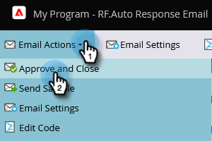

# Automatische Antwort-E-Mail {#email-auto-response}

## Auftrag: Senden einer Dankesnachricht, wenn eine Person ein Formular ausfüllt {#mission-send-out-a-thank-you-email-when-a-person-fills-out-a-form}

>[!PREREQUISITES]
>
>* [Einrichten und Hinzufügen einer Person](/help/marketo/getting-started/quick-wins/get-set-up-and-add-a-person.md){target=&quot;_blank&quot;}
>* [Landingpage mit einem Formular](/help/marketo/getting-started/quick-wins/landing-page-with-a-form.md){target=&quot;_blank&quot;}

## Schritt 1: E-Mail erstellen {#step-create-an-email}

1. Wechseln Sie zum Bereich Marketingaktivitäten .

   

1. Wählen Sie Ihr Programm im linken Menü aus und klicken Sie auf die Schaltfläche **Neu** und wählen Sie **Neues lokales Asset**.

   

1. Auswählen **Email**.

   

1. Benennen Sie Ihre E-Mail mit &quot;Automatische Antwort-E-Mail&quot;, wählen Sie eine Vorlage aus und klicken Sie auf **Erstellen**.

   

   Ein E-Mail-Editor wird in einem neuen Fenster oder Tab geöffnet. Wenn Popups blockiert sind, klicken Sie auf **Entwurf bearbeiten** auf der Asset-Zusammenfassungsseite, um auf die E-Mail zuzugreifen.

1. Geben Sie eine Betreffzeile ein und doppelklicken Sie auf den bearbeitbaren Bereich der E-Mail.

   

   _Im E-Mail-Editor wird ein Rich-Text-Editor geöffnet._

1. Markieren Sie den vorhandenen E-Mail-Inhalt.

   

1. Geben Sie Ihren E-Mail-Inhalt ein und klicken Sie auf **Speichern**.

   

1. Klicken Sie auf **E-Mail-Aktionen** und wählen Sie **Genehmigen und schließen**.

   

## Schritt 2: Intelligente Kampagne erstellen {#step-create-a-smart-campaign}

1. Wählen Sie Ihr Programm aus, klicken Sie auf das **Neu** und wählen Sie **Neue intelligente Kampagne**.

   

1. **Name** Ihre Smart-Kampagne &quot;Automatische Antwortkampagne&quot;und klicken Sie auf **Erstellen**.

   

1. Wechseln Sie zur Registerkarte **Intelligente Liste**.

   

   Wir richten diese Kampagne so ein, dass sie immer dann ausgeführt wird, wenn eine Person das in [**Landingpage mit einem Formular**](/help/marketo/getting-started/quick-wins/landing-page-with-a-form.md){target=&quot;_blank&quot;}.

1. Suchen und Ziehen **Formular ausfüllen** Trigger zur Arbeitsfläche.

   

1. Auswählen **Mein Formular** in der Dropdown-Liste. Klicken Sie anschließend auf **Fluss** Registerkarte.

   

1. Ziehen Sie die **E-Mail senden** Flussaktion auf die linke Arbeitsfläche.

   

1. Wählen Sie Ihre **Automatische Antwort-E-Mail**. Klicken Sie anschließend auf **Zeitplan** Registerkarte.

   

1. Klicken **Bearbeiten**.

   

1. Auswählen **Jedes Mal** und klicken Sie auf **Speichern**.

   

1. Klicken Sie auf **Aktivieren**.

   

1. Klicken **Aktivieren** auf dem Bestätigungsbildschirm.

   

>[!NOTE]
>
>Nach der Aktivierung wird diese Kampagne jedes Mal ausgeführt, wenn eine Person das angegebene Formular ausfüllt. Die Kampagne läuft so lange, bis sie deaktiviert wird.

## Schritt 3: Formular ausfüllen {#step-fill-out-the-form}

1. Auswählen **Meine Seite** (Dies wurde im [Landingpage mit einem Formular](/help/marketo/getting-started/quick-wins/landing-page-with-a-form.md){target=&quot;_blank&quot;} quick win) und klicken Sie auf **Vorschau**.

   

   _Ihre Landingpage &quot;Kostenlose Testversion&quot;wird in einem neuen Tab geöffnet._

1. Füllen Sie das Formular mit Vorname, Nachname und E-Mail-Adresse aus und klicken Sie auf **Einsenden**.

   

>[!NOTE]
>
>Stellen Sie sicher, dass Sie Ihre richtige E-Mail-Adresse verwenden, damit Sie E-Mails empfangen können.

## Aufgabe abgeschlossen {#mission-complete}

Innerhalb weniger Minuten sollte die automatische Antwort-E-Mail in Ihrem Posteingang angezeigt werden. Großartig gemacht!

  

[◄ Aufgabe 3: Einfache Bewertung](/help/marketo/getting-started/quick-wins/simple-scoring.md)

[Auftrag 5: Import a List of People ►](/help/marketo/getting-started/quick-wins/import-a-list-of-people.md)
