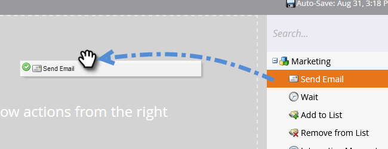

# Automatische Antwort-E-Mail {#email-auto-response}

## Auftrag: Senden Sie eine Dankesnachricht, wenn eine Person ein Formular ausfüllt {#mission-send-out-a-thank-you-email-when-a-person-fills-out-a-form}

>[!PREREQUISITES]
>
>* [Einrichten und Hinzufügen einer Person](/help/marketo/getting-started/quick-wins/get-set-up-and-add-a-person.md){target="_blank"}
>* [Landingpage mit einem Formular](/help/marketo/getting-started/quick-wins/landing-page-with-a-form.md){target="_blank"}

## Schritt 1: E-Mail erstellen {#step-create-an-email}

1. Wechseln Sie zum Bereich **[!UICONTROL Marketingaktivitäten]** .

   

1. Wählen Sie Ihr Programm im linken Menü aus, klicken Sie auf die Dropdownliste **[!UICONTROL Neu]** und wählen Sie **[!UICONTROL Neues lokales Asset]** aus.

   

1. Wählen Sie **[!UICONTROL E-Mail]** aus.

   

1. Benennen Sie Ihre E-Mail mit &quot;Automatische Antwort-E-Mail&quot;, wählen Sie eine Vorlage aus und klicken Sie auf **[!UICONTROL Erstellen]**.

   

   Ein E-Mail-Editor wird in einem neuen Fenster oder Tab geöffnet. Wenn Popups blockiert sind, klicken Sie auf der Asset-Zusammenfassungsseite auf **[!UICONTROL Entwurf bearbeiten]** , um auf die E-Mail zuzugreifen.

1. Geben Sie eine Betreffzeile ein und doppelklicken Sie auf den bearbeitbaren Bereich der E-Mail.

   

   _Ein Rich-Text-Editor wird über dem E-Mail-Editor geöffnet._

1. Markieren Sie den vorhandenen E-Mail-Inhalt.

   

1. Geben Sie Ihren E-Mail-Inhalt ein und klicken Sie auf **[!UICONTROL Speichern]**.

   

1. Klicken Sie auf das Dropdown-Menü **[!UICONTROL E-Mail-Aktionen]** und wählen Sie **[!UICONTROL Genehmigen und schließen]** aus.

   

## Schritt 2: Intelligente Kampagne erstellen {#step-create-a-smart-campaign}

1. Wählen Sie Ihr Programm aus, klicken Sie auf das Dropdownfeld **[!UICONTROL Neu]** und wählen Sie **[!UICONTROL Neue Smart-Kampagne]** aus.

   

1. **Nennen** Sie Ihre Smart-Kampagne &quot;Automatische Antwortkampagne&quot;und klicken Sie auf **[!UICONTROL Erstellen]**.

   

1. Gehen Sie zur Registerkarte **[!UICONTROL Smart List]** .

   

   Wir richten diese Kampagne so ein, dass sie immer dann ausgeführt wird, wenn eine Person das Formular ausfüllt, das Sie in [**Landingpage mit einem Formular**](/help/marketo/getting-started/quick-wins/landing-page-with-a-form.md){target="_blank"} erstellt haben.

1. Suchen und ziehen Sie den Trigger **[!UICONTROL Formular ausfüllen]** auf die Arbeitsfläche.

   

1. Wählen Sie **[!UICONTROL Mein Formular]** in der Dropdown-Liste aus. Klicken Sie dann auf die Registerkarte **[!UICONTROL Fluss]**.

   

1. Ziehen Sie die Fluss-Aktion **[!UICONTROL E-Mail senden]** auf die linke Arbeitsfläche.

   

1. Wählen Sie Ihre **automatische Antwort-E-Mail** aus. Klicken Sie dann auf die Registerkarte **[!UICONTROL Plan]** .

   

1. Klicken Sie auf **[!UICONTROL Bearbeiten]**.

   

1. Wählen Sie **[!UICONTROL jedes Mal]** aus und klicken Sie auf **[!UICONTROL Speichern]**.

   

1. Klicken Sie auf **[!UICONTROL Aktivieren]**.

   

1. Klicken Sie auf dem Bestätigungsbildschirm auf **[!UICONTROL Aktivieren]** .

   

>[!NOTE]
>
>Nach der Aktivierung wird diese Kampagne jedes Mal ausgeführt, wenn eine Person das angegebene Formular ausfüllt. Die Kampagne läuft so lange, bis sie deaktiviert wird.

## Schritt 3: Formular ausfüllen {#step-fill-out-the-form}

1. Wählen Sie &quot;**Meine Seite**&quot;(dies wurde auf der [Einstiegsseite mit Formular](/help/marketo/getting-started/quick-wins/landing-page-with-a-form.md){target="_blank"}-Schnellvorschau erstellt) und klicken Sie auf &quot;**[!UICONTROL Vorschau]**&quot;.

   

   _Ihre Landingpage &quot;Kostenlose Testversion&quot;wird in einer neuen Registerkarte geöffnet._

1. Füllen Sie das Formular mit Ihrem Vornamen, Nachnamen und Ihrer E-Mail-Adresse aus und klicken Sie dann auf **[!UICONTROL Senden]**.

   

>[!NOTE]
>
>Stellen Sie sicher, dass Sie Ihre richtige E-Mail-Adresse verwenden, damit Sie E-Mails empfangen können.

## Aufgabe abgeschlossen {#mission-complete}

Innerhalb weniger Minuten sollte die automatische Antwort-E-Mail in Ihrem Posteingang angezeigt werden. Großartig gemacht!

  

[Auftrag 3: Einfache Bewertung](/help/marketo/getting-started/quick-wins/simple-scoring.md)

[Mission 5: Import a List of People ►](/help/marketo/getting-started/quick-wins/import-a-list-of-people.md)
