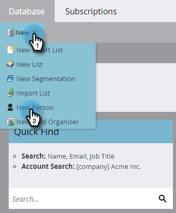

# Einrichten und eine Person hinzufügen {#get-set-up-and-add-a-person}

Es gibt ein paar Sachen zu erledigen, bevor Sie mit Ihren Aufgaben loslegen können.

## Schritt 1: Anmelden bei Marketo Engage {#step-log-in-to-marketo}

1. [Melden Sie sich bei Marketo Engage](https://app.marketo.com){target="_blank"} mit den Anmeldedaten an, die Sie per E-Mail erhalten haben.

   

## Schritt 2: Erstellen eines Lernordners {#step-create-a-learning-folder}

Es soll ein Ordner erstellt werden, in dem alle Vorgänge gespeichert werden, die Sie in den einzelnen Aufgaben ausführen.

1. Navigieren Sie zum Bereich **[!UICONTROL Marketing-Aktivitäten]**.

   

1. Klicken Sie auf das Dropdown-Menü **[!UICONTROL Neu]** und wählen Sie **[!UICONTROL Neuer Kampagnenordner]**.

   

1. Nennen Sie den Ordner „Lernen“ und klicken Sie auf **[!UICONTROL Erstellen]**.

   

1. Der neue Ordner „Lernen“ wird im linken Menü angezeigt.

   

## Schritt 3: Sich selbst als Person hinzufügen {#step-add-yourself-as-a-person}

Fügen Sie sich selbst als Person in Marketo hinzu, sodass Sie zu einem späteren Zeitpunkt Test-E-Mails an sich selbst versenden können.

1. Wechseln Sie dazu zum Bereich **[!UICONTROL Datenbank]**.

   

1. Klicken Sie auf das Dropdown-Menü **[!UICONTROL Neu]** und wählen Sie **[!UICONTROL Neue Person]**.

   

1. Geben Sie Ihren Vor- und Nachnamen, Ihre E-Mail-Adresse und Ihren Firmennamen ein und klicken Sie dann auf **[!UICONTROL Erstellen]**, um sich selbst als Person hinzuzufügen.

   

   >[!CAUTION]
   >
   >* Achten Sie darauf, dass E-Mail-Adressen nur ASCII-Zeichen enthalten dürfen.
   >
   >* Marketo unterstützt **keine** E-Mail-Adressen, die Emojis enthalten.

1. Um Ihre Personen anzuzeigen, öffnen Sie im linken Menü [!UICONTROL Smart Lists für System] und klicken Sie dann auf **[!UICONTROL Alle Personen]**.

   

1. Klicken Sie auf die Registerkarte **[!UICONTROL Personen]**. Ihr Name sollte in der Datenbank angezeigt werden.

   

## Einrichtung abgeschlossen {#set-up-complete}

Sie sind bereit für Ihre erste Aufgabe!

  

[Aufgabe 1: Massen-E-Mail senden ►](/help/marketo/getting-started/quick-wins/send-an-email.md)
