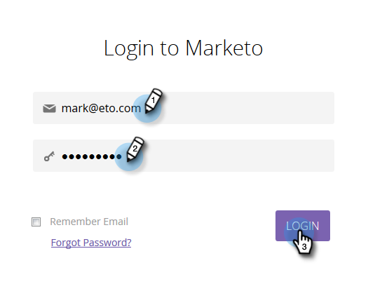
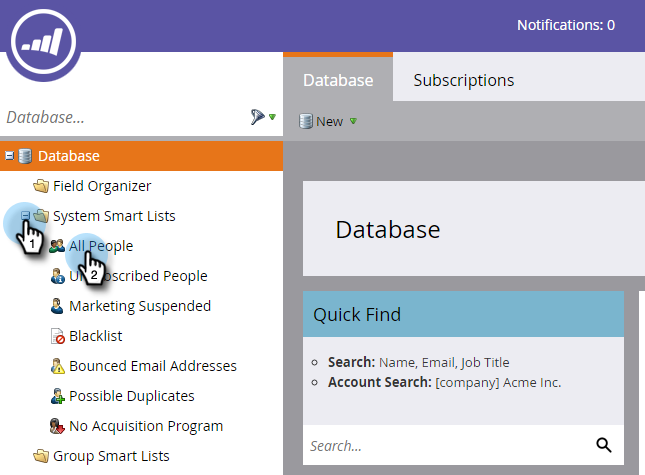

# Einrichten und Hinzufügen einer Person {#get-set-up-and-add-a-person}

Es gibt ein paar Dinge zu tun, bevor Sie mit den Missionen beginnen.

## Schritt 1: Bei Marketing anmelden {#step-log-in-to-marketo}

1. [Melden Sie sich mit den per E-Mail erhaltenen Anmeldeinformationen bei Marketing](https://app.marketo.com) an.

   

## Schritt 2: Lernordner erstellen {#step-create-a-learning-folder}

Erstellen wir einen Ordner, in dem alle Aufgaben gespeichert werden.

1. Gehen Sie zum Bereich **Marketing-Aktivitäten** .

   

1. Klicken Sie auf die Dropdownliste **Neu** und wählen Sie **Neuer Kampagnenordner**.

   

1. Benennen Sie den Ordner &quot;Learning&quot;und klicken Sie auf **Erstellen**.

   

1. Der neue Lernordner wird im linken Menü angezeigt.

   

## Schritt 3: hinzufügen Sie sich selbst als Person {#step-add-yourself-as-a-person}

hinzufügen Sie sich selbst als Person in Marketo, damit Sie sich später selbst Test-E-Mails senden können.

1. Wechseln Sie zum Bereich **Datenbank** .

   

1. Klicken Sie auf die Dropdownliste **Neu** und wählen Sie **Neue Person**.

   

1. Geben Sie Ihren Vor- und Nachnamen, Ihre E-Mail-Adresse und Ihren Firmen ein und klicken Sie dann auf **Erstellen** , um sich selbst als Person hinzuzufügen.

   

1. Öffnen Sie zur Ansicht Ihrer Personen im linken Menü Ihre System Smart-Listen und klicken Sie dann auf Alle Personen.

   

1. Klicken Sie auf die Registerkarte **Personen** . Du solltest dich in der Datenbank sehen.

   

## Einrichten abgeschlossen {#set-up-complete}

Du bist bereit, deine erste Mission zu starten!

  

[Auftrag 1: Senden Sie eine E-Mail-Blase ►](/help/marketo/getting-started/quick-wins/send-an-email.md)
