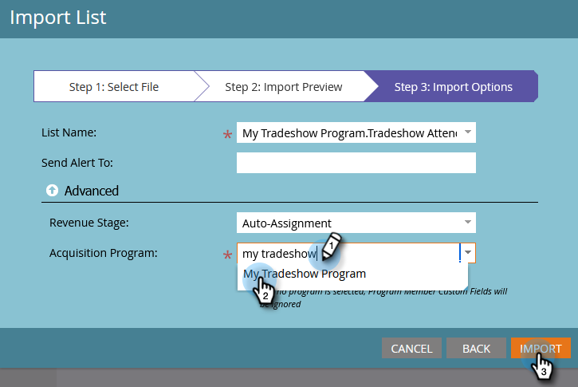

# Importieren einer Liste mit Personen {#import-a-list-of-people}

## Aufgabe: Importieren einer Tabellenkalkulationsliste mit Teilnehmerinnen und Teilnehmern an einer Messe in Ihre Datenbank {#mission-import-a-spreadsheet-list-of-trade-show-attendees-into-your-database}

>[!PREREQUISITES]
>
>[Einrichten und eine Person hinzufügen](/help/marketo/getting-started/quick-wins/get-set-up-and-add-a-person.md){target="_blank"}

In diesem Tutorial erfahren Sie, wie Sie Personen aus einer Tabellenkalkulationsdatei in Marketo importieren.

## Schritt 1: Herunterladen und Bearbeiten einer Tabellenkalkulation {#step-download-and-edit-a-spreadsheet}

1. Laden Sie zunächst unsere Übungsdatei ([**tradeshow-attendes.csv**](/help/marketo/getting-started/assets/tradeshow-attendees.csv){target="_blank"}) auf Ihren Computer herunter.

   

   >[!NOTE]
   >
   >Verwenden Sie beim Importieren eines Datums dieses Format: **9/21/20** (Monat/Tag/Jahr).

   >[!NOTE]
   >
   >Alle importierten Datums-/Uhrzeitfelder werden als Central Time behandelt. Wenn Sie Datums-/Zeitfelder in einer anderen Zeitzone haben, können Sie eine Excel-Formel verwenden, um sie in Central Time (America/Chicago) umzuwandeln.

1. Fügen Sie Ihren eigenen Vornamen, Nachnamen, eine echte E-Mail-Adresse (damit Sie die Nurturing-E-Mails erhalten können, die Sie in der nächsten Aufgabe senden werden) und den Stellentitel hinzu. Speichern Sie die Datei auf Ihrem Computer.

   

   >[!CAUTION]
   >
   >* Achten Sie darauf, dass E-Mail-Adressen nur ASCII-Zeichen enthalten dürfen.
   >
   >* Marketo unterstützt **keine** E-Mail-Adressen, die Emojis enthalten.
   >
   >* Der Import von `NULL`-Werten über CSV könnte zu einer „Änderung des Datenwerts“ bei numerischen Felder im [Aktivitätsprotokoll](/help/marketo/product-docs/core-marketo-concepts/smart-lists-and-static-lists/managing-people-in-smart-lists/locate-the-activity-log-for-a-person.md){target="_blank"} einer Person führen, _selbst wenn die Felder bereits leer sind_. Wenn Sie über [intelligente Kampagnen](/help/marketo/product-docs/core-marketo-concepts/smart-campaigns/understanding-smart-campaigns.md){target="_blank"} verfügen, die den Filter „Datenwert geändert“ oder den Trigger „Datenwertänderungen“ verwenden, kann dies dazu führen, dass sich Personen für diese Kampagnen qualifizieren, obwohl sich die Daten tatsächlich nicht ändern. Sie können [Beschränkungen](/help/marketo/product-docs/core-marketo-concepts/smart-lists-and-static-lists/using-smart-lists/add-a-constraint-to-a-smart-list-filter.md){target="_blank"} verwenden, um sicherzustellen, dass sich beim Import niemand für diese Kampagnen qualifiziert.

## Schritt 2: Erstellen eines Programms {#step-create-a-program}

1. Navigieren Sie zum Bereich **[!UICONTROL Marketing-Aktivitäten]**.

   

1. Wählen Sie den Ordner **Lernen** aus und klicken Sie dann unter **[!UICONTROL Neu]** auf **[!UICONTROL Neues Programm]**.

   

1. **Nennen** Sie das Programm „Mein Messeprogramm“ und wählen Sie als **[!UICONTROL Programmtyp]** die Option „Ereignis“.

   

1. Wählen Sie **[!UICONTROL Fachmesse]** für den **[!UICONTROL Kanal]** und klicken Sie auf **[!UICONTROL Erstellen]**.

   

>[!NOTE]
>
>Ereignisprogramme finden an bestimmten Daten statt. Erfahren Sie mehr über [**Ereignisse**](/help/marketo/product-docs/demand-generation/events/understanding-events/understanding-event-programs.md){target="_blank"}.

## Schritt 3: Importieren Ihrer Tabelle in Marketo {#step-import-your-spreadsheet-into-marketo}

1. Klicken Sie in **Mein Messeprogramm** auf **[!UICONTROL Neu]** und wählen Sie **[!UICONTROL Neues lokales Asset]**.

   

1. Wählen Sie **[!UICONTROL Liste]**.

   

1. **Nennen** Sie die Liste „Messeteilnehmer“ und klicken Sie auf **[!UICONTROL Erstellen]**.

   

1. Klicken Sie in Ihrer Liste **[!UICONTROL Messeteilnehmer]** auf **[!UICONTROL Listenaktionen]** und wählen Sie **[!UICONTROL Liste importieren]**.

   

   >[!CAUTION]
   >
   >Wenn Sie Ihre eigene CSV-Datei verwenden, stellen Sie sicher, dass diese mit UTF-8, UTF-16, Shift-JIS oder EUC-JP codiert ist.

   >[!NOTE]
   >
   >Die Größenbeschränkung für CSV-Dateien beträgt 100 MB.

1. **[!UICONTROL Navigieren]** Sie auf Ihrem Computer zur Tabellenkalkulationsdatei **tradeshow-attendes.csv** und klicken Sie auf **[!UICONTROL Weiter]**.

   

   >[!NOTE]
   >
   >Im Listenimportmodus bedeutet die Auswahl von **[!UICONTROL Neue Personen und Aktualisierungen überspringen]**, dass es keine Auswirkungen auf bestehende Personendatensätze gibt und keine Aktivitäten protokolliert werden. Verwenden Sie diesen Modus, wenn Sie zur Verwendung in Ihren Marketing-Aktivitäten eine schnelle, vorab gefilterte statische Liste der vorhandenen Personen wünschen. Durch Auswahl dieses Modus geschieht Folgendes:
   >
   > * Erstellung neuer Personen überspringen
   > * Personen-Feldaktualisierungen überspringen
   > * Aktivitätsprotokollierung überspringen

1. Ordnen Sie Ihre Felder [!UICONTROL Listenspalte] den entsprechenden Marketo-Feldern zu und klicken Sie auf **[!UICONTROL Weiter]**.

   

   >[!TIP]
   >
   >Spaltenüberschriften sollten immer genau mit dem Feld übereinstimmen (Groß-/Kleinschreibung beachten), um bei der automatischen Zuordnung optimale Ergebnisse zu erzielen. Wenn Sie benutzerdefinierte Felder verwenden und diese nicht in der Dropdown-Liste angezeigt werden, gehen Sie zurück und [erstellen Sie sie](/help/marketo/product-docs/administration/field-management/create-a-custom-field-in-marketo.md){target="_blank"}, damit sie als Optionen verfügbar sind.

   >[!NOTE]
   >
   >Wenn Sie bestimmte Felder nicht importieren möchten, wählen Sie im Dropdown-Menü „Marketo-Feld“ die Option **Ignorieren** aus.

1. Wählen Sie **Mein Messeprogramm** als **[!UICONTROL Akquiseprogramm]** und klicken Sie dann auf **[!UICONTROL Importieren]**.

   

1. Warten Sie, bis Ihre Personen importiert sind, und schließen Sie dann das Popup mit dem Importfortschritt.

   

1. Wieder zurück in **Mein Messeprogramm** klicken Sie auf die Registerkarte **[!UICONTROL Mitglieder]**. Alle gerade importierten Personen werden angezeigt.

   

>[!NOTE]
>
>Sie können den Erfolg Ihres Programms analysieren, indem Sie die Programmmitgliedschaft verfolgen. Erfahren Sie mehr über [**Programme**](/help/marketo/product-docs/core-marketo-concepts/programs/creating-programs/understanding-programs.md){target="_blank"}. 

## Aufgabe abgeschlossen {#mission-complete}

Ihre Messeteilnehmer sind nun Mitglieder Ihres Marketo-Programms!

  

[◄ Aufgabe 4: Automatische E-Mail-Antwort](/help/marketo/getting-started/quick-wins/email-auto-response.md)

[Aufgabe 6: Schrittweises Nurturing ►](/help/marketo/getting-started/quick-wins/drip-drip-nurture.md)
