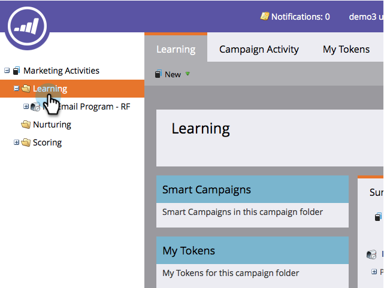
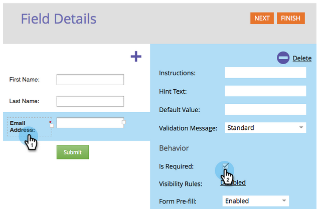
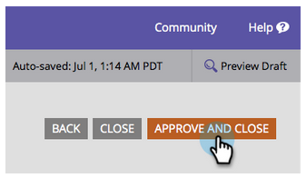
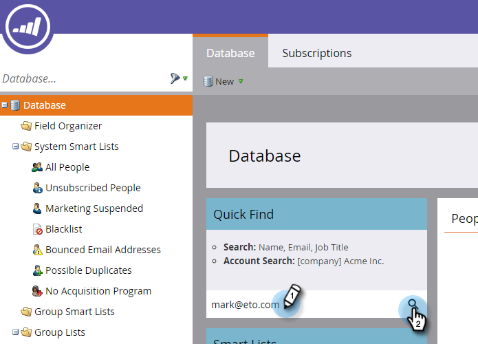

# Landingpage mit einem Formular {#landing-page-with-a-form}

## Auftrag: Erstellen Sie eine Landingpage mit einem Formular, um neue Personen zu akquirieren. {#mission-create-a-landing-page-with-a-form-to-acquire-new-people}

>[!NOTE]
>
>**FYI**
>
>Marketo standardisiert nun die Sprache für alle Abonnements, sodass Sie möglicherweise Interessenten in Ihrem Abonnement und Personen/Personen in docs.marketo.com sehen können. Diese Begriffe bedeuten dasselbe. Es hat keine Auswirkungen auf die Artikelanweisungen. Es gibt auch noch einige andere Änderungen. [Weitere Informationen](http://docs.marketo.com/display/DOCS/Updates+to+Marketo+Terminology).

>[!PREREQUISITES]
>
>* [Einrichten und Hinzufügen einer Person](get-set-up-and-add-a-person.md)

## SCHRITT 1: Programm erstellen {#step-create-a-program}

1. Gehen Sie zum Bereich **Marketing-Aktivitäten** .

   

1. Wählen Sie den im [vorherigen Quick win](send-an-email.md)erstellten Ordner****.

   

1. Klicken Sie unter **Neu** auf **Neues Programm**.

   

1. Geben Sie einen **Programm** ein, wählen Sie einen** Kanal** und klicken Sie auf** Erstellen**.

   >[!NOTE]
   >
   >**Erinnerung**
   >
   >
   >Fügen Sie Ihre Initialen am Ende des Programm-Namens ein, um sie eindeutig zu machen.

   

   >[!NOTE]
   >
   >**Definition**
   >
   >
   >Ein Programm ist eine spezifische Marketinginitiative. Der **Kanal** soll der Versand sein, z. B. Webinar, Sponsoring oder Online-Werbung. Je nachdem, was in Ihrer eigenen Instanz verfügbar ist, sehen Sie in Ihrer Dropdown-Liste möglicherweise unterschiedliche Kanal. Sie können auch Ihren eigenen Kanal [erstellen.](../../product-docs/administration/tags/create-a-program-channel.md)

   

Gut gemacht! Nachdem wir nun ein Programm erstellt haben, lassen Sie uns fortfahren und Inhalte erstellen.

## SCHRITT 2: Formular erstellen {#step-create-a-form}

1. Klicken Sie bei ausgewähltem Programm auf **Neu** und dann auf** Neues lokales Asset**.

   

1. Wählen Sie **Formular**.

   

1. Geben Sie einen **Namen** ein und klicken Sie auf **Erstellen**.

   

   >[!NOTE]
   >
   >Vergewissern Sie sich, dass das Kontrollkästchen Im Editor **öffnen** aktiviert ist. Ist dies nicht der Fall, müssen Sie auf die **Registerkarte &quot;Formular** bearbeiten&quot;klicken **.**

   >[!TIP]
   >
   >Sehen Sie nicht den Formulareditor? Ihr Browser hat das Fenster wahrscheinlich blockiert. Aktivieren Sie Popups von [app.marketo.com](http://app.marketo.com/) in Ihrem Browser und klicken Sie in der oberen Menüleiste auf Entwurf bearbeiten.

1. Wählen Sie das Feld** E-Mail-Adresse** und aktivieren Sie die Option Ist **erforderlich**.

   

1. Klicken Sie auf **Weiter**.

   

1. Klicken Sie auf die Pfeile, um durch die Themen zu blättern. Wählen Sie eine aus.

   

1. Klicken Sie auf** Weiter*.

   

1. Wählen Sie im Abschnitt Danksagungsseite die Option **Externe URL** für **Folgemaßnahmen**.

   

1. Geben Sie die URL ein.

   

   >[!NOTE]
   >
   >**Definition**
   >
   >Auf der Nachverfolgungsseite wird der Besucher nach dem Ausfüllen des Formulars umgeleitet. Die externe URL ist eine Option, aber es gibt noch mehr. Siehe Danksagungsseite [für ein Formular](../../product-docs/demand-generation/forms/creating-a-form/set-a-form-thank-you-page.md)festlegen.

1. Klicken Sie auf **Fertig stellen**.

   

1. Klicken Sie auf **Genehmigen und Schließen**.

   

   Super! Jetzt haben Sie ein Programm mit einem Formular darin. Lassen Sie uns fortfahren und eine Seite erstellen.

   

## SCHRITT 3: Landingpage erstellen und Formular Hinzufügen {#step-create-a-landing-page-and-add-your-form}

1. Wählen Sie das Programm aus und klicken Sie auf **Neu** und dann auf **Neues lokales Asset**.

   

1. Wählen Sie **Landingpage**.

   

1. Geben Sie eine Seite ein** Name**, wählen Sie eine Vorlage und klicken Sie auf **Erstellen**.

   >[!NOTE]
   >
   >Sie haben vielleicht eine andere Vorlage als die in unserem Screenshot, es ist in Ordnung, wählen Sie einfach eine und gehen Sie weiter.

   

1. Ziehen Sie nach dem Öffnen des Landingpages-Editors das Formularelement in die Arbeitsfläche.

   

1. Wählen Sie das Formular aus und klicken Sie auf **Einfügen**.

   

1. Ziehen Sie das Formular an die gewünschte Position.

   

1. Alle Änderungen werden automatisch gespeichert. Schließen Sie die Registerkarte/das Fenster des Formulareditors.

   

   Gute Arbeit! Sie haben jetzt eine Landingpage mit einem Formular darauf. Lassen Sie uns Ihre Seite genehmigen, um sie zu aktivieren.

## SCHRITT 4: Genehmigen Ihrer Landingpage {#step-approve-your-landing-page}

1. Wählen Sie Ihre Landingpage aus und klicken Sie unter &quot; **Landingpages-Aktionen** &quot;auf **Genehmigen**.

   >[!NOTE]
   >
   >**Definition**
   >
   >
   >Durch die Genehmigung der Landingpage wird sie live geschaltet und im Internet zugänglich gemacht.

   

   Perfekt! Sehen Sie das grüne Häkchen darauf?

   

## SCHRITT 5: Formular testen {#step-test-your-form}

1. Wählen Sie Ihre Landingpage aus und klicken Sie auf** Ansicht genehmigt Seite**.

   

1. Füllen Sie das Formular mit den Informationen aus, von denen Sie wissen, dass es eindeutig ist, und klicken Sie auf **Senden**.

   

1. Wechseln Sie zum Bereich **Datenbank** .

   

1. Suchen Sie nach der eindeutigen E-Mail-Adresse, die Sie beim Ausfüllen des Formulars verwendet haben.

   

   Da ist es! Sie haben eine neue Landingpage mit einem Formular erstellt und damit eine neue Person generiert.

   

## Auftrag abgeschlossen! {#mission-complete}

  

[Senden einer E-Mail-Blast](send-an-email.md) mit [einfacher Punktzahl ►](simple-scoring.md)