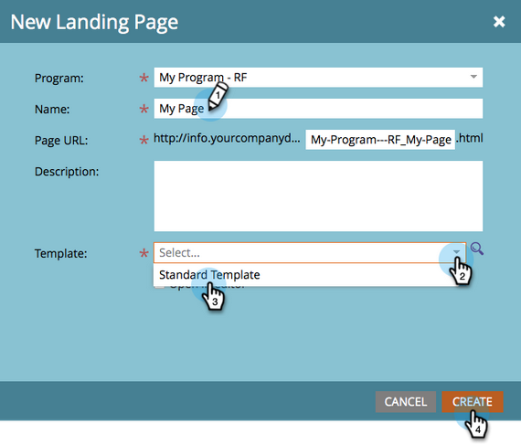
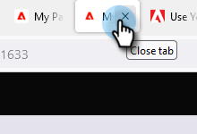

# Landing Page mit Formular {#landing-page-with-a-form}

## Auftrag: Erstellen Sie eine Landingpage mit einem Formular, um neue Personen zu gewinnen. {#mission-create-a-landing-page-with-a-form-to-acquire-new-people}

>[!PREREQUISITES]
>
>[Einrichten und Hinzufügen einer Person](/help/marketo/getting-started/quick-wins/get-set-up-and-add-a-person.md)

## SCHRITT 1: Erstellen eines Programms {#step-create-a-program}

1. Wechseln Sie zum Bereich **[!UICONTROL Marketingaktivitäten]** .

   

1. Wählen Sie den Ordner &quot;**Lernen**&quot;, der im Ordner &quot;[previous quick win](/help/marketo/getting-started/quick-wins/send-an-email.md){target="_blank"}&quot;erstellt wurde. Klicken Sie unter **[!UICONTROL Neu]** auf **[!UICONTROL Neues Programm]**.

   

1. Geben Sie ein Programm **[!UICONTROL Name]** ein, wählen Sie einen **[!UICONTROL Kanal]** aus und klicken Sie auf **[!UICONTROL Erstellen]**.

   

   >[!TIP]
   >
   >Fügen Sie Ihre Initialen am Ende des Programmnamens ein, um sie eindeutig zu machen.

   >[!NOTE]
   >
   >Ein Programm ist eine spezifische Marketinginitiative. Der **Kanal** ist als Bereitstellungsmechanismus gedacht, z. B. Webinar, Sponsoring oder Online-Anzeige. Je nachdem, was in Ihrer eigenen Instanz verfügbar ist, können in der Dropdown-Liste verschiedene Kanaloptionen angezeigt werden. Sie können auch [Ihren eigenen Kanal erstellen](/help/marketo/product-docs/administration/tags/create-a-program-channel.md){target="_blank"}.

Schön gemacht! Nachdem wir nun ein Programm erstellt haben, gehen wir weiter und erstellen etwas Inhalt.

## Schritt 2: Erstellen eines Formulars {#step-create-a-form}

1. Klicken Sie bei ausgewähltem Programm auf die Dropdownliste **[!UICONTROL Neu]** und wählen Sie **[!UICONTROL Neues lokales Asset]** aus.

   

1. Wählen Sie **[!UICONTROL Formular]** aus.

   

1. Geben Sie ein Formular **[!UICONTROL Name]** ein und klicken Sie auf **[!UICONTROL Erstellen]**.

   

   >[!NOTE]
   >
   >Stellen Sie sicher, dass das Kontrollkästchen **[!UICONTROL Im Editor öffnen]** aktiviert ist. Ist dies nicht der Fall, müssen Sie auf die Registerkarte **[!UICONTROL Formular bearbeiten]** klicken.

   >[!TIP]
   >
   >Siehst du den Formular-Editor nicht? Das Fenster wurde möglicherweise durch Ihren Browser gesperrt. Aktivieren Sie Popups von `app.marketo.com` in Ihrem Browser und klicken Sie in der oberen Menüleiste auf Entwurf bearbeiten .

1. Wählen Sie das Feld **[!UICONTROL E-Mail-Adresse]** aus und aktivieren Sie die Option **[!UICONTROL Ist erforderlich]**.

   

1. Klicken Sie auf **[!UICONTROL Weiter]**.

   

1. Klicken Sie auf die Pfeile, um durch die Designs zu blättern. Wählen Sie eins aus.

   

1. Klicken Sie auf **[!UICONTROL Weiter]**.

   

1. Wählen Sie unter dem Abschnitt Dankeseite die Option **[!UICONTROL Externe URL]** für **[!UICONTROL Follow-up mit]** aus.

   

1. Geben Sie die URL ein.

   

   >[!NOTE]
   >
   >Auf der Nachverfolgungsseite wird der Besucher nach dem Ausfüllen des Formulars umgeleitet. Die externe URL ist eine Option, es gibt jedoch mehr. Siehe [Einrichten einer Dankeseite für Formulare](/help/marketo/product-docs/demand-generation/forms/creating-a-form/set-a-form-thank-you-page.md){target="_blank"}.

1. Klicken Sie auf **[!UICONTROL Beenden]**.

   

1. Klicken Sie auf **[!UICONTROL Genehmigen und schließen]**.

   

   Sehr gut! Jetzt haben Sie ein Programm mit einem Formular darin. Erstellen wir eine Seite.

## Schritt 3: Erstellen einer Landingpage und Hinzufügen Ihres Formulars {#step-create-a-landing-page-and-add-your-form}

1. Klicken Sie bei ausgewähltem Programm auf die Dropdownliste **[!UICONTROL Neu]** und wählen Sie **[!UICONTROL Neues lokales Asset]** aus.

   

1. Wählen Sie **[!UICONTROL Landingpage]** aus.

   

1. Geben Sie die Seite **[!UICONTROL Name]** ein, wählen Sie eine Vorlage aus und klicken Sie auf **[!UICONTROL Erstellen]**.

   >[!NOTE]
   >
   >Sie haben vielleicht eine andere Vorlage als die in unserem Screenshot, es ist okay, wählen Sie einfach eine und machen Sie weiter.

   

1. Nachdem der Landingpage-Editor geöffnet wurde, ziehen Sie das Element [!UICONTROL Formular] auf die Arbeitsfläche.

   

1. Suchen und wählen Sie das Formular aus und klicken Sie auf **[!UICONTROL Einfügen]**.

   

1. Ziehen Sie das Formular an die gewünschte Position.

   

1. Alle Änderungen werden automatisch gespeichert. Schließen Sie die Registerkarte/das Fenster des Formular-Editors.

   

   Gut gemacht! Sie haben jetzt eine Landingpage mit einem Formular darauf. Lassen Sie uns Ihre Seite genehmigen, damit sie live ist.

## SCHRITT 4: Genehmigen der Landingpage {#step-approve-your-landing-page}

1. Wählen Sie Ihre Landingpage aus und klicken Sie auf **[!UICONTROL Entwurf genehmigen]**.

   

   >[!NOTE]
   >
   >Wenn Sie die Landingpage validieren, wird sie live geschaltet und im Internet zugänglich gemacht.

   Perfekt! Siehst du das grüne Häkchen darauf?

   

## Schritt 5: Testen des Formulars {#step-test-your-form}

1. Wählen Sie Ihre Landingpage aus und klicken Sie auf **[!UICONTROL Genehmigte Seite anzeigen]**.

   

1. Füllen Sie das Formular mit Informationen aus, von denen Sie wissen, dass es eindeutig ist, und klicken Sie auf **[!UICONTROL Senden]**.

   

1. Wechseln Sie zum Bereich **[!UICONTROL Datenbank]** .

   

1. Suchen Sie nach der eindeutigen E-Mail-Adresse, die Sie beim Ausfüllen des Formulars verwendet haben.

   

   Da ist es! Sie haben eine neue Landingpage mit einem Formular erstellt und mit ihr eine neue Person erstellt.

   

## Auftrag abgeschlossen! {#mission-complete}

  

[Auftrag 1: E-Mail-Blase senden](/help/marketo/getting-started/quick-wins/send-an-email.md)

[Mission 3: Einfache Auswertung ►](/help/marketo/getting-started/quick-wins/simple-scoring.md)
