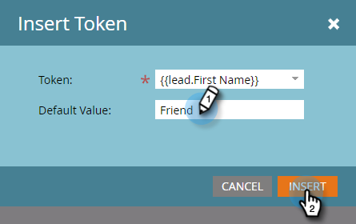

# Personalisieren einer E-Mail {#personalize-an-email}

## Aufgabe: Personalisieren von E-Mails durch Hinzufügen von Daten-Token {#mission-make-your-emails-personal-by-adding-data-tokens}

>[!PREREQUISITES]
>
>* [Einrichten und eine Person hinzufügen](/help/marketo/getting-started/quick-wins/get-set-up-and-add-a-person.md){target="_blank"}
>* [Massen-E-Mail senden](/help/marketo/getting-started/quick-wins/send-an-email.md){target="_blank"}
>* [Schrittweises Nurturing von Leads](/help/marketo/getting-started/quick-wins/drip-drip-nurture.md){target="_blank"}

## Schritt 1: Auswählen einer E-Mail zur Personalisierung {#step-select-an-email-to-personalize}

1. Wählen Sie eine der in den [vorherigen Schnellverfahren](/help/marketo/getting-started/quick-wins/drip-drip-nurture.md){target="_blank"} erstellten Nurturing-E-Mails aus und klicken Sie auf **[!UICONTROL Entwurf erstellen]**.

   

   >[!NOTE]
   >
   >Damit wird eine Kopie der E-Mail als Entwurf erstellt. Denken Sie daran, den Entwurf zu genehmigen, damit die Änderungen live gehen können.

Wenn Sie keinen Popup-Blocker aktiviert haben, wird der E-Mail-Editor in einer neuen Registerkarte oder einem neuen Fenster geöffnet. Klicken Sie andernfalls zweimal auf **[!UICONTROL Entwurf erstellen]**.

## Schritt 2: Auswählen der Vertriebsperson als Absenderin bzw. Absender {#step-make-the-salesperson-the-sender}

1. Wählen Sie das Feld **[!UICONTROL Von]** aus, markieren Sie den aktuellen Namen und **löschen** Sie ihn.

   

1. Klicken Sie auf das **Token**-Symbol rechts neben dem Feld **[!UICONTROL Von]**.

   

1. Suchen Sie das Token **`{{lead.Lead Owner First Name}}`** und wählen Sie es aus.

   

1. Geben Sie Ihren Firmennamen und einen Bindestrich für den **Standardwert** ein, um sicherzustellen, dass irgendetwas angezeigt wird, falls der Vorname der Vertriebsperson nicht verfügbar ist. Klicken Sie auf **Einfügen**.

   

1. Klicken Sie im Feld **[!UICONTROL Von]** auf die Leertaste und stellen Sie sicher, dass der Cursor eine Leerstelle nach dem soeben eingefügten Token blinkt. Klicken Sie dann erneut auf das **Token**-Symbol.

   

1. Suchen Sie das Token **`{{lead.Lead Owner Last Name}}`** und wählen Sie es aus.

   

1. Geben Sie als **Standardwert** „Vertrieb“ ein und klicken Sie auf **Einfügen**.

   

## Schritt 3: Hinzufügen des Lead-Namens zur E-Mail {#step-add-the-leads-name-to-the-email}

1. Wählen Sie den oberen bearbeitbaren Abschnitt aus, klicken Sie auf das Zahnradsymbol und wählen Sie **[!UICONTROL Bearbeiten]**.

   

1. Fügen Sie nach „Hallo“ ein Leerzeichen hinzu, platzieren Sie den Cursor vor dem Komma und klicken Sie dann auf das Symbol **Token einfügen**.

   

1. Suchen Sie das Token **`{{lead.First Name}}`** und wählen Sie es aus.

   

1. Geben Sie „Freundin“ bzw. „Freund“ (oder eine beliebige andere Bezeichnung) in das Feld **[!UICONTROL Standardwert]** ein und klicken Sie auf **[!UICONTROL Einfügen]**.

   

   >[!TIP]
   >
   >Geben Sie immer einen Standardwert für Token an. Dadurch wird sichergestellt, dass der Standardwert in der E-Mail angezeigt wird, wenn ein Teil der persönlichen Daten fehlt.

1. Klicken Sie auf **[!UICONTROL Speichern]**.

   

1. Wählen Sie unter **[!UICONTROL E-Mail-Aktionen]** die Option **[!UICONTROL Genehmigen und schließen]** aus.

   

>[!TIP]
>
>Benötigen Sie eine kurze Auffrischung, wie Sie die E-Mail an sich selbst senden? Siehe [Massen-E-Mail senden](/help/marketo/getting-started/quick-wins/send-an-email.md){target="_blank"}.

### Aufgabe abgeschlossen {#mission-complete}

Herzlichen Glückwunsch, Sie haben Ihre E-Mail personalisiert!

  

[◄ Aufgabe 6: Schrittweises Nurturing](/help/marketo/getting-started/quick-wins/drip-drip-nurture.md)

[Aufgabe 8: Benachrichtigen des Vertriebspersonals►](/help/marketo/getting-started/quick-wins/alert-the-sales-rep.md)
