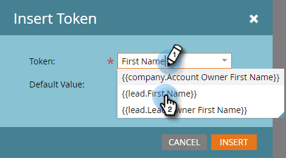

# E-Mail personalisieren {#personalize-an-email}

## Auftrag: Personalisieren Sie Ihre E-Mails durch Hinzufügen von Daten-Token {#mission-make-your-emails-personal-by-adding-data-tokens}

>[!PREREQUISITES]
>
>* [Einrichten und Hinzufügen einer Person](/help/marketo/getting-started/quick-wins/get-set-up-and-add-a-person.md){target="_blank"}
>* [Massen-E-Mail senden](/help/marketo/getting-started/quick-wins/send-an-email.md){target="_blank"}
>* [Schrittweises Lead-Nurturing](/help/marketo/getting-started/quick-wins/drip-drip-nurture.md){target="_blank"}

## Schritt 1: E-Mail zur Personalisierung auswählen {#step-select-an-email-to-personalize}

1. Wählen Sie eine der E-Mails aus, die in der [vorheriger Schnellsieg](/help/marketo/getting-started/quick-wins/drip-drip-nurture.md){target="_blank"} und klicken **[!UICONTROL Entwurf erstellen]**.

   

   >[!NOTE]
   >
   >Damit wird eine Kopie der E-Mail als Entwurf erstellt. Denken Sie daran, den Entwurf zu validieren, damit die Änderungen live geschaltet werden.

Wenn Sie einen Popup-Blocker nicht aktiviert haben, wird der E-Mail-Editor in einer neuen Registerkarte/einem neuen Fenster geöffnet. Klicken Sie andernfalls auf **[!UICONTROL Entwurf erstellen]** zweimal.

## Schritt 2: Verkäufer zum Absender machen {#step-make-the-salesperson-the-sender}

1. Wählen Sie die **[!UICONTROL Von]** Feld, Hervorhebung und **delete** den aktuellen Namen.

   

1. Klicken Sie auf **Token** rechts neben dem **[!UICONTROL Von]** -Feld.

   

1. Suchen und Auswählen **`{{lead.Lead Owner First Name}}`** Token.

   

1. Geben Sie Ihren Firmennamen und einen Bindestrich für die **Standardwert** um sicherzustellen, dass etwas angezeigt wird, falls der Vorname des Verkaufsprotokolls nicht verfügbar ist. Klicken Sie auf **Einfügen**.

   

1. Drücken Sie die Leertaste im **[!UICONTROL Von]** -Feld, um sicherzustellen, dass der Cursor ein Leerzeichen nach dem soeben eingefügten Token blinkt. Klicken Sie anschließend auf **Token** erneut.

   

1. Suchen und Auswählen **`{{lead.Lead Owner Last Name}}`** Token.

   

1. Geben Sie &quot;Verkauf&quot;für die **Standardwert** und klicken **Einfügen**.

   

## Schritt 3: Hinzufügen des Lead-Namens zur E-Mail {#step-add-the-leads-name-to-the-email}

1. Wählen Sie den oberen bearbeitbaren Abschnitt aus, klicken Sie auf das Zahnradsymbol und wählen Sie **[!UICONTROL Bearbeiten]**.

   

1. Fügen Sie nach &quot;Hello&quot;ein Leerzeichen hinzu, platzieren Sie den Cursor vor dem Komma und klicken Sie dann auf die **Token einfügen** Symbol.

   

1. Suchen und Auswählen **`{{lead.First Name}}`** Token.

   

1. Geben Sie &quot;Friend&quot;(oder eine beliebige Bezeichnung) in den **[!UICONTROL Standardwert]** Feld und klicken Sie auf **[!UICONTROL Einfügen]**.

   

   >[!TIP]
   >
   >Fügen Sie immer einen Standardwert für Token hinzu. Dadurch wird sichergestellt, dass der Standardwert in der E-Mail angezeigt wird, wenn ein Teil der personenbezogenen Daten fehlt.

1. Klicks **[!UICONTROL Speichern]**.

   

1. under **[!UICONTROL E-Mail-Aktionen]** und wählen **[!UICONTROL Genehmigen und schließen]**.

   

>[!TIP]
>
>Benötigen Sie einen schnellen Auffrischungskurs dazu, wie Sie sich die E-Mail selbst senden können? Siehe [E-Mail-Blast senden](/help/marketo/getting-started/quick-wins/send-an-email.md){target="_blank"}.

### Aufgabe abgeschlossen {#mission-complete}

Herzlichen Glückwunsch! Sie haben Ihre E-Mail personalisiert!

  

[◄ Aufgabe 6: Schrittweises Lead-Nurturing](/help/marketo/getting-started/quick-wins/drip-drip-nurture.md)

[Aufgabe 8: Vertriebsmitarbeiter benachrichtigen ►](/help/marketo/getting-started/quick-wins/alert-the-sales-rep.md)
