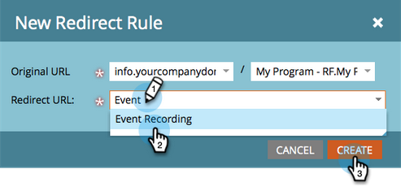

# Landing Page umleiten {#redirect-a-landing-page}

## Mission: Eine Landingpage zu einer anderen Web-Seite umleiten {#mission-redirect-a-landing-page-to-a-different-web-page}

>[!NOTE]
>
>**Administratorberechtigungen erforderlich**

>[!PREREQUISITES]
>
>* [Landingpage mit einem Formular](/help/marketo/getting-started/quick-wins/landing-page-with-a-form.md){target="_blank"}
>* [Landingpage-URL mit einem CNAME anpassen](/help/marketo/product-docs/demand-generation/landing-pages/landing-page-actions/customize-your-landing-page-urls-with-a-cname.md){target="_blank"}

## Schritt 1: Neue Umleitungsregel starten {#step-start-a-new-redirect-rule}

1. Navigieren Sie zum Bereich **[!UICONTROL Admin]**.

   

1. Navigieren Sie zu **[!UICONTROL Landingpages]**.

   

1. Klicken Sie auf die **[!UICONTROL Regeln]** und dann auf **[!UICONTROL Neu]** und **[!UICONTROL Neue Umleitungsregel]**.

   

## Schritt 2: Umleitungsregel definieren {#step-define-the-redirect-rule}

1. Klicken Sie auf die erste **[!UICONTROL Original-URL]** Dropdown-Liste und wählen Sie Ihren Marketo-CNAME aus.

   

   >[!NOTE]
   >
   >Denken Sie daran, dass Sie nur Landingpages umleiten können, die mit Ihrem Marketo ([) ](/help/marketo/product-docs/demand-generation/landing-pages/landing-page-actions/customize-your-landing-page-urls-with-a-cname.md){target="_blank"}.

1. Klicken Sie auf die zweite **[!UICONTROL Original-URL]** Dropdown-Liste und wählen Sie die Landingpage aus, die Sie umleiten möchten.

   

1. Wählen **[!UICONTROL unter &quot;]**&quot; die Seite aus, zu der Sie umleiten möchten, und klicken Sie auf **[!UICONTROL Erstellen]**.

   

## Aufgabe abgeschlossen {#mission-complete}

Herzlichen Glückwunsch! Sie haben eine Landingpage erfolgreich umgeleitet.

  

[◄ Mission 9: Aktualisieren von Lead-Daten](/help/marketo/getting-started/quick-wins/update-person-data.md)
