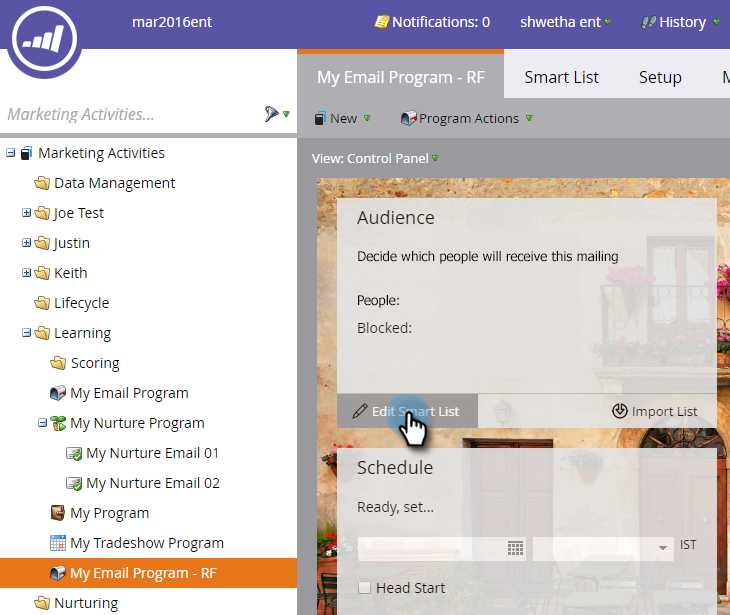

# E-Mail senden {#send-an-email}

Das ist das erste, was jeder tun möchte. Senden wir eine E-Mail aus Marketo!

>[!PREREQUISITES]
>
>[Einrichten und Hinzufügen einer Person](/help/marketo/getting-started/quick-wins/get-set-up-and-add-a-person.md)

## E-Mail-Programm {#create-an-email-program} erstellen

1. Gehen Sie zum Bereich **Marketing-Aktivitäten**.

   

1. Wählen Sie den Ordner **Lernen**. Klicken Sie auf die Dropdownliste **Neu** und wählen Sie **Neues Programm**.

   

1. Geben Sie einen **Programm** ein und wählen Sie **E-Mail** für **Typ des .**

   >[!TIP]
   >
   >hinzufügen Sie Ihre Initialen am Ende des Programms, um sie eindeutig zu machen.

   

1. Wählen Sie unter **Kanal** **E-Mail senden** und klicken Sie auf **Erstellen**.

   

## Definieren Sie Ihre Audience {#define-your-audience}

1. Klicken Sie unter der Kachel &quot;Audience&quot;auf **Intelligente Liste bearbeiten**.

   

1. Suchen Sie den Filter &quot;E-Mail-Adresse&quot;und ziehen Sie ihn in die Arbeitsfläche.

   

   >[!TIP]
   >
   >Verwenden Sie **Suchen** oben in der Liste &quot;Filter&quot;, um den Filter leichter zu finden.

1. Suchen und wählen Sie Ihre E-Mail-Adresse aus.

   

   >[!NOTE]
   >
   >Wenn Ihre E-Mail nicht automatisch aufgefüllt wird, haben Sie möglicherweise vergessen, [Setup aufzurufen und einen Interessenten Hinzufügen.](/help/marketo/getting-started/quick-wins/get-set-up-and-add-a-person.md)

   >[!NOTE]
   >
   >In diesem Beispiel senden Sie die E-Mail nur an Sie selbst, aber Sie können die Audience nach Ihren Vorstellungen anpassen.

1. Gehen Sie zurück zur Registerkarte &quot;Haupt-Programm&quot;und klicken Sie auf das Aktualisierungssymbol für **Person**.

   

   Sie sollten sehen, wie die Personenanzahl auf 1 steigt. Das bist du!

## Erstellen einer E-Mail {#create-an-email}

1. Klicken Sie unter der E-Mail-Kachel auf **Neue E-Mail**.

   

1. Geben Sie einen **Name** ein, wählen Sie eine **Vorlage** und klicken Sie auf **Erstellen**.

   

1. Das Fenster des E-Mail-Editors wird geöffnet. Geben Sie einen Betreff mit höchstens 50 Zeichen ein (empfohlen).

   

   >[!NOTE]
   >
   >Wenn Sie einen Popup-Blocker haben, klicken Sie auf **Entwurf bearbeiten**, um den E-Mail-Editor einzugeben.

1. Wählen Sie den zu bearbeitenden Bereich aus, klicken Sie auf das Zahnradsymbol auf der rechten Seite und wählen Sie **Bearbeiten** (Sie können auch mit der Dublette auf den bearbeitbaren Bereich klicken, um ihn zu bearbeiten).

   

1. Geben Sie den gewünschten Inhalt ein und klicken Sie auf **Speichern**.

   

1. Die Änderungen werden automatisch gespeichert. Schließen Sie die Registerkarte/das Fenster des Editors.

   

1. Klicken Sie auf die Dropdownliste **E-Mail-Aktionen** und wählen Sie **Genehmigen**.

   

   >[!TIP]
   >
   >Möchten Sie sich ein kurzes Beispiel senden, um zu sehen, wie Ihre E-Mail vor dem Start aussieht? Wählen Sie **Beispiel senden** im Menü oben oder klicken Sie auf **E-Mail-Aktionen** und dann [**Beispiel senden**](/help/marketo/product-docs/email-marketing/general/creating-an-email/send-a-sample-email.md).

1. Wählen Sie das E-Mail-Programm in der linken Baumstruktur aus.

   

1. Legen Sie in der Kachel Plan den Starttag für die E-Mail auf **Heute fest.**

   

1. Wählen Sie eine Zeit aus, die in der Zukunft mindestens 15 Minuten beträgt.

   

   >[!TIP]
   >
   >Ist die Standardzeitzone nicht Ihre? Erfahren Sie, wie Sie [es hier aktualisieren](/help/marketo/product-docs/administration/settings/select-your-language-locale-and-time-zone.md).

1. Klicken Sie unter der Genehmigungskachel auf **Programm genehmigen** und Sie sind fertig!

   

Sie sollten die E-Mail kurz nach dem geplanten Tag/der geplanten Uhrzeit erhalten.

  

[Einrichten und Hinzufügen eines Interessenten](/help/marketo/getting-started/quick-wins/get-set-up-and-add-a-person.md)

[Landingpage mit einem Formular ►](/help/marketo/getting-started/quick-wins/landing-page-with-a-form.md)
