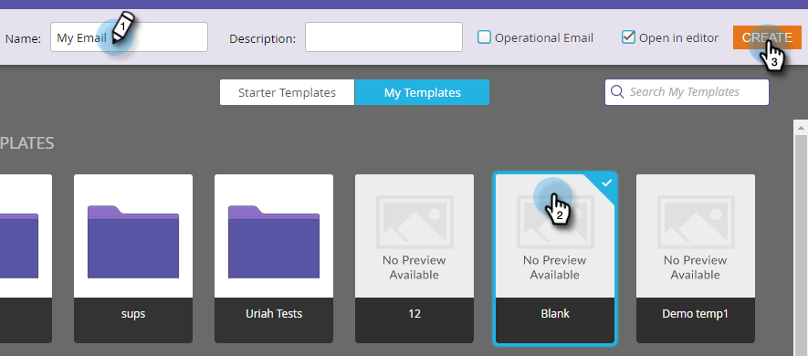

# Senden einer E-Mail {#send-an-email}

Das ist das Erste, was jeder machen will. Senden wir eine E-Mail aus Marketo!

>[!PREREQUISITES]
>
>[Einrichten und Person hinzufügen](/help/marketo/getting-started/quick-wins/get-set-up-and-add-a-person.md){target="_blank"}

## E-Mail-Programm erstellen {#create-an-email-program}

1. Navigieren Sie zum Bereich **[!UICONTROL Marketing]** Aktivitäten.

   

1. Wählen Sie Ihren **[!UICONTROL Lernplan]** Ordner aus. Klicken Sie auf **[!UICONTROL Neu]** und wählen Sie **[!UICONTROL Neues Programm]**.

   

1. Geben Sie einen **[!UICONTROL Namen]** ein und wählen Sie **[!UICONTROL E-Mail]** für **[!UICONTROL Programmtyp]** aus.

   >[!TIP]
   >
   >Fügen Sie Ihre Initialen am Ende des Programmnamens hinzu, um ihn eindeutig zu machen.

   

1. Wählen **[!UICONTROL unter]** Kanal **[!UICONTROL die Option E-Mail senden]** klicken Sie auf **[!UICONTROL Erstellen]**.

   

## Definieren der Audience {#define-your-audience}

1. Klicken Sie **[!UICONTROL der Kachel [!UICONTROL Zielgruppe]** auf Smart-Liste &#x200B;].

   

1. Suchen Sie den Filter [!UICONTROL E-Mail-Adresse] und ziehen Sie ihn auf die Arbeitsfläche.

   

   >[!TIP]
   >
   >Verwenden Sie die **[!UICONTROL Suche]**, um Filter leichter zu finden.

1. Suchen Sie Ihre E-Mail-Adresse und wählen Sie sie aus.

   

   >[!NOTE]
   >
   >Wenn Ihre E-Mail nicht automatisch ausgefüllt wird, haben Sie möglicherweise vergessen, [Einrichten und einen Lead hinzufügen“](/help/marketo/getting-started/quick-wins/get-set-up-and-add-a-person.md){target="_blank"}

   >[!NOTE]
   >
   >In diesem Beispiel senden Sie die E-Mail nur an sich selbst. Sie können die Zielgruppe jedoch nach Belieben anpassen.

1. Gehen Sie zurück zur Registerkarte Hauptprogramm und klicken Sie auf das Aktualisierungssymbol für **[!UICONTROL Person]**.

   

   Die Personenanzahl sollte bis zu 1 betragen. Das bist du!

## E-Mail erstellen {#create-an-email}

1. Klicken Sie unter der Kachel E-Mail auf **[!UICONTROL Neue E-Mail]**.

   

1. Geben Sie **[!UICONTROL Name]** ein, wählen Sie **Vorlage** und klicken Sie auf **[!UICONTROL Erstellen]**.

   

1. Das Fenster E-Mail-Editor wird geöffnet. Geben Sie einen Betreff mit höchstens 50 Zeichen ein (empfohlen).

   

   >[!NOTE]
   >
   >Wenn Sie über einen Popup-Blocker verfügen, klicken Sie auf **[!UICONTROL Entwurf bearbeiten]**, um den E-Mail-Editor aufzurufen.

1. Wählen Sie den zu bearbeitenden Bereich aus, klicken Sie auf das Zahnradsymbol rechts und wählen Sie **[!UICONTROL Bearbeiten]** (Sie können zum Bearbeiten auch auf den bearbeitbaren Abschnitt doppelklicken).

   

1. Geben Sie den gewünschten Inhalt ein und klicken Sie auf **[!UICONTROL Speichern]**.

   

1. Klicken Sie auf die **[!UICONTROL E-Mail]** Aktionen) und wählen Sie **[!UICONTROL Genehmigen und schließen]**.

   

   >[!TIP]
   >
   >Möchten Sie sich vor dem Start ein kurzes Beispiel senden, um zu sehen, wie Ihre E-Mail aussieht? Wählen Sie **[!UICONTROL obigen Menü]** Beispiel senden“ aus oder klicken Sie auf **[!UICONTROL E-Mail-]** und dann [**[!UICONTROL Beispiel senden]**](/help/marketo/product-docs/email-marketing/general/creating-an-email/send-a-sample-email.md){target="_blank"}.

1. Wählen Sie das E-Mail-Programm in der linken Struktur aus.

   

1. Legen Sie unter [!UICONTROL &#x200B; Kachel &#x200B;] den Launch-Tag für die E-Mail auf **[!UICONTROL Heute]** fest.

   

   >[!NOTE]
   >
   >Weitere Informationen zu [Zeitzone des Empfängers](/help/marketo/product-docs/email-marketing/email-programs/email-program-actions/scheduling-with-recipient-time-zone/schedule-email-programs-with-recipient-time-zone.md){target="_blank"} und [Kopfstart](/help/marketo/product-docs/email-marketing/email-programs/email-program-actions/head-start-for-email-programs.md){target="_blank"}.

1. Wählen Sie eine Zeit aus, die mindestens 15 Minuten in der Zukunft liegt.

   

   >[!TIP]
   >
   >Ist die Standardzeitzone nicht Ihre? Hier erfahren Sie, wie [ aktualisiert ](/help/marketo/product-docs/administration/settings/select-your-language-locale-and-time-zone.md){target="_blank"}.

1. Klicken Sie **&#x200B;**&#x200B;der Kachel [!UICONTROL Genehmigung] auf Programm genehmigen und Sie sind fertig!

   

Sie sollten die E-Mail kurz nach dem geplanten Tag/zur geplanten Uhrzeit erhalten.

## Mission abgeschlossen! {#mission-complete}

  

[◄ Einrichten und Person hinzufügen](/help/marketo/getting-started/quick-wins/get-set-up-and-add-a-person.md)

[Mission 2: Landingpage mit ►](/help/marketo/getting-started/quick-wins/landing-page-with-a-form.md)
