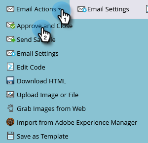

# Senden einer E-Mail {#send-an-email}

Das ist das Erste, was alle tun wollen. Senden wir eine E-Mail von Marketo aus!

>[!PREREQUISITES]
>
>[Einrichten und eine Person hinzufügen](/help/marketo/getting-started/quick-wins/get-set-up-and-add-a-person.md){target="_blank"}

## Erstellen eines E-Mail-Programms {#create-an-email-program}

1. Navigieren Sie zum Bereich **[!UICONTROL Marketing-Aktivitäten]**.

   

1. Wählen Sie Ihren Ordner **[!UICONTROL Lernen]** aus. Klicken Sie auf das Dropdown-Menü **[!UICONTROL Neu]** und wählen Sie **[!UICONTROL Neues Programm]**.

   

1. Geben Sie einen **[!UICONTROL Namen]** ein und wählen Sie **[!UICONTROL E-Mail]** als **[!UICONTROL Programmtyp]** aus.

   >[!TIP]
   >
   >Fügen Sie am Ende des Programmnamens Ihre Initialen hinzu, um ihn eindeutig zu machen.

   

1. Wählen Sie unter **[!UICONTROL Kanal]** die Option **[!UICONTROL E-Mail senden]** und klicken Sie auf **[!UICONTROL Erstellen]**.

   

## Definieren Ihrer Zielgruppe {#define-your-audience}

1. Klicken Sie unter der Kachel [!UICONTROL Zielgruppe] auf **[!UICONTROL Intelligente Liste bearbeiten]**.

   

1. Ziehen Sie den Filter [!UICONTROL E-Mail-Adresse] in die Arbeitsfläche.

   

   >[!TIP]
   >
   >Verwenden Sie die Funktion **[!UICONTROL Suchen]**, um Filter leichter zu finden.

1. Suchen Sie Ihre E-Mail-Adresse und wählen Sie sie aus.

   

   >[!NOTE]
   >
   >Wenn Ihre E-Mail-Adresse nicht automatisch ausgefüllt wird, haben Sie möglicherweise vergessen, diese [einzurichten und einen Lead hinzuzufügen](/help/marketo/getting-started/quick-wins/get-set-up-and-add-a-person.md){target="_blank"}.

   >[!NOTE]
   >
   >In diesem Beispiel senden Sie die E-Mail nur an sich selbst. Sie können die Zielgruppe jedoch nach Belieben anpassen.

1. Gehen Sie zurück zur Hauptregisterkarte des Programms und klicken Sie auf das Aktualisierungssymbol für **[!UICONTROL Person]**.

   

   Die Personenanzahl sollte auf 1 steigen. Das sind Sie!

## Erstellen einer E-Mail {#create-an-email}

1. Klicken Sie unter der Kachel „E-Mail“ auf **[!UICONTROL Neue E-Mail]**.

   

1. Geben Sie einen **[!UICONTROL Namen]** ein, wählen Sie eine **Vorlage** aus und klicken Sie auf **[!UICONTROL Erstellen]**.

   

1. Das Fenster des E-Mail-Editors wird geöffnet. Geben Sie einen Betreff mit höchstens 50 Zeichen ein (empfohlen).

   

   >[!NOTE]
   >
   >Wenn Sie einen Popup-Blocker haben, klicken Sie auf **[!UICONTROL Entwurf bearbeiten]**, um den E-Mail-Editor aufzurufen.

1. Wählen Sie den zu bearbeitenden Bereich aus, klicken Sie rechts auf das Zahnradsymbol und wählen Sie **[!UICONTROL Bearbeiten]** (Sie können zum Bearbeiten auch auf den bearbeitbaren Abschnitt doppelklicken).

   

1. Geben Sie den gewünschten Inhalt ein und klicken Sie auf **[!UICONTROL Speichern]**.

   

1. Klicken Sie auf das Dropdown-Menü **[!UICONTROL E-Mail-Aktionen]** und wählen Sie **[!UICONTROL Genehmigen und schließen]**.

   

   >[!TIP]
   >
   >Möchten Sie vor dem Start ein kurzes Beispiel an sich selbst senden, um zu sehen, wie Ihre E-Mail aussieht? Wählen Sie im obigen Menü **[!UICONTROL Beispiel senden]** oder klicken Sie auf **[!UICONTROL E-Mail-Aktionen]** und dann auf [**[!UICONTROL Beispiel senden]**](/help/marketo/product-docs/email-marketing/general/creating-an-email/send-a-sample-email.md){target="_blank"}.

1. Wählen Sie das E-Mail-Programm in der linken Struktur aus.

   

1. Legen Sie unter der Kachel [!UICONTROL Zeitplan] den Starttag für die E-Mail auf **[!UICONTROL Heute]** fest.

   

   >[!NOTE]
   >
   >Erfahren Sie mehr über [Zeitzone der Empfängerin bzw. des Empfängers](/help/marketo/product-docs/email-marketing/email-programs/email-program-actions/scheduling-with-recipient-time-zone/schedule-email-programs-with-recipient-time-zone.md){target="_blank"} und [Vorsprung](/help/marketo/product-docs/email-marketing/email-programs/email-program-actions/head-start-for-email-programs.md){target="_blank"}.

1. Die gewählte Startzeit muss mindestens 15 Minuten in der Zukunft liegen

   

   >[!TIP]
   >
   >Ist die Standardzeitzone nicht Ihre? [Hier](/help/marketo/product-docs/administration/settings/select-your-language-locale-and-time-zone.md){target="_blank"} erfahren Sie, wie Sie sie aktualisieren können.

1. Klicken Sie unter der Kachel [!UICONTROL Genehmigung] auf **[!UICONTROL Programm genehmigen]**, und schon sind Sie fertig!

   

Sie sollten die E-Mail am geplanten Tag kurz nach der geplanten Uhrzeit erhalten.

## Aufgabe abgeschlossen! {#mission-complete}

  

[◄ Einrichten und eine Person hinzufügen](/help/marketo/getting-started/quick-wins/get-set-up-and-add-a-person.md)

[Aufgabe 2: Landingpage mit Formular ►](/help/marketo/getting-started/quick-wins/landing-page-with-a-form.md)
