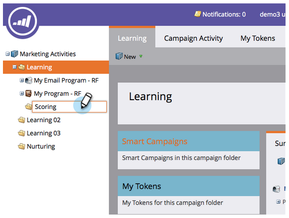
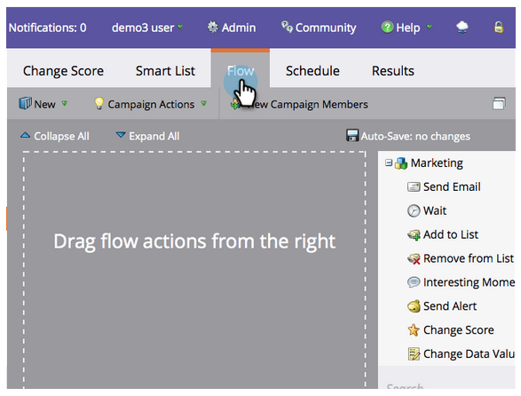

# Einfache Bewertung {#simple-scoring}

>[!NOTE]
>
>**FYI**
>
>Marketo standardisiert nun die Sprache für alle Abonnements, sodass Sie möglicherweise Interessenten in Ihrem Abonnement und Personen/Personen in docs.marketo.com sehen können. Diese Begriffe bedeuten dasselbe. Es hat keine Auswirkungen auf die Artikelanweisungen. Es gibt auch noch einige andere Änderungen. [Weitere Informationen](http://docs.marketo.com/display/DOCS/Updates+to+Marketo+Terminology).

>[!PREREQUISITES]
>
>* [Einrichten und Hinzufügen einer Person](get-set-up-and-add-a-person.md)
>* [Landingpage mit einem Formular](landing-page-with-a-form.md)

>

## Schritt 1: Erstellen einer Kampagne zur Bewertung {#step-create-a-scoring-campaign}

1. Gehen Sie zum Bereich **Marketing-Aktivitäten** .

   

1. Klicken Sie mit der rechten Maustaste auf den Ordner **Learning** und dann auf **New Campaign Folder**.

   

1. Benennen Sie den Ordner &quot;Kampagne&quot;als &quot;Punktzahl&quot;.

   

   >[!NOTE]
   >
   >Wenn Sie bereits über einen Scoring-Ordner verfügen, geben Sie diesem einen anderen Namen, z. B. Scoring 1. Ordnernamen müssen eindeutig sein.

1. Klicken Sie dann mit der rechten Maustaste auf den neuen **Scoring** -Ordner und wählen Sie **Neue Smart-Kampagne**.

   

1. **Benennen** Sie die Kampagne &quot;Ergebnis ändern&quot;und klicken Sie auf **Erstellen**.

   

1. Klicken Sie auf die Registerkarte **Intelligente Liste** .

   

   Wir möchten, dass diese Kampagne immer dann ausgeführt wird, wenn eine Person Ihr **Testanforderungsformular** ausfüllt.

1. Ziehen Sie den Auslöser &quot;Formular **ausfüllen** &quot;auf die linke Arbeitsfläche.

   

1. Wählen Sie **Mein Formular**.

   >[!NOTE]
   >
   >Wenn Sie die [Landingpage mit einem Formular](landing-page-with-a-form.md) Quick win abgeschlossen haben, sollten Sie das Formular haben. Wenn Sie einen anderen Namen für Ihr Formular verwendet haben, wählen Sie diesen aus.

   

1. Klicken Sie auf die Registerkarte **Fluss **s.

   

1. Ziehen Sie die Aktion &quot; **Score** ändern&quot;auf die linke Arbeitsfläche.

   

1. Sie können einen beliebigen Wert eingeben, der dem Ergebnis der Person hinzugefügt werden soll. Geben Sie &quot;+5&quot;in das Feld **Ändern** ein.

   

   >[!TIP]
   >
   >Gute Kampagnen sind der Schlüssel zur Bereitstellung hochwertiger Mitarbeiter für den Vertrieb. Lesen Sie [**den Leitfaden zur Interessentenbewertung**](http://www.marketo.com/definitive-guides/lead-scoring/).

1. Klicken Sie auf die Registerkarte **Plan** und dann auf die Schaltfläche **Aktivieren** .

   

1. Klicken Sie im Bestätigungsbildschirm auf **Aktivieren** .

   

>[!NOTE]
>
>Sobald diese Kampagne aktiv ist, wird sie jedes Mal ausgeführt, wenn ein Benutzer das Formular ausfüllt. Die Kampagne läuft, bis sie deaktiviert ist.

## Schritt 2: Ausfüllen des Formulars {#step-fill-out-the-form}

1. Wählen Sie die Landingpage aus, die Sie in der [Landingpage mit einem Schnellgewinn für das Formular](landing-page-with-a-form.md) erstellt haben.

   

1. Klicken Sie auf **Ansicht genehmigt Seite**. Die Landingpage wird in einer neuen Registerkarte geöffnet.

   

1. Füllen Sie das Formular mit Ihrem Vornamen, Nachnamen und Ihrer E-Mail-Adresse aus und klicken Sie auf **Senden** .

   

   >[!NOTE]
   >
   >Verwenden Sie denselben Namen und dieselbe E-Mail-Adresse, die Sie beim ersten Einstieg als Person verwendet haben, um die &quot;+5&quot;-Ergebniserhöhung anzuwenden.

## Schritt 3: Ansicht der Benutzerinformationen {#step-view-the-person-info}

1. Wechseln Sie zum Bereich &quot;Datenbank&quot;.

   

1. Suchen Sie nach der E-Mail-Adresse, die Sie beim Ausfüllen des Formulars verwendet haben.

   

1. Klicken Sie mit der Dublette auf Ihre Person.

   

Ihre persönlichen Daten werden in einem neuen Register oder Fenster geöffnet. Sehen Sie, wie Ihr Ergebnis um 5 Punkte für das Ausfüllen des Formulars erhöht wurde!!

**Herzlichen Glückwunsch!** Sie haben eine bewertete Kampagne erstellt.
[Auftrag 2: Landingpage mit einem Formular](landing-page-with-a-form.md) [Mission 4: E-Mail-Automatisches Reagieren ►](email-auto-response.md)