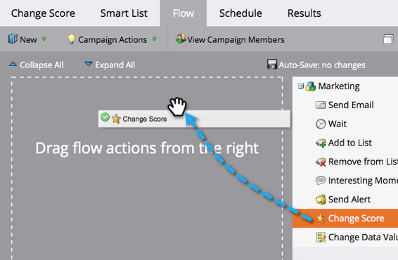
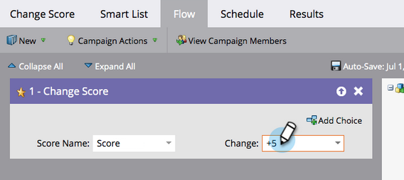
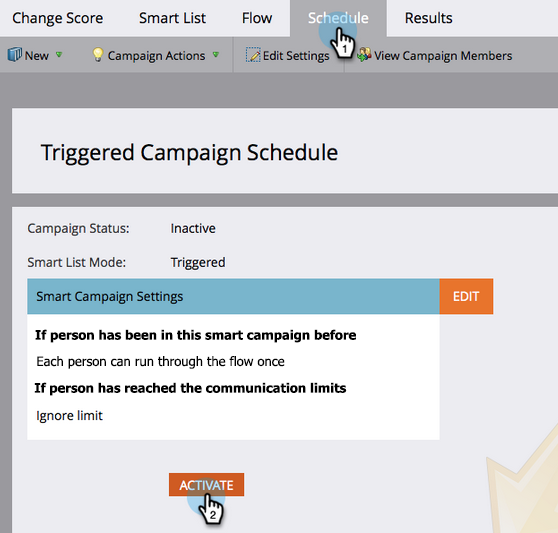

# Einfache Bewertung {#simple-scoring}

>[!PREREQUISITES]
>
>* [Einrichten und Person hinzufügen](/help/marketo/getting-started/quick-wins/get-set-up-and-add-a-person.md){target="_blank"}
>* [Landingpage mit einem Formular](/help/marketo/getting-started/quick-wins/landing-page-with-a-form.md){target="_blank"}

## Schritt 1: Bewertungskampagne erstellen {#step-create-a-scoring-campaign}

1. Navigieren Sie zum Bereich **[!UICONTROL Marketing]** Aktivitäten.

   

1. Klicken Sie mit der rechten Maustaste auf **Ordner** Lernen) und klicken Sie auf **[!UICONTROL Neuer Kampagnenordner]**.

   

1. Nennen Sie den Kampagnenordner Scoring und klicken Sie auf **[!UICONTROL Erstellen]**.

   

   >[!NOTE]
   >
   >Wenn Sie bereits über einen Bewertungsordner verfügen, benennen Sie diesen Ordner anders, z. B. Bewertung 1. Ordnernamen müssen eindeutig sein.

1. Klicken Sie mit der rechten Maustaste auf **Ordner** Scoring“ und wählen Sie **[!UICONTROL Neue intelligente Kampagne]**.

   

1. Nennen Sie die Kampagne „Ergebnis ändern“ und klicken Sie auf **[!UICONTROL Erstellen]**.

   

1. Klicken Sie auf **[!UICONTROL Registerkarte]** Smart-Liste“.

   

   Wir möchten, dass diese Kampagne immer dann ausgeführt wird, wenn eine Person Ihr **Testanfrageformular“**.

1. Suchen Sie den Trigger **[!UICONTROL Formular ausfüllen]** und ziehen Sie ihn auf die linke Arbeitsfläche.

   

1. Wählen Sie **Mein Formular** aus.

   

   >[!NOTE]
   >
   >Wenn Sie die [Landingpage mit einem Formular](/help/marketo/getting-started/quick-wins/landing-page-with-a-form.md){target="_blank"} Quick Win ausgefüllt haben, sollten Sie das Formular verwenden. Wenn Sie einen anderen Namen für Ihr Formular verwendet haben, wählen Sie diesen aus.

1. Klicken Sie auf **[!UICONTROL Registerkarte]** Fluss“.

   

1. Ziehen Sie **Flussaktion** Score ändern“ auf die linke Arbeitsfläche.

   

1. Sie können einen beliebigen Wert eingeben, der zum Score der Person hinzugefügt werden soll. Geben wir &quot;+5“ in das Feld &quot;**[!UICONTROL &quot;]**.

   

   >[!TIP]
   >
   >Gute Scoring-Kampagnen sind der Schlüssel zur Bereitstellung hochwertiger Mitarbeiter im Vertrieb. Lesen Sie [**Endgültige Anleitung zur Lead-Bewertung**](https://www.marketo.com/definitive-guides/lead-scoring/){target="_blank"}.

1. Klicken Sie auf die **[!UICONTROL Zeitplan]** und auf die Schaltfläche **[!UICONTROL Aktivieren]**.

   

1. Klicken Sie **[!UICONTROL Bestätigungsbildschirm]** Aktivieren“.

   

>[!NOTE]
>
>Nach der Aktivierung wird diese Kampagne jedes Mal ausgeführt, wenn eine Person das Formular ausfüllt. Die Kampagne wird weiter ausgeführt, bis sie deaktiviert wird.

## Schritt 2: Formular ausfüllen {#step-fill-out-the-form}

1. Wählen Sie die Landingpage aus, die Sie in der [Landingpage mit einem Formular](/help/marketo/getting-started/quick-wins/landing-page-with-a-form.md){target="_blank"} Quick Win erstellt haben.

   

1. Klicken Sie **[!UICONTROL Vorschau]**. Die Landingpage wird in einer neuen Registerkarte geöffnet.

   

1. Füllen Sie das Formular mit Vorname, Nachname und E-Mail-Adresse aus und klicken Sie dann auf **[!UICONTROL Senden]**.

   

   >[!NOTE]
   >
   >Verwenden Sie denselben Namen und dieselbe E-Mail-Adresse, die Sie bei der ersten Eingabe als Person verwendet haben, um die Punktzahl &quot;+5“ zu erhöhen.

## Schritt 3: Anzeigen der Personeninformationen {#step-view-the-person-info}

1. Wechseln Sie zum Bereich **[!UICONTROL Datenbank]**.

   

1. Suchen Sie nach der E-Mail-Adresse, die Sie beim Ausfüllen des Formulars verwendet haben.

   

1. Doppelklicken Sie auf Ihre Person.

   

Ihre Personendaten werden in einer neuen Registerkarte oder einem neuen Fenster geöffnet. Sehen Sie, wie Ihr Punktestand beim Ausfüllen des Formulars um 5 Punkte gestiegen ist?

## Mission abgeschlossen! {#mission-complete}

  

[◄ Mission 2: Landingpage mit einem Formular](/help/marketo/getting-started/quick-wins/landing-page-with-a-form.md)

[Mission 4: E-Mail-►](/help/marketo/getting-started/quick-wins/email-auto-response.md)
