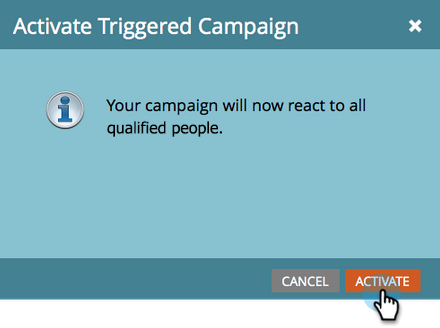

# Einfache Bewertung {#simple-scoring}

>[!PREREQUISITES]
>
>* [Einrichten und Hinzufügen einer Person](/help/marketo/getting-started/quick-wins/get-set-up-and-add-a-person.md){target="_blank"}
>* [Landingpage mit einem Formular](/help/marketo/getting-started/quick-wins/landing-page-with-a-form.md){target="_blank"}

## Schritt 1: Bewertungskampagne erstellen {#step-create-a-scoring-campaign}

1. Wechseln Sie zum Bereich **[!UICONTROL Marketingaktivitäten]** .

   

1. Klicken Sie mit der rechten Maustaste auf den Ordner **Lernen** und klicken Sie auf **[!UICONTROL Neuer Kampagnenordner]**.

   

1. Nennen Sie den Kampagnenordner &quot;Scoring&quot;und klicken Sie auf **[!UICONTROL Erstellen]**.

   

   >[!NOTE]
   >
   >Wenn Sie bereits über einen Scoring-Ordner verfügen, benennen Sie diesen etwas Anderes, z. B. Scoring 1. Ordnernamen müssen eindeutig sein.

1. Klicken Sie mit der rechten Maustaste auf den Ordner **Scoring** und wählen Sie **[!UICONTROL Neue Smart-Kampagne]** aus.

   

1. Nennen Sie die Kampagne &quot;Punktzahl ändern&quot;und klicken Sie auf **[!UICONTROL Erstellen]**.

   

1. Klicken Sie auf die Registerkarte **[!UICONTROL Smart List]** .

   

   Diese Kampagne soll immer dann ausgeführt werden, wenn eine Person Ihr **Testanfrageformular** ausfüllt.

1. Suchen und ziehen Sie den Trigger **[!UICONTROL Formular ausfüllen]** auf die linke Arbeitsfläche.

   

1. Wählen Sie **Mein Formular** aus.

   

   >[!NOTE]
   >
   >Wenn Sie die [Einstiegsseite mit einem Formular](/help/marketo/getting-started/quick-wins/landing-page-with-a-form.md){target="_blank"}-Schnellgewinn abgeschlossen haben, sollten Sie über das Formular verfügen. Wenn Sie für Ihr Formular einen anderen Namen verwendet haben, wählen Sie diesen aus.

1. Klicken Sie auf die Registerkarte **[!UICONTROL Fluss]**.

   

1. Ziehen Sie die Flussaktion **Score ändern** auf die linke Arbeitsfläche.

   

1. Sie können einen beliebigen Wert eingeben, der dem Ergebnis der Person hinzugefügt werden soll. Geben wir &quot;+5&quot;in das Feld **[!UICONTROL Ändern]** ein.

   

   >[!TIP]
   >
   >Gute Scoring-Kampagnen sind der Schlüssel zur Bereitstellung hochwertiger Mitarbeiter für den Vertrieb. Lesen Sie [**die endgültige Anleitung zum Lead-Scoring**](https://www.marketo.com/definitive-guides/lead-scoring/){target="_blank"}.

1. Klicken Sie auf die Registerkarte **[!UICONTROL Plan]** und auf die Schaltfläche **[!UICONTROL Aktivieren]**.

   

1. Klicken Sie auf dem Bestätigungsbildschirm auf **[!UICONTROL Aktivieren]** .

   

>[!NOTE]
>
>Nach der Aktivierung wird diese Kampagne jedes Mal ausgeführt, wenn eine Person das Formular ausfüllt. Die Kampagne läuft so lange, bis sie deaktiviert wird.

## Schritt 2: Formular ausfüllen {#step-fill-out-the-form}

1. Wählen Sie die Landingpage aus, die Sie auf der [Landingpage mit einem Schnellgewinn für Formular](/help/marketo/getting-started/quick-wins/landing-page-with-a-form.md){target="_blank"} erstellt haben.

   

1. Klicken Sie auf **[!UICONTROL Vorschau]**. Die Landingpage wird in einem neuen Tab geöffnet.

   

1. Füllen Sie das Formular mit Ihrem Vornamen, Nachnamen und Ihrer E-Mail-Adresse aus und klicken Sie dann auf **[!UICONTROL Senden]**.

   

   >[!NOTE]
   >
   >Verwenden Sie denselben Namen und dieselbe E-Mail-Adresse, die Sie beim ersten Einstieg als Person verwendet haben, um die Erhöhung des Punktwerts &quot;+5&quot;anzuwenden.

## Schritt 3: Anzeigen der Personeninformationen {#step-view-the-person-info}

1. Wechseln Sie zum Bereich **[!UICONTROL Datenbank]** .

   

1. Suchen Sie nach der E-Mail-Adresse, die Sie beim Ausfüllen des Formulars verwendet haben.

   

1. Doppelklicken Sie auf Ihre Person.

   

Ihre Personendetails werden in einem neuen Tab oder Fenster geöffnet. Erfahren Sie, wie sich Ihr Ergebnis beim Ausfüllen des Formulars um 5 Punkte erhöht hat.

## Auftrag abgeschlossen! {#mission-complete}

  

[Auftrag 2: Landingpage mit einem Formular](/help/marketo/getting-started/quick-wins/landing-page-with-a-form.md)

[Auftrag 4: Automatische E-Mail-Antwort ►](/help/marketo/getting-started/quick-wins/email-auto-response.md)
