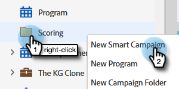

# Einfache Bewertung {#simple-scoring}

>[!PREREQUISITES]
>
>* [Einrichten und Hinzufügen einer Person](/help/marketo/getting-started/quick-wins/get-set-up-and-add-a-person.md){target="_blank"}
>* [Landing Page mit Formular](/help/marketo/getting-started/quick-wins/landing-page-with-a-form.md){target="_blank"}

## Schritt 1: Bewertungskampagne erstellen {#step-create-a-scoring-campaign}

1. Navigieren Sie zu **[!UICONTROL Marketingaktivitäten]** Bereich.

   

1. Rechtsklick auf Ihre **Lernen** Ordner und klicken Sie auf **[!UICONTROL Neuer Kampagnenordner]**.

   

1. Benennen Sie den Kampagnenordner &quot;Scoring&quot;und klicken Sie auf **[!UICONTROL Erstellen]**.

   

   >[!NOTE]
   >
   >Wenn Sie bereits über einen Scoring-Ordner verfügen, benennen Sie diesen etwas Anderes, z. B. Scoring 1. Ordnernamen müssen eindeutig sein.

1. Rechtsklick auf Ihre **Scoring** Ordner und wählen Sie **[!UICONTROL Neue intelligente Kampagne]**.

   

1. Benennen Sie die Kampagne &quot;Ergebnis ändern&quot;und klicken Sie auf **[!UICONTROL Erstellen]**.

   

1. Klicken Sie auf die Registerkarte **[!UICONTROL “Intelligente Liste“]**.

   

   Wir möchten, dass diese Kampagne ausgeführt wird, sobald eine Person Ihre **Testanfrageformular**.

1. Suchen und Ziehen **[!UICONTROL Formular ausfüllen]** Trigger auf der linken Arbeitsfläche.

   

1. Auswählen **Mein Formular**.

   

   >[!NOTE]
   >
   >Wenn Sie die [Landingpage mit einem Formular](/help/marketo/getting-started/quick-wins/landing-page-with-a-form.md){target="_blank"} schnell gewinnen, sollten Sie das Formular haben. Wenn Sie für Ihr Formular einen anderen Namen verwendet haben, wählen Sie diesen aus.

1. Klicken Sie auf die Registerkarte **[!UICONTROL “Flow“]**.

   

1. Ziehen Sie die **Bewertung ändern** Flussaktion auf die linke Arbeitsfläche.

   

1. Sie können einen beliebigen Wert eingeben, der dem Ergebnis der Person hinzugefügt werden soll. Geben wir &quot;+5&quot;im **[!UICONTROL Änderung]** -Feld.

   

   >[!TIP]
   >
   >Gute Scoring-Kampagnen sind der Schlüssel zur Bereitstellung hochwertiger Mitarbeiter für den Vertrieb. Lesen Sie [**Die ultimative Anleitung für die Lead-Bewertung**](https://www.marketo.com/definitive-guides/lead-scoring/){target="_blank"}.

1. Klicken Sie auf **[!UICONTROL Zeitplan]** und **[!UICONTROL Aktivieren]** Schaltfläche.

   

1. Klicken **[!UICONTROL Aktivieren]** auf dem Bestätigungsbildschirm.

   

>[!NOTE]
>
>Nach der Aktivierung wird diese Kampagne jedes Mal ausgeführt, wenn eine Person das Formular ausfüllt. Die Kampagne läuft so lange, bis sie deaktiviert wird.

## Schritt 2: Formular ausfüllen {#step-fill-out-the-form}

1. Wählen Sie die Landingpage aus, die Sie im [Landingpage mit einem Formular](/help/marketo/getting-started/quick-wins/landing-page-with-a-form.md){target="_blank"} schnell gewinnen.

   

1. Klicken **[!UICONTROL Vorschau]**. Die Landingpage wird in einem neuen Tab geöffnet.

   

1. Füllen Sie das Formular mit Vorname, Nachname und E-Mail-Adresse aus und klicken Sie auf **[!UICONTROL Einsenden]**.

   

   >[!NOTE]
   >
   >Verwenden Sie denselben Namen und dieselbe E-Mail-Adresse, die Sie beim ersten Einstieg als Person verwendet haben, um die Erhöhung des Punktwerts &quot;+5&quot;anzuwenden.

## Schritt 3: Anzeigen der Personeninformationen {#step-view-the-person-info}

1. Navigieren Sie zu **[!UICONTROL Datenbank]** Bereich.

   

1. Suchen Sie nach der E-Mail-Adresse, die Sie beim Ausfüllen des Formulars verwendet haben.

   

1. Doppelklicken Sie auf Ihre Person.

   

Ihre Personendetails werden in einem neuen Tab oder Fenster geöffnet. Erfahren Sie, wie sich Ihr Ergebnis beim Ausfüllen des Formulars um 5 Punkte erhöht hat.

## Aufgabe abgeschlossen! {#mission-complete}

  

[◄ Aufgabe 2: Landing Page mit Formular](/help/marketo/getting-started/quick-wins/landing-page-with-a-form.md)

[Aufgabe 4: Automatische Antwort-E-Mail ►](/help/marketo/getting-started/quick-wins/email-auto-response.md)
