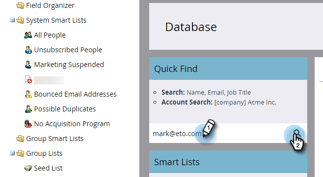

# Aktualisieren von Personendaten {#update-person-data}

## Mission: Aktualisieren der Kontaktinformationen einer Person oder anderer Daten {#mission-update-a-persons-contact-info-or-other-data}

>[!PREREQUISITES]
>
>* [Einrichten und eine Person hinzufügen](/help/marketo/getting-started/quick-wins/get-set-up-and-add-a-person.md){target="_blank"}
>* [Liste mit Personen importieren](/help/marketo/getting-started/quick-wins/import-a-list-of-people.md){target="_blank"}

Stellen wir uns vor, dass Ihnen auf Ihrer letzten Messe eine Person zusätzliche Kontaktinformationen gegeben hat. So aktualisieren Sie Personendaten.

## Die Person finden, die Sie aktualisieren müssen {#find-the-person-you-need-to-update}

1. Gehen Sie zu Ihrer [!UICONTROL Datenbank].

   

1. Den Namen oder die E-Mail-Adresse der Person durchsuchen.

   >[!TIP]
   >
   >Die Verwendung der zu suchenden E-Mail-Adresse führt zu einer schnelleren Suche.

   

1. Doppelklicken Sie, um die Personendetails zu öffnen.

   

   >[!TIP]
   >
   >Es gibt viele Möglichkeiten, Personendaten in Marketo zu aktualisieren. Siehe [Importieren einer Personenliste](/help/marketo/getting-started/quick-wins/import-a-list-of-people.md){target="_blank"} und [Ändern des &#x200B;](/help/marketo/product-docs/core-marketo-concepts/smart-campaigns/flow-actions/change-data-value.md){target="_blank"}&quot;.

## Aktualisieren der Personendaten {#update-the-person-data}

1. Geben Sie die neuen Informationen ein, die Sie erhalten haben, und schließen Sie dann die Registerkarte.

>[!CAUTION]
>
>* Achten Sie darauf, dass E-Mail-Adressen nur ASCII-Zeichen enthalten dürfen.
>
>* Marketo unterstützt **keine** E-Mail-Adressen, die Emojis enthalten.

>[!NOTE]
>
>Sobald Sie die Daten ändern, erkennen Smart Lists und Smart Campaign die neuen Informationen sofort.

## Aufgabe abgeschlossen {#mission-complete}

Gute Arbeit! Sie haben Ihre Personendaten aktualisiert.

  

[◄ Mission 8: Benachrichtigung des Vertriebsmitarbeiters](/help/marketo/getting-started/quick-wins/alert-the-sales-rep.md)

[Mission 10: Umleiten einer Landingpage-►](/help/marketo/getting-started/quick-wins/redirect-a-landing-page.md)
