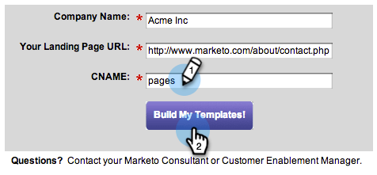

# Einrichtungsschritte {#setup-steps}

**Willkommen bei Marketo!**

Bevor Sie sich mit Marketo vertraut machen, müssen Sie einige Schritte ausführen.

Dazu gehören:

* einige grundlegende Kontoeinstellungen
* Branding Ihrer Landingpages-URLs und E-Mail-Links zur Verbesserung der Vertrauenswürdigkeit und Lieferbarkeit
* CRM synchronisieren
* Hinzufügen von Trackingcode zu Ihrer Firmenwebsite

>[!NOTE]
>
>Sie müssen diese Schritte nur ausführen, wenn Ihre Firma **neu bei Marketo** ist. Ist dies nicht der Fall, ist das Setup möglicherweise bereits abgeschlossen.

Einige Schritte erfordern Hilfe von Ihrem IT-Team.

>[!TIP]
>
>Wenn Sie diese Checkliste [ausdrucken](/help/marketo/getting-started/setup-steps/setup-checklist.md), können Sie die Elemente während des Abschlusses deaktivieren.

1. Melden Sie sich an und erstellen Sie zusätzliche Marketing-Benutzer

1. Melden Sie sich [hier](https://app.marketo.com/) mit den per E-Mail erhaltenen Anmeldeinformationen bei Marketo an.

   

Herzlichen Glückwunsch! Sie sind jetzt in Marketo und können Beginn erforschen. Möglicherweise möchten Sie Ihre Kollegen im Marketingteam einladen, sich Ihnen anzuschließen. Dazu können Sie neue Benutzer hinzufügen.

Gehen Sie zum **Admin** -Bereich.

>[!TIP]
>
>Während Sie hier sind, können Sie auf **Mein Konto** klicken, um Ihre Konto- und Ortseinstellungen zu ändern und einen neuen Abonnement festzulegen.

>[!NOTE]
>
>**Administratorberechtigungen erforderlich**

Klicken Sie auf **Benutzer und Rollen**.

Klicken Sie auf Neuen Benutzer **einladen**.

Füllen Sie die E-Mail-Adresse, den Vor- und Nachnamen Ihres Kollegen aus.

Geben Sie optional mit der Kalenderauswahl einen Grund für die Einladung und ein Ablaufdatum ein. Klicken Sie auf **OK**.

Klicken Sie auf **Weiter**.

>[!TIP]
>
>Ein Ablaufdatum ist ideal für kurzfristige externe Interessenten oder Berater, die Marketo nur für kurze Zeit benötigen.

>[!NOTE]
>
>Wenn das Ablaufdatum eintrifft, erhält der Benutzer eine Ablaufbenachrichtigung und das Konto wird gesperrt.

Wählen Sie eine Rolle und klicken Sie auf **Weiter**. Standardbenutzer haben Zugriff auf alle Bereiche außer Admin.

>[!NOTE]
>
>Zusätzlich zu den fünf integrierten Rollen können Sie auch benutzerdefinierte Rollen erstellen. Weitere Informationen zum [Verwalten von Benutzerrollen und -berechtigungen](/help/marketo/product-docs/administration/users-and-roles/managing-user-roles-and-permissions.md).

Sie können den Einladungstext jederzeit anpassen. Klicken Sie auf **Senden**.

Der neue Benutzer wird jetzt auf der Registerkarte &quot;Benutzer&quot;aufgelistet und sollte eine E-Mail mit einem Link erhalten, um ein Kennwort und eine Anmeldung zu erstellen. Nächster Schritt!

1. Einrichten Ihrer autorisierten Supportkontakte

   Möglicherweise haben Sie eine E-Mail von Marketo Support erhalten, in der Sie als Administrator des Marketing-Kundendiensts für Ihre Firma angegeben haben. In diesem Fall können Sie **autorisierte Supportkontakte** für Ihr Team einrichten. Nur autorisierte Support-Ansprechpartner können sich direkt über das [Marketing Support Portal](https://support.marketo.com)an den Marketing-Support wenden.

   >[!NOTE]
   >
   >Die Anzahl der Support-Kontakte, die Sie erstellen können, richtet sich nach dem von Ihnen erworbenen Paket. Diese Beschränkung ist in Ihrer E-Mail von MarketingTo Support angegeben.

   Die autorisierten Support-Kontaktdocs wurden in die Marketing Community verschoben. Bitte sehen Sie sich [diesen Artikel](https://nation.marketo.com/t5/Knowledgebase/Managing-Authorized-Support-Contacts/ta-p/254341)an.

   >[!NOTE]
   >
   >Nur Personen, die sich bei der Marketing Community angemeldet haben, werden in der Liste angezeigt. Wenn Sie die Person nicht finden können, stellen Sie sicher, dass sie sich zuerst bei der Community anmeldet.

1. Passen Sie Ihre Landingpages-URLs mit einem CNAME an

   >[!NOTE]
   >
   >Sind Sie ein Launch Pack-Kunde? Sie können diesen Schritt überspringen. Ihr Berater stellt Ihnen während des Startaufrufs ein Dokument zur IT-Einrichtung zur Verfügung.

   >[!NOTE]
   >
   >**Administratorberechtigungen erforderlich**

   Wählen Sie einen CNAME für Ihre Landingpages. Einige Beispiele:

   * **Los**.[CompanyDomain].com
   * **www2**.[CompanyDomain].com
   * **lp**.[CompanyDomain].com

   >[!TIP]
   >
   >Halte es kurz! Kürzere URLs lassen sich leichter merken. Wir empfehlen &quot;go&quot; als Domäne.

   Der erste Teil (fett) ist der `[LandingPageCNAME]`. Sie werden es in Schritt 5 benötigen.

   Rufen Sie zum Abrufen der Kontozeichenfolge, die Sie durch den CNAME Ihrer Landingpage ersetzen, den Bereich &quot;Admin&quot;auf.

   

   Klicken Sie auf **Landingpages**.

   

   Kopieren Sie die Kontozeichenfolge aus den Einstellungen für die Landingpage.

   

   Das ist der `[AccountString]`. Speichern Sie es. Sie müssen es IT in Schritt 5 geben.

Konfigurieren Sie Ihre Domäneneinstellungen, damit Landingpages die Domäne Ihrer Firma anstelle von Marketo verwenden (wo sie gehostet werden).

1. E-Mail-Auslieferung sicherstellen

   >[!NOTE]
   >
   >Sind Sie ein Launch Pack-Kunde? Sie können diesen Schritt überspringen. Ihr Berater stellt Ihnen während des Startaufrufs ein Dokument zur IT-Einrichtung zur Verfügung.

   Es gibt mehrere Maßnahmen, die Sie ergreifen können, um sicherzustellen, dass die E-Mails möglichst viele Ihrer Mitarbeiter erreichen.

   1. **Markieren Sie Ihre Tracking-Links**. Sie können einen CNAME auswählen, um Ihre eigene Domäne (anstelle von Marketo) in den Links zu verwenden, die Sie in E-Mails von Marketo einschließen. Dies stärkt Ihr Domain-Branding und erhöht das Vertrauen und die Lieferbarkeit mit Ihren Empfänger.
   1. **hinzufügen Sie Marketo in Ihre Corporate E-Mail-Zulassungsliste.** Es ist eine gängige Best Practice, vor dem Versenden von E-Mails an tatsächliche Personen Test-E-Mails an Ihre Testkonten zu senden. Durch den auf die Zulassungsliste setz von Marketo können Sie verhindern, dass diese Test-E-Mails blockiert oder als Spam gekennzeichnet werden.
   1. **Richten Sie SPF und DKIM ein.** Diese Technologien garantieren Ihren Empfängern, dass Ihre Marketo-E-Mails kein Spam sind. Gehen Sie wie folgt vor, um zu verhindern, dass die Spam-Filter von Empfängern Ihre Marketo-E-Mails ablehnen, und [richten Sie einen SPF und einen DKIM für Ihre E-Mail-Zustellbarkeit](/help/marketo/product-docs/email-marketing/deliverability/set-up-spf-and-dkim-for-your-email-deliverability.md)ein.
   1. **Richten Sie einen MX-Datensatz für Ihre Domäne ein.** Ein MX-Datensatz ermöglicht es Ihnen, E-Mails an die Domäne zu senden, von der Sie E-Mails senden, um Antworten zu verarbeiten und automatische Antworten zu erhalten. Wenn Sie von Ihrer Unternehmensdomäne aus senden, haben Sie diese wahrscheinlich bereits konfiguriert. Andernfalls können Sie in der Regel so einrichten, dass sie dem MX-Datensatz Ihrer Unternehmensdomäne zugeordnet werden.
   1. **Empfohlene Einstellungen für die Von-Adresse.** Sie müssen eine gültige, vorhandene und funktionierende E-Mail-Domäne in der &quot;Von-Adresse&quot;in allen E-Mail-Kampagnen verwenden. Es kann sinnvoll sein, eine Subdomäne Ihrer Unternehmensdomäne zu konfigurieren, anstatt sie von Ihrer Unternehmensdomäne zu senden. Dadurch wird sichergestellt, dass Probleme von Ihrem Corporate Mailstream nicht Ihren Marketo Mailstream beeinträchtigen und umgekehrt. Darüber hinaus wird E-Mail von something@nonexistentdomain.com gefiltert oder blockiert. Jede Domäne, die in der Absenderadresse verwendet wird, muss über ein gültiges und funktionierendes Postmaster@- und Missbrauchskonto verfügen.
Wenn Sie Google-Apps zum Hosten Ihrer E-Mail-Adresse verwenden, können Sie keine Missbrauchs@- oder Postmaster@-E-Mails unter Ihrer Domäne erstellen. Um dies zu umgehen, müssen Sie Gruppen namens &quot;Missbrauch&quot;und &quot;Postmaster&quot;erstellen. Benutzer, die Mitglieder dieser Gruppen sind, erhalten E-Mails, die an diese Adressen gesendet werden (z.B. postmaster@domain.com). Detaillierte Anweisungen zum Erstellen von Gruppen finden Sie [hier](https://support.google.com/a/answer/33343#adminconsole).

   Wählen Sie einen CNAME für E-Mail-Tracking-Links (wählen Sie einen CNAME, der _sich von dem in Schritt 3 ausgewählten CNAME der Landingpage unterscheidet_ ). Einige Beispiele:

   * go2.[CompanyDomain].com
   * em.[CompanyDomain].com
   * Wow.[CompanyDomain].com

   Der erste Teil ist das E-Mail-Tracking CNAME, `[EmailTrackingCNAME]`. Sie müssen es in Schritt 5 IT geben.

   >[!CAUTION]
   >
   >E-Mail- und Landingpage-CNAMEs müssen unterschiedlich sein. Vermeiden Sie außerdem CNAMEs wie &quot;track&quot;oder &quot;link&quot;. Er wird oft als Spam gekennzeichnet

   Um Ihren Marketo-Tracking-Link zu finden, gehen Sie zum **Admin** -Bereich.

   

   Klicken Sie auf **E-Mail**.

   

   Kopieren Sie den Link &quot;Verfolgung&quot;aus Ihren E-Mail-Einstellungen.

   Der Link zum Verfolgen befindet sich in folgendem Format: `mkto-[a-z][4 digits].com`.

   

   Das ist dein `[MktoTrackingLink]`. Speichern Sie es. Sie müssen es IT in Schritt 5 geben.

   &quot;Von&quot;-Domänen erfassen. Erstellen Sie eine Liste aller &quot;Von&quot;-Domänen (wie in, `[Sender]@[FromDomain].com`), die Sie zum Senden von E-Mails von Marketo verwenden möchten. Für die meisten gibt es nur einen.

   Beispiel: &quot;marketo.com&quot;, &quot;info.marketo.com&quot;. Das sind `[FromDomain1]``[FromDomain2]`, usw. Speichern Sie sie. Sie müssen sie in Schritt 5 IT übergeben.

   Sie haben jetzt alle Informationen, die Sie benötigen, um Ihre Anfrage an IT!

1. IT-Abteilung bitten, Protokolle zu konfigurieren

   >[!NOTE]
   >
   >Sind Sie ein Launch Pack-Kunde? Sie können diesen Schritt überspringen. Ihr Berater stellt Ihnen während des Startaufrufs ein Dokument zur IT-Einrichtung zur Verfügung.

   Nachdem Sie alle erforderlichen Informationen gesammelt haben, können Sie eine Anfrage an die IT senden. Sie können den unten stehenden Text als Vorlage verwenden und den fett gedruckten Text durch Ihre eigenen Informationen ersetzen.

   [Fügen Sie einen Link zu diesem Artikel](/help/marketo/getting-started/setup-steps/configure-protocols-for-marketo.md)hinzu.

   Fügen Sie diesen Text in die E-Mail ein und ersetzen Sie die fett hervorgehobenen Platzhalter:

   >[!NOTE]
   >
   >Siehe Schritte 3 und 4 oben, um den Text zu bestimmen, der die Platzhalter ersetzen soll. Denken Sie daran, dass `[LandingPageCNAME]` und `[EmailTrackingCNAME]` muss anders sein.

`---------------------------------------------`

Sehr geehrte IT-Administratoren,

Unser Marketing-Team nutzt jetzt die Plattform Marketo, um mit unseren Mitarbeitern zu kommunizieren. Um eine großartige E-Mail-Zustellbarkeit sicherzustellen, müssen folgende Änderungen vorgenommen werden:

`1)` Fügen Sie für unsere Landingpages einen DNS-Eintrag (CNAME) für **[LandingPageCNAME]** hinzu.**[CompanyDomain]**.com mit Verweis auf **[AccountString]**.mktoweb.com.

`2)` Fügen Sie für unsere Tracking-Links in E-Mails einen DNS-Eintrag (CNAME) für **[EmailTrackingCNAME]** hinzu.**[CompanyDomain]**.com mit Verweis auf **[MktoTrackingLink]**.

`3)` Zulassungsliste Marketo.

    * Wenn Sie in unserer Zulassungsliste &quot;E-Mail-&quot;IP-Adressen verwenden, fügen Sie die unten aufgeführten IP-Adressen hinzu:
    199.15.212.0/22
    
    192.28.144.0/20
    
    192.28.160.0/19
    
    185.28.196.0/22
    
    130.248.172.0/24
    
    130.248.173.0/24
    
    103.237.104.0/22
    
    94.236.119.0/26

HINWEIS: Wenden Sie sich an die Marketing-Support-Abteilung, wenn Sie eine gekürzte Liste von IPs auf Zulassungslisten Ihrer Umgebung wünschen.

    * Wenn unser Anti-Spam-System von Domänen verwendet, fügen Sie Folgendes hinzu:

**`[FromDomain1]`**
**`[FromDomain2]`**

`4)` Wir müssen SPF und DKIM so einrichten, dass Marketo berechtigt ist, in unserem Namen signierte E-Mails zu versenden.

`a.` Um SPF einzurichten, fügen Sie bitte die folgende Zeile zu unseren DNS-Einträgen hinzu:

In TXT **[von Domäne]**:  v=spf1 mx ip4:**[Unternehmens-IP(s)]** beinhaltet: mktomail.com ~all

Wenn wir bereits einen SPF-Datensatz in unserem DNS-Eintrag haben, fügen Sie einfach Folgendes hinzu:

include:mktomail.com

`[`Ersetzen Sie **von Domäne** durch Ihre E-Mail von Domäne (z. B.: firma.com) und **CorpIP** mit der IP-Adresse Ihres Unternehmens-E-Mail-Servers (z. B.: 255 255 255 255).  Wenn Sie E-Mails von mehreren Domänen über Marketo senden möchten, sollten Ihre IT-Mitarbeiter diese Zeile für jede Domäne (in einer Zeile) hinzufügen.`]`

`b.` Erstellen Sie für DKIM DNS-Ressourcendatensätze für jede Domäne, die wir einrichten möchten. Nachfolgend finden Sie die Hostdatensätze und TXT-Werte für jede Domäne, für die wir unterschreiben werden:

**`[DKIMDomain1]`**: Host Record ist **`[HostRecord1]`** und der TXT-Wert ist **[TXTValue1]**.

**`[DKIMDomain2]`**: Host Record ist **`[HostRecord2]`** und der TXT-Wert ist **`[TXTValue2]`**.

`[`Kopieren Sie den **HostRecord** und den **TXTValue** für jede **DKIMDomain** , die Sie eingerichtet haben, nachdem Sie die [Anweisungen hier](/help/marketo/product-docs/email-marketing/deliverability/set-up-a-custom-dkim-signature.md)befolgt haben. Vergessen Sie nicht, jede Domäne unter **Admin > E-Mail > DKIM** zu überprüfen, nachdem Ihr IT-Personal diesen Schritt abgeschlossen hat.`]`

`5)` Wir müssen sicherstellen, dass es einen gültigen MX-Datensatz für unsere VON-Domänen **[FromDomain1]**, **[FromDomain2]** usw. gibt. Können Sie das bestätigen? Falls nicht, konfigurieren Sie bitte die Zuordnung zu unserem Unternehmensdomäne MX Datensatz. Auf diese Weise können wir Antworten/Autoresponder auf unsere Marketing Mailings verarbeiten.

Lassen Sie mich wissen, wenn Sie diese Schritte durchgeführt haben, damit ich den Einrichtungsprozess mit Marketo abschließen kann.

Danke! Du bist der Beste!

Liebe,

**`[Your Name]`**

`---------------------------------------------`

Senden Sie die E-Mail an IT. Wir wissen, dass es einige Zeit dauern kann, bis die IT diese Aufgaben abschließt. Sie können mit Schritt 7 fortfahren. Denken Sie jedoch daran, dass Sie Schritt 6 zurückgeben müssen, um das Setup von Marketing abzuschließen.

1. Führen Sie nach Abschluss der IT das Setup von MarketingTo durch

   Nachdem die IT-Abteilung ihre Aufgaben abgeschlossen hat, führen Sie die folgenden Schritte aus, um Ihre Landingpages- und E-Mail-CNAMEs hinzuzufügen und die DKIM-Signatur zu aktivieren.

   Gehen Sie zum **Admin** -Bereich, um den CNAME Ihrer Landingpage Hinzufügen

   

   Wählen Sie Landingpages aus und klicken Sie im Bereich Einstellungen auf **Bearbeiten** .

   

   Geben Sie den neuen Domänennamen in das Feld Domänenname für Landingpages ein. Dies sollte in folgender Form erfolgen:

   `[LandingPageCNAME].[CompanyDomain].com`

   

   Geben Sie im Feld &quot;Fallback-Seite&quot;die URL ein, zu der die Benutzer gehen sollen, wenn eine Landingpage nicht verfügbar ist. Sie können Ihre Firma-Startseite verwenden, wenn Sie keine Ausweichseite haben. Geben Sie im Feld &quot;Homepage&quot;Ihre Firma-Website ein.

   

   Wählen Sie im Admin-Bereich E-Mail, um Ihren E-Mail-CNAME Hinzufügen

   

   Blättern Sie nach unten und klicken Sie auf **Bearbeiten**.

   

   Geben Sie im Feld Domäne Ihre E-Mail-Tracking-Domäne ein. Dies sollte in folgender Form erfolgen:

   `[EmailTrackingCNAME].[CompanyDomain].com`. Klicken Sie auf **Speichern**.

   

1. Senden einer URL für Landingpages- und E-Mail-Vorlagen

   Unsere Kreativdesigner können Ihnen maßgeschneiderte E-Mail- und Landingpage-Vorlagen zur Verfügung stellen, mit denen Sie Ihre Marketing-Programm schnell und einfach starten können. Sie müssen ihnen einige Informationen bereitstellen, damit sie die Vorlagen mit Ihrer Firma-Website und Ihrem Logo abgleichen können.

   >[!NOTE]
   >
   >Diese benutzerdefinierten Vorlagen stehen nur für Launch Pack-Kunden zur Verfügung.

   Wechseln Sie zum [Formular &quot;Entwurf und Erstellen](http://pages2.marketo.com/CESubmit-URL-ForTemplates.html) von Vorlagen&quot;. Füllen Sie Ihre Firmen aus.

   

   Geben Sie für die URL Ihrer Landingpage eine Beispiel-URL von der Website Ihrer Firma ein, die die Farben, das Logo und den Stil Ihrer Firma anzeigt. Die meisten Kunden verwenden eine Kontaktseite mit einem Formular.

   

   Geben Sie als CNAME den CNAME der Landingpage ein, den Sie in Schritt 3 ausgewählt haben (`[LandingPageCNAME]`). Senden Sie Ihre Anforderung.

   

   >[!NOTE]
   >
   >Ihre Vorlagen können erst ausgefüllt werden, wenn Ihre IT einen DNS-Datensatz für Ihren CNAME der Landingpage erstellt.

   Das ist&#39;s! Sie sollten Ihre neuen Vorlagen in 3-5 Werktagen im Marketo Design Studio sehen.

1. CRM integrieren

   Dies ist wahrscheinlich der spannendste Schritt Ihres Setups - es ist an der Zeit, Marketo mit all den Leads und Kontakten zu füllen, die Sie in Ihrem CRM gespeichert haben!

   Wählen Sie je nach CRM, das Ihre Firma verwendet, eine der folgenden Optionen.

   * [Integration von Marketo mit Salesforce.com](/help/marketo/product-docs/crm-sync/salesforce-sync/understanding-the-salesforce-sync.md)
   * [Marketo mit Microsoft Dynamics integrieren](/help/marketo/product-docs/crm-sync/microsoft-dynamics-sync/understanding-the-microsoft-dynamics-sync.md)

   >[!NOTE]
   >
   >Sie benötigen die Unterstützung des CRM-Administrators Ihrer Firma, um diese Schritte durchzuführen.

## 9. hinzufügen des Rückverfolgungscodes auf Ihrer Website {#add-tracking-code-to-your-website}

>[!NOTE]
>
>Sind Sie ein Launch Pack-Kunde? Sie können diesen Schritt überspringen. Ihr Berater wird Ihnen im Dokument mit IT-Setup-Anweisungen Munchkin-Code geben.

Marketo verfügt über ein benutzerdefiniertes Tracking-JavaScript (namens Munchkin), mit dem Sie persönliche Aktivitäten auf jeder Webseite verfolgen können. Munchkin ist erforderlich, um Ihre Website in Marketo zu integrieren. Gehen Sie wie folgt vor, um [Hinzufügen Munchkin-Rückverfolgungscode auf Ihrer Website](/help/marketo/product-docs/administration/additional-integrations/add-munchkin-tracking-code-to-your-website.md)zu verwenden.

>[!NOTE]
>
>Erlebnis mit HTML, das zum Hinzufügen des Trackingcodes erforderlich ist.

Alle Setup-Schritte sind vorbei. Es bleibt nur noch, in Marketo einzutauchen und es zu benutzen!
