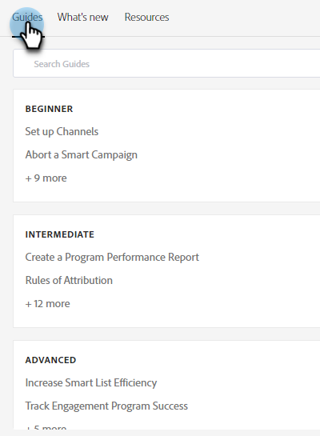

# Hilfezentrum {#help-center}

Das Hilfezentrum in Adobe Marketo Engage dient als zentraler Ort, um Unterstützung zu erhalten. Zusätzlich zu Verknüpfungen zu verschiedenen Ressourcen (z. B. [Produktdokumentation](/help/marketo/home.md){target="_blank"}, [Versionsinformationen](/help/marketo/release-notes/current.md){target="_blank"}, [Marketing Nation Community](https://nation.marketo.com/){target="_blank"}) können Sie auf nützliche produktinterne Anleitungen zugreifen, die nach Erfahrungsgrad angeordnet sind.

## So greifen Sie darauf zu {#how-to-access}

Klicken Sie nach der Anmeldung bei Marketo Engage auf das Hilfesymbol.

### Handbücher {#guides}

Handbücher dienen als schnelle Anleitungen für beliebte Funktionen.

1. Klicken Sie auf das gewünschte Handbuch, um es anzuzeigen.

   

1. Klicken Sie auf **Erste Schritte**.

   

1. Klicken Sie auf **Weiter**, um fortzufahren.

   

1. Klicken Sie auf **Fertig**, um die Anleitung zu beenden.

   

   >[!TIP]
   >
   >Sie können das Handbuch jederzeit verlassen, indem Sie auf **Verwerfen** klicken.

### Neue Funktionen {#whats-new}

Die Registerkarte Neue Funktionen enthält alle Details der neuesten Version von Marketo Engage.

>[!TIP]
>
>Klicken Sie unten auf das Pfeilsymbol, um die Seite in Experience League anzuzeigen.

### Ressourcen {#resources}

Die Registerkarte „Ressourcen“ bietet Ihnen schnellen und direkten Zugriff auf verschiedene Möglichkeiten, zusätzliche Hilfe zu Ihrer Marketo Engage-Instanz zu erhalten.

