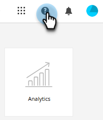

# Hilfezentrum {#help-center}

Das Hilfezentrum in Adobe Marketo Engage dient als zentraler Ort, um Unterstützung zu erhalten. Zusätzlich zu Verknüpfungen zu verschiedenen Ressourcen (z. B. [Produktdokumentation](/help/marketo/home.md){target="_blank"}, [Versionsinformationen](/help/marketo/release-notes/current.md){target="_blank"}, [Marketing Nation Community](https://nation.marketo.com/){target="_blank"}) können Sie auf nützliche produktinterne Anleitungen zugreifen, die nach Erfahrungsgrad angeordnet sind.

## So greifen Sie darauf zu {#how-to-access}

Es gibt zwei verschiedene Erlebnisse, je nachdem, ob Ihr Abonnement bereits in das Adobe Identitäts-Management-System (IMS) migriert wurde.

### Vor der Migration zu Adobe IMS {#pre-adobe-ims-integration}

Diese Schritte richten sich an Marketo Engage-Benutzende, die _noch nicht_ zu [Adobe IMS](/help/marketo/product-docs/administration/marketo-with-adobe-identity/adobe-identity-management-overview.md){target="_blank"} migriert wurden.

[Melden Sie sich bei Marketo Engage an](https://login.marketo.com/){target="_blank"} und klicken Sie auf das Hilfesymbol.

#### Handbücher {#guides}

Handbücher dienen als schnelle Anleitungen für beliebte Funktionen.

1. Klicken Sie auf das gewünschte Handbuch, um es anzuzeigen.

   

1. Klicken Sie auf **Erste Schritte**.

   

1. Klicken Sie auf **Weiter**, um fortzufahren.

   

1. Klicken Sie auf **Fertig**, um die Anleitung zu beenden.

   

   >[!TIP]
   >
   >Sie können das Handbuch jederzeit verlassen, indem Sie auf **Verwerfen** klicken.

#### Neue Funktionen {#whats-new}

Die Registerkarte „Neue Funktionen“ enthält Details zur neuesten Version von Marketo Engage.

>[!TIP]
>
>Klicken Sie unten auf das Pfeilsymbol, um die Seite in Experience League anzuzeigen.

#### Ressourcen {#resources}

Die Registerkarte „Ressourcen“ bietet Ihnen schnellen und direkten Zugriff auf verschiedene Möglichkeiten, zusätzliche Hilfe zu Ihrer Marketo Engage-Instanz zu erhalten.

### Nach der Migration zu Adobe IMS {#post-adobe-ims-integration}

Diese Schritte richten sich an Marketo Engage-Benutzende, die bereits zu [Adobe IMS](/help/marketo/product-docs/administration/marketo-with-adobe-identity/adobe-identity-management-overview.md){target="_blank"} migriert wurden.

[Melden Sie sich bei Marketo Engage an](https://experience.adobe.com/){target="_blank"} und klicken Sie auf das Hilfesymbol.

Das Hilfezentrum wird angezeigt. Klicken Sie auf eine der aufgelisteten Hilferessourcen, um zum entsprechenden Bereich zu gelangen. Sie können auch nach bestimmten Begriffen suchen.

Handbücher (ehemals Teil des Hilfezentrums vor der Migration zu Adobe IMS) befinden sich jetzt im linken Navigationsbereich.

Das Guide Center verfügt über zwei Registerkarten: „Handbücher“ und „Neue Funktionen“. Handbücher dienen als schnelle Anleitungen für beliebte Funktionen in Marketo Engage. Klicken Sie auf das gewünschte Handbuch oder suchen Sie nach einem bestimmten Handbuch.

Die Registerkarte „Neue Funktionen“ enthält Details zur neuesten Version von Marketo Engage.

