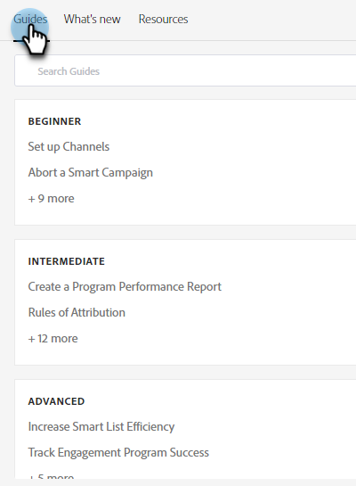

# Hilfezentrum {#help-center}

Das Help Center in Adobe Marketo Engage dient als zentralisierter Ort, um Hilfe zu erhalten. Zusätzlich zur Verknüpfung mit verschiedenen Ressourcen (z. B. [Produktdokumentation](/help/marketo/home.md){target="_blank"}, [Versionsinformationen](/help/marketo/release-notes/current.md){target="_blank"}, die [Community der Marketing-Nationen](https://nation.marketo.com/){target="_blank"}) können Sie auf hilfreiche produktinterne Umgehungen zugreifen, die nach Erlebnisebene organisiert sind.

## Zugriff {#how-to-access}

Nachdem Sie sich bei Marketo Engage angemeldet haben, klicken Sie auf das Hilfesymbol.

### Anleitungen {#guides}

Handbücher dienen als schnelle Anleitungen für beliebte Funktionen.

1. Klicken Sie auf das gewünschte Handbuch, um es anzuzeigen.

   

1. Klicken Sie auf **Erste Schritte**.

   

1. Klicken Sie auf **Weiter** , um fortzufahren.

   

1. Klicken Sie auf **Fertig** , um die exemplarische Vorgehensweise zu beenden.

   

   >[!TIP]
   >
   >Beenden Sie das Handbuch jederzeit, indem Sie auf **Beenden** klicken.

### Neue Funktionen {#whats-new}

Der Tab Neue Funktionen enthält alle Details der neuesten Version von Marketo Engage.

>[!TIP]
>
>Klicken Sie unten auf das Pfeilsymbol, um die Seite im Experience League anzuzeigen.

### Ressourcen {#resources}

Im Tab Ressourcen haben Sie schnellen und direkten Zugriff auf verschiedene Möglichkeiten, zusätzliche Hilfe bei Ihrer Marketo Engage-Instanz zu erhalten.

