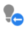
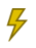

# Marketo Engage-Symbol Glossar {#icon-glossary}

Unten finden Sie die Symbole für die aktuelle Adobe Marketo Engage-Benutzeroberfläche. Wenn Sie auf die Marketo Classic-Symbole verweisen müssen, können diese [hier finden](/help/marketo/getting-started/things-to-know/classic-icon-glossary.md).

## Allgemeine Symbole {#general-icons}

<table> 
 <tbody>
  <tr>
   <th>Altes Symbol</th> 
   <th> Neues Symbol</th> 
   <th>Beschreibung</th> 
  </tr>
  <tr>
   <td><strong>Nicht zutreffend</strong></td> 
   <td></td> 
   <td>Konto-Smart List</td> 
  </tr>
  <tr>
   <td></td> 
   <td></td> 
   <td>Batch-Kampagne - aktiv</td> 
  </tr>
  <tr>
   <td></td> 
   <td></td> 
   <td>Batch-Kampagne - inaktiv</td> 
  </tr>
  <tr>
   <td></td> 
   <td></td> 
   <td>Standardprogramm</td> 
  </tr>
  <tr>
   <td></td> 
   <td></td> 
   <td>E-Mail</td> 
  </tr>
  <tr>
   <td></td>
   <td></td> 
   <td>E-Mail-Programm</td> 
  </tr>
  <tr>
   <td></td> 
   <td></td> 
   <td>E-Mail-Vorlage</td> 
  </tr>
  <tr>
   <td></td> 
   <td></td> 
   <td>Engagementprogramm</td> 
  </tr>
  <tr>
   <td></td> 
   <td></td> 
   <td>Veranstaltungsprogramm</td> 
  </tr>
  <tr>
   <td></td> 
   <td></td> 
   <td>Ausführbare Kampagne</td> 
  </tr>
  <tr>
   <td></td> 
   <td></td> 
   <td>Feldorganisator</td> 
  </tr>
  <tr>
   <td></td> 
   <td></td> 
   <td>Filter</td> 
  </tr>
  <tr>
   <td><strong>Nicht zutreffend</strong></td> 
   <td></td> 
   <td>Filter - aktiv</td> 
  </tr>
  <tr>
   <td></td> 
   <td></td> 
   <td>Ordner</td> 
  </tr>
  <tr>
   <td></td> 
   <td></td> 
   <td>Ordner - archiviert</td> 
  </tr>
  <tr>
   <td></td> 
   <td></td> 
   <td>Ordner - freigegeben</td> 
  </tr>
  <tr>
   <td></td> 
   <td></td> 
   <td>Ordner - gesperrt</td> 
  </tr>
  <tr>
   <td></td> 
   <td></td> 
   <td>Formular</td> 
  </tr>
  <tr>
   <td></td> 
   <td></td> 
   <td>Bilder (und Dateien)</td> 
  </tr>
  <tr>
   <td></td> 
   <td></td> 
   <td>In-App-Nachrichten</td> 
  </tr>
  <tr>
   <td></td> 
   <td></td> 
   <td>In-App-Programm</td> 
  </tr>
  <tr>
   <td></td> 
   <td></td> 
   <td>Landingpage</td> 
  </tr>
  <tr>
   <td></td> 
   <td></td> 
   <td>Landing Page-Vorlage</td> 
  </tr>
  <tr>
   <td></td> 
   <td></td> 
   <td>Modell</td> 
  </tr>
  <tr>
   <td></td> 
   <td></td> 
   <td>Umfrage</td> 
  </tr>
  <tr>
   <td></td> 
   <td></td> 
   <td>Push-Benachrichtigung</td> 
  </tr>
  <tr>
   <td></td> 
   <td></td> 
   <td>Empfehlungsangebot</td> 
  </tr>
  <tr>
   <td></td> 
   <td></td> 
   <td>Bericht</td> 
  </tr>
  <tr>
   <td><strong>Nicht zutreffend</strong></td> 
   <td></td> 
   <td>Suche</td> 
  </tr>
  <tr>
   <td></td> 
   <td></td> 
   <td>Segmente</td> 
  </tr>
  <tr>
   <td></td> 
   <td></td> 
   <td>Smart List</td> 
  </tr>
  <tr>
   <td></td> 
   <td></td> 
   <td>Smart List - cached</td> 
  </tr>
  <tr>
   <td></td> 
   <td></td> 
   <td>SMS-Nachricht</td> 
  </tr>
  <tr>
   <td></td> 
   <td></td> 
   <td>Ausschnitte</td> 
  </tr>
  <tr>
   <td></td> 
   <td></td> 
   <td>Social-Schaltfläche</td> 
  </tr>
  <tr>
   <td></td> 
   <td></td> 
   <td>Statische Liste</td> 
  </tr>
  <tr>
   <td></td> 
   <td></td> 
   <td>Gewinnspiele</td> 
  </tr>
  <tr>
   <td></td> 
   <td></td> 
   <td>Testgruppe</td> 
  </tr>
  <tr>
   <td></td> 
   <td></td> 
   <td>Trigger - aktiv</td> 
  </tr>
  <tr>
   <td><strong>Nicht zutreffend</strong></td> 
   <td></td> 
   <td>Trigger - inaktiv</td> 
  </tr>
  <tr>
   <td></td> 
   <td></td> 
   <td>Arbeitsbereich</td> 
  </tr>
  <tr>
   <td></td> 
   <td></td> 
   <td>YouTube-Video</td> 
  </tr>
 </tbody>
</table>

## Stapelkampagnen {#batch-campaigns}

<table> 
 <tbody>
  <tr>
   <th>Altes Symbol</th> 
   <th> Neues Symbol</th> 
   <th>Beschreibung</th> 
  </tr>
  <tr>
   <td></td> 
   <td></td> 
   <td>Wurde durchgeführt, keine anstehend</td> 
  </tr>
  <tr>
   <td></td> 
   <td></td> 
   <td>Ungültig</td> 
  </tr>
  <tr>
   <td></td> 
   <td></td> 
   <td>nie ausführen</td> 
  </tr>
  <tr>
   <td></td> 
   <td></td> 
   <td>Wird durchgeführt, im Warteschritt</td> 
  </tr>
  <tr>
   <td></td> 
   <td></td> 
   <td>Geplant für Ausführung</td> 
  </tr>
  <tr>
   <td></td> 
   <td></td> 
   <td>Geplant für die erneute Ausführung</td> 
  </tr>
  <tr>
   <td></td> 
   <td></td> 
   <td>Verwendung durch Krankenpflege</td> 
  </tr>
 </tbody>
</table>

## Auslöserkampagnen {#trigger-campaigns}

<table> 
 <tbody>
  <tr>
   <th>Altes Symbol</th> 
   <th> Neues Symbol</th> 
   <th>Beschreibung</th> 
  </tr>
  <tr>
   <td></td> 
   <td></td> 
   <td>Aktiv</td> 
  </tr>
  <tr>
   <td></td> 
   <td></td> 
   <td>wird angefordert</td> 
  </tr>
  <tr>
   <td><strong>Nicht zutreffend</strong></td> 
   <td></td> 
   <td>Inaktiv</td> 
  </tr>
  <tr>
   <td></td> 
   <td></td> 
   <td>Ungültig</td> 
  </tr>
 </tbody>
</table>

## E-Mail-Programme {#email-programs}

<table> 
 <tbody>
  <tr>
   <th>Altes Symbol</th> 
   <th> Neues Symbol</th> 
   <th>Beschreibung</th> 
  </tr>
  <tr>
   <td></td> 
   <td></td> 
   <td>Abgebrochen</td> 
  </tr>
  <tr>
   <td></td> 
   <td></td> 
   <td>Abgeschlossen</td> 
  </tr>
  <tr>
   <td></td> 
   <td></td> 
   <td>Nicht genehmigt</td> 
  </tr>
  <tr>
   <td></td> 
   <td></td> 
   <td>Geplant</td> 
  </tr>
 </tbody>
</table>

## Engagementprogramme {#engagement-programs}

<table> 
 <tbody>
  <tr>
   <th>Altes Symbol</th> 
   <th> Neues Symbol</th> 
   <th>Beschreibung</th> 
  </tr>
  <tr>
   <td></td> 
   <td></td> 
   <td>Aus</td> 
  </tr>
  <tr>
   <td></td> 
   <td></td> 
   <td>Ein</td> 
  </tr>
 </tbody>
</table>

## In-App-Programme {#in-app-programs}

<table> 
 <tbody>
  <tr>
   <th>Altes Symbol</th> 
   <th> Neues Symbol</th> 
   <th>Beschreibung</th> 
  </tr>
  <tr>
   <td></td> 
   <td></td> 
   <td>Genehmigt</td> 
  </tr>
  <tr>
   <td></td> 
   <td></td> 
   <td>Not Configured Yet</td> 
  </tr>
  <tr>
   <td></td> 
   <td></td> 
   <td>Pausiert</td> 
  </tr>
  <tr>
   <td><strong>Nicht zutreffend</strong></td> 
   <td></td> 
   <td>Geplant</td> 
  </tr>
  <tr>
   <td></td> 
   <td></td> 
   <td>Beendet</td> 
  </tr>
 </tbody>
</table>

## Assets {#assets}

<table> 
 <tbody>
  <tr>
   <th>Altes Symbol</th> 
   <th> Neues Symbol</th> 
   <th>Beschreibung</th> 
  </tr>
  <tr>
   <td></td> 
   <td></td> 
   <td>Genehmigt</td> 
  </tr>
  <tr>
   <td></td> 
   <td></td> 
   <td>Entwurf</td> 
  </tr>
  <tr>
   <td></td> 
   <td></td> 
   <td>Mit Entwurf genehmigt</td> 
  </tr>
 </tbody>
</table>

## Segmente {#segments}

<table> 
 <tbody>
  <tr>
   <th>Altes Symbol</th> 
   <th> Neues Symbol</th> 
   <th>Beschreibung</th> 
  </tr>
  <tr>
   <td><strong>Nicht zutreffend</strong></td> 
   <td></td> 
   <td>Genehmigt - Berechnung</td> 
  </tr>
  <tr>
   <td><strong>Nicht zutreffend</strong></td> 
   <td></td> 
   <td>Genehmigt - in Neuberechnung</td> 
  </tr>
  <tr>
   <td><strong>Nicht zutreffend</strong></td> 
   <td></td> 
   <td>Entwurf - Berechnung</td> 
  </tr>
 </tbody>
</table>
