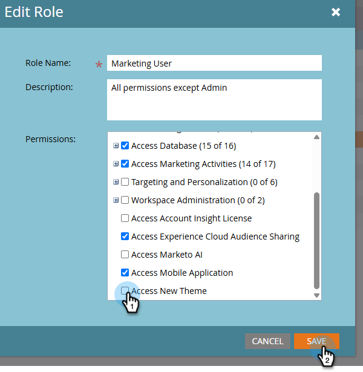
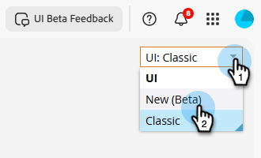

# Neue Benutzeroberfläche von Marketo Engage {#new-ui}

Vielen Dank für Ihre Teilnahme an der Betaversion der neuen Marketo Engage-Benutzeroberfläche. Dieses Update modernisiert die Formatierung von Marketo Engage und verbessert die Reaktionsfähigkeit, ohne die Funktionalität zu verändern. Auf die neue Benutzeroberfläche kann über ein Dropdown-Menü zugegriffen werden, das oben rechts auf den meisten Seiten in Marketo Engage angezeigt wird.

## Vorbereitung {#before-starting}

Bevor Sie auf die neue Benutzeroberfläche zugreifen können, benötigen Sie Folgendes:

* wurde die Berechtigung _Zugriff auf neue Benutzeroberfläche_ für eine oder mehrere Ihrer Marketo Engage-Benutzerrollen gewährt.

* Akzeptierte die Bedingungen für offene Beta-Tests, wenn dazu aufgefordert wurde.

## Neue UI-Berechtigung {#new-ui-permission}

Admins können _Zugriff auf neue_) einer oder mehreren Benutzerrollen gewähren.

1. Wählen Sie im Bereich **Admin** die Option **Benutzer und Rollen** aus.

   

1. Klicken Sie auf die **Rollen**. Wählen Sie die gewünschte Rolle aus und klicken Sie auf **Rolle bearbeiten**.

   

>[!NOTE]
>
>Sie können auch eine neue Rolle erstellen.

1. Aktivieren Sie das **Zugriff auf neues Design** und klicken Sie auf **Speichern**.

   

## Neue und klassische Benutzeroberfläche {#new-and-classic}

Um zur neuen Benutzeroberfläche zu wechseln, klicken Sie auf das Dropdown-Menü in der oberen rechten Ecke und wählen Sie **Neu (Beta)**.

Wenn Sie aus irgendeinem Grund zurückkehren müssen, klicken Sie erneut auf die Dropdown-Liste Benutzeroberfläche und wählen Sie **Classic**.

## Senden von Feedback {#feedback}

Wir freuen uns über Ihr Feedback. Wenn beim Kennenlernen der neuen Benutzeroberfläche Probleme beim Zugriff auf oder bei der Verwendung der Funktion auftreten oder Sie Vorschläge oder Bedenken haben, klicken Sie oben rechts auf die Schaltfläche Beta-Feedback für die Benutzeroberfläche .

