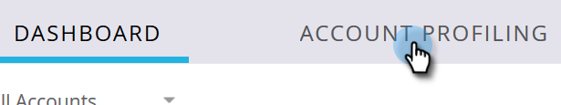
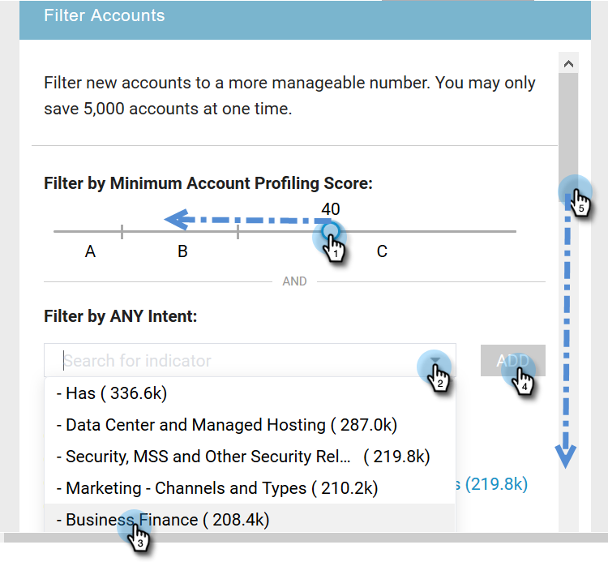

# Neue Kontoerkennung {#new-account-discovery}

Mit der neuen Kontoerfassung können Sie mithilfe von AI-basierten Empfehlungen aus Ihrem idealen Profil neue Zielgruppen finden.

>[!PREREQUISITES]
>
>[Kontoprofilerstellung einrichten](http://docs.marketo.com/x/FgAKAQ)

>[!TIP]
>
>Es wird empfohlen, die Schaltfläche **Vorhandene Konten aktualisieren** zu betätigen, bevor Sie eine neue Kontosuche durchführen, um sicherzustellen, dass Sie die neuesten Daten sehen. Diese Aktualisierung kann bis zu 24 Stunden dauern.

1. Klicken Sie in &quot;My Marketo&quot;auf **ABM**.

   

1. Klicken Sie auf die Registerkarte **Kontoprofilerstellung**.

   

1. Klicken Sie auf die Registerkarte **Neue Konten**.

   

   >[!NOTE]
   >
   >Neue Konten zeigen eine Liste von Konten an, die noch nicht in ABM enthalten sind. Es handelt sich dabei um Konten, die je nach von Ihnen gewählten Filtern neu sein können.

1. Wählen Sie alle entsprechenden Filter aus (dieser Teil ist stark anpassbar, das folgende Beispiel zeigt die Filterung).

   

1. Klicken Sie unten rechts auf der Seite auf **Alle speichern und Liste erstellen**.

   

   >[!NOTE]
   >
   >Wenn Sie nur einige der gewünschten Konten sehen, haben Sie die Möglichkeit, nach Abschluss des Vorgangs auf einzelne Konten zu klicken und auf **Ausgewählte Konten speichern** zu klicken.

1. Sie können Ihre Liste zu einer eigenen neuen Konto-Liste machen oder zu einer vorhandenen hinzufügen. In diesem Beispiel erstellen wir ein neues.

   

   >[!NOTE]
   >
   >Um die Datei in einer vorhandenen Konto-Liste zu speichern, wählen Sie diese Option aus, klicken Sie auf die Dropdown-Liste und wählen Sie die gewünschte Konto-Liste aus und klicken Sie auf **Weiter**.

1. Klicken Sie auf **Speichern**.

   

   >[!NOTE]
   >
   >Sie können bis zu 5.000 Konten gleichzeitig speichern. Wenn Ihre Suche 10.000 Ergebnisse liefert, müssen Sie die ersten 5.000 (Top) speichern, dann die Filter zurücksetzen und die nächsten 5.000 speichern. Die Kontogrenze von **total** beträgt eine Million.

1. Klicken Sie auf **OK**.

   

   >[!TIP]
   >
   >Nachdem Sie Ihre Konten gespeichert haben, können Sie eine [übereinstimmende Audience auf LinkedIn](http://docs.marketo.com/x/rYGZAQ) verwenden, um sie zu Zielgruppe.

