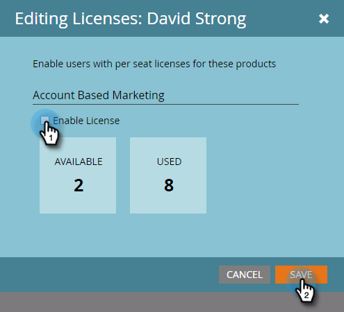

# Lizenz ausstellen {#issue-a-license}

Sie müssen Benutzer mit einer Lizenz für die Verwendung von ABM einrichten. Hier ist, wie man das macht.

>[!NOTE]
>
>Die Anzahl der verfügbaren Lizenzen hängt von Ihrem Abonnement ab. Wenn Sie mehr benötigen, wenden Sie sich bitte an Ihren Vertriebspartner.

1. Klicken Sie auf **Admin**.

   

1. Klicken Sie auf **Benutzer und Rollen**. Wählen Sie den Benutzer aus, für den die Lizenz ausgestellt werden soll, klicken Sie auf die Dropdownliste **Ausgabenlizenz** und wählen Sie **Kontobasiertes Marketing**.

   

1. Markieren Sie das Kontrollkästchen **Lizenz aktivieren** und klicken Sie auf **Speichern**.

   

   >[!NOTE]
   >
   >Um die Lizenz eines Benutzers zu entfernen, führen Sie Schritt 1 aus, und markieren Sie dann *un* das Kontrollkästchen und klicken Sie auf **Speichern**.

