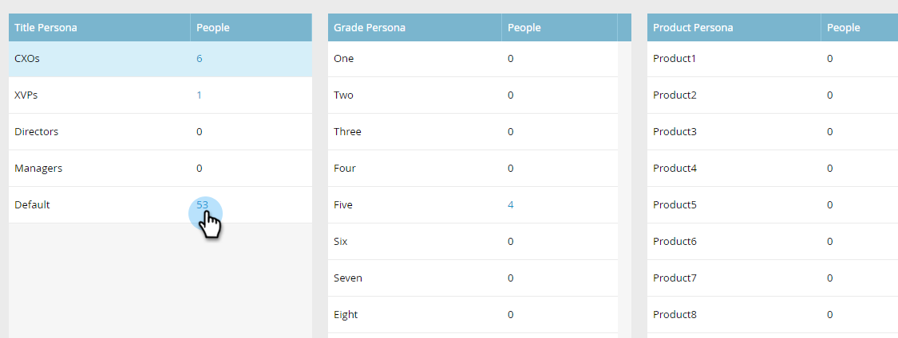

# Verwenden von Personas {#using-personas}

Personas sind eine großartige Möglichkeit, Ihre ABM-Audience und Ihren Markt auf eine bestimmte Gruppe von Personen zu segmentieren.

## hinzufügen {#add-a-persona}

1. Klicken Sie in My Marketo auf **Admin**.

   

1. Wählen Sie in der Struktur **ABM**.

   

1. Klicken Sie auf **Bearbeiten**.

   

   >[!NOTE]
   >
   >Die Job Title-Persona ist standardmäßig enthalten. Es kann nicht geändert oder gelöscht werden.

1. Um weitere Personen hinzuzufügen, klicken Sie auf **+Hinzufügen**.

   

1. Benennen Sie Ihre Person und wählen Sie das entsprechende Feld in der Dropdownliste aus. Sie können bis zu zwei weitere Personen hinzufügen. Klicken Sie abschließend auf **Speichern** .

   

   >[!NOTE]
   >
   >Nur Salesforce-benutzerdefinierte Felder des Typs &quot;picklist&quot;, die mit Ihrer Marketo-Instanz synchronisiert wurden, stehen beim Erstellen einer Persona in der Dropdown-Liste &quot;persona&quot; zur Verfügung.

## Ansicht Ihrer Persönlichkeiten {#view-your-personas}

Ansicht Ihrer Personalien durch Besuch eines bestimmten benannten Kontos.

1. Wählen Sie das gewünschte benannte Konto aus.

   

1. Klicken Sie auf die Registerkarte **Personas** .

   

1. Alle Ihre Personen werden aufgelistet. Klicken Sie auf eine Zahl, um die Liste der Menschen zu sehen.

   

   >[!NOTE]
   >
   >Das X im Titel Persona dient als Platzhalterzeichen. &quot;CXO&quot;umfasst beispielsweise CEOs, CFOs usw.

## Persönliche Filter {#persona-filters}

1. Verwenden Sie persönliche Filter in einer intelligenten Liste, um eine bestimmte Personengruppe zu vermarkten.

