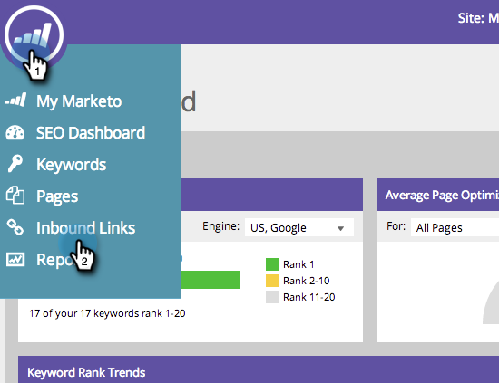

# SEO - Vorschläge für eingehende Links abrufen {#seo-get-inbound-link-suggestions}

Marketo kann vorschlagen, welche eingehenden Links für Ihre [Offpage-Optimierung](/help/marketo/product-docs/additional-apps/seo/understanding-seo/understanding-search-engine-optimization.md) nützlich sind.

1. Wechseln Sie zum Abschnitt **[!UICONTROL Eingehende Links]** .

   

1. Klicken Sie auf **[!UICONTROL Empfehlungen abrufen]**.

   

1. Geben Sie einen Suchbegriff ein. Klicken Sie auf **[!UICONTROL Links vorschlagen]**.

   

1. Wählen Sie die Links aus. Klicken Sie auf **[!UICONTROL Ausgewählte hinzufügen]**.

   

   >[!TIP]
   >
   >Wussten Sie, dass Sie [Ihren Link zu einer neuen oder vorhandenen Liste hinzufügen können](/help/marketo/product-docs/additional-apps/seo/inbound-links/seo-add-remove-an-inbound-link-url-from-a-list.md)? Schau es dir an!

Fantastisch! Diese hinzugefügten Links werden nun verfolgt.

>[!NOTE]
>
>[Grundlegendes zu eingehenden Links](/help/marketo/product-docs/additional-apps/seo/inbound-links/seo-understanding-inbound-links.md)
