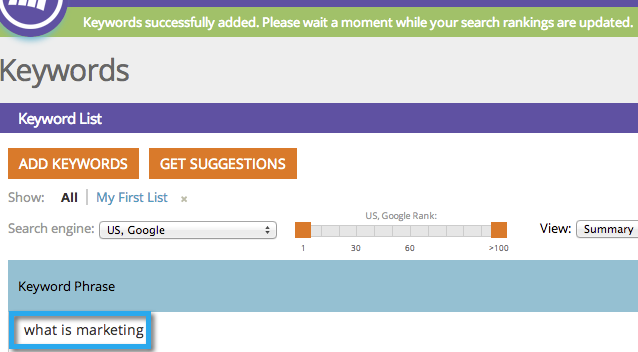
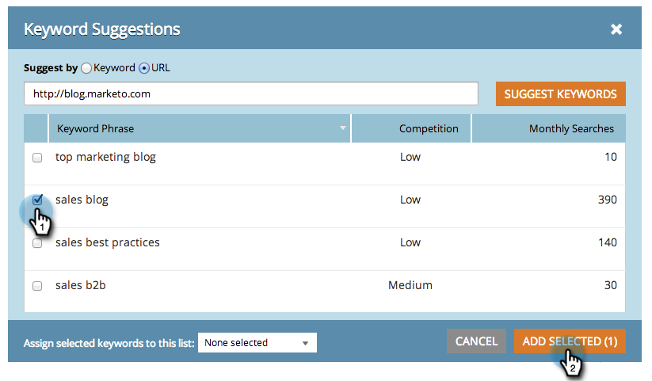

# SEO – Vorschläge für Keywords {#seo-get-suggested-keywords}

Marketo SEO kann vorschlagen, welche Keywords Sie verfolgen sollten. Wir können Vorschläge basierend auf einem Keyword oder der URL einer Website geben.

>[!IMPORTANT]
>
>Am 31. März 2026 wird Marketo Engage die Suchmaschinenoptimierungsfunktion einstellen. Bitte exportieren Sie alle relevanten Daten am oder vor dem 30. März. [Weitere Informationen](https://nation.marketo.com/t5/product-blogs/marketo-engage-seo-feature-deprecation/ba-p/359060){target="_blank"}.
>
>* [Exportprobleme](https://experienceleague.adobe.com/de/docs/marketo/using/product-docs/additional-apps/seo/pages/seo-export-issues-to-csv){target="_blank"}
>* [Exportieren von Keyword-Ergebnissen](https://experienceleague.adobe.com/de/docs/marketo/using/product-docs/additional-apps/seo/keywords/seo-exporting-keyword-results){target="_blank"}
>* [Export Keyword Trends](https://experienceleague.adobe.com/de/docs/marketo/using/product-docs/additional-apps/seo/reports/seo-use-the-keyword-trends-report#exporting-data){target="_blank"}
>* [Trends mit dem Konkurrenten-Keyword exportieren](https://experienceleague.adobe.com/de/docs/marketo/using/product-docs/additional-apps/seo/reports/seo-use-the-competitor-kw-trends-report#exporting-data){target="_blank"}

## Abrufen von Keyword-Vorschlägen mit einem Keyword {#get-keyword-suggestions-using-a-keyword}

1. Navigieren Sie zum Abschnitt **[!UICONTROL Keywords]**.

   

1. Klicken Sie **[!UICONTROL Vorschläge abrufen]**.

   

1. Geben Sie ein **[!UICONTROL Keyword]** ein. Klicken Sie auf **[!UICONTROL Keywords vorschlagen]**.

   

   >[!TIP]
   >
   >Wussten Sie, [&#x200B; Sie Ihr Keyword direkt hier zu einer neuen oder &#x200B;](/help/marketo/product-docs/additional-apps/seo/understanding-seo/seo-managing-lists.md) Liste hinzufügen können?

1. Vorgeschlagene Keywords auswählen. Klicken Sie **[!UICONTROL Ausgewählte hinzufügen]**.

   

   Sehr gut! Ihr Keyword wurde hinzugefügt.

   

   Oh, ja! Nachdem Sie nun wissen, wie Sie Keyword-Vorschläge basierend auf einem Keyword erhalten, versuchen Sie, Vorschläge basierend auf einer URL zu erhalten.

## Keyword-Vorschläge von einer URL abrufen  {#get-keyword-suggestions-from-a-url}

1. Navigieren Sie zum Abschnitt **[!UICONTROL Keywords]**.

   

1. Klicken Sie **[!UICONTROL Vorschläge abrufen]**.

   

1. Legen Sie **[!UICONTROL Vorschlagen von]** auf **[!UICONTROL URL]** fest.

   

1. Geben Sie eine **[!UICONTROL URL]** ein und klicken Sie auf **[!UICONTROL Keywords vorschlagen]**.

   

   >[!TIP]
   >
   >Wussten Sie, [&#x200B; Sie Ihr Keyword direkt hier zu einer neuen oder &#x200B;](/help/marketo/product-docs/additional-apps/seo/understanding-seo/seo-managing-lists.md) Liste hinzufügen können?

1. Vorgeschlagene Keywords auswählen. Klicken Sie **[!UICONTROL Ausgewählte hinzufügen]**.

   

Sehr gut! Ihr Keyword wurde hinzugefügt.

>[!MORELIKETHIS]
>
>* [Schlüsselwörter verstehen (Zusammenfassungsansicht)](/help/marketo/product-docs/additional-apps/seo/keywords/seo-understanding-keywords.md)
>* [Keywords zu einer Liste hinzufügen/daraus entfernen](/help/marketo/product-docs/additional-apps/seo/keywords/seo-add-remove-keywords-from-a-list.md)
