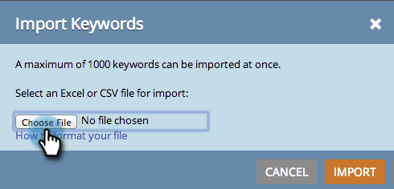

# SEO - Importieren von Keywords mit einer CSV-Datei {#seo-importing-keywords-with-a-csv}

1. Sie können [Keywords](/help/marketo/product-docs/additional-apps/seo/keywords/seo-add-keywords.md) manuell hinzufügen, [ Suchbegriffvorschläge abrufen](/help/marketo/product-docs/additional-apps/seo/keywords/seo-get-suggested-keywords.md) und sogar Suchbegriffe aus einer CSV-Datei importieren. Im Folgenden erfahren Sie, wie Sie den Import durchführen.

1. Wechseln Sie zum Abschnitt **[!UICONTROL Suchbegriffe]** .

   

1. Klicken Sie auf **[!UICONTROL Importieren]**.

   

1. Wählen Sie eine zu importierende Excel-Datei aus.

   

1. Klicken Sie auf **[!UICONTROL Datei auswählen]**.

   

   >[!NOTE]
   >
   >Die Importbeschränkungen variieren je nach Abonnement. Wenden Sie sich für weitere Informationen an Ihren Vertriebsmitarbeiter.

1. Klicken Sie auf **[!UICONTROL Importieren]**.

   

   Ihre neuen Suchbegriffe sollten in der Liste Ihrer Suchbegriffe in alphabetischer Reihenfolge angezeigt werden.

   

   >[!NOTE]
   >
   >Es kann einige Minuten dauern, bis alle mit jedem Suchbegriff verknüpften Daten geladen sind.

   >[!MORELIKETHIS]
   >
   >* [Grundlegendes zu Suchbegriffen (Zusammenfassungsansicht)](/help/marketo/product-docs/additional-apps/seo/keywords/seo-understanding-keywords.md)
   >* [Suchbegriffe aus einer Liste hinzufügen/entfernen](/help/marketo/product-docs/additional-apps/seo/keywords/seo-add-remove-keywords-from-a-list.md)
