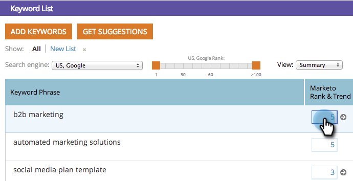

# SEO - Übersicht über Suchbegriffstrends {#seo-keyword-trends-chart}

Es ist wichtig zu überwachen, wie Ihr Suchbegriff [SERP-Ränge](/help/marketo/product-docs/additional-apps/seo/understanding-seo/understanding-search-engine-optimization.md) Trend im Zeitverlauf. Sehen Sie sich diese coole Grafik an, um den Fortschritt zu überwachen.

1. Navigieren Sie zu **[!UICONTROL Schlüsselwörter]** Abschnitt.

   

1. Klicken Sie auf das Rangfeld für den Suchbegriff, für den Sie einen Trend verfolgen möchten.

   

   Sie zeigt Ihre [SERP-Rang](/help/marketo/product-docs/additional-apps/seo/understanding-seo/understanding-search-engine-optimization.md) für die letzten 30 Tage:

   

   >[!TIP]
   >
   >Weitere Informationen zur Rangfolge Ihrer Suchbegriffe finden Sie im Suchbegriff-Trendbericht .

   >[!MORELIKETHIS]
   >
   >[Verwenden des Suchbegriff-Trends-Berichts](/help/marketo/product-docs/additional-apps/seo/reports/seo-use-the-keyword-trends-report.md)
