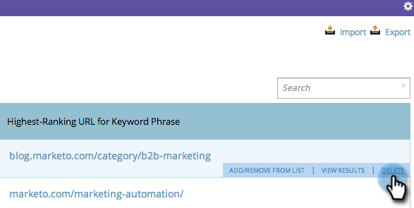

# SEO - Entfernen eines Suchbegriffs {#seo-remove-a-keyword}

Wenn Sie einen Suchbegriff haben, für den Sie die Optimierung nicht fortsetzen möchten, können Sie ihn hier entfernen.

1. Klicken Sie auf , um zum Abschnitt **Suchbegriffe** zu wechseln.

   

1. Bewegen Sie den Mauszeiger über den Suchbegriff, den Sie entfernen möchten, und klicken Sie auf **DELETE**.

   

1. Klicken Sie zur Bestätigung erneut auf **Löschen**.

   

   Was für eine Erleichterung! Jetzt können Sie zu größeren und besseren Dingen übergehen.
