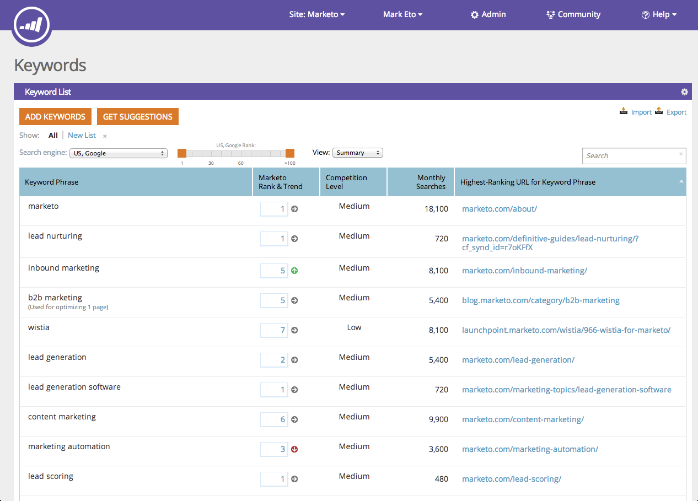

# SEO - Grundlegendes [!UICONTROL Schlüsselwörter] {#seo-understanding-keywords}

[!UICONTROL Keywords] sind das Rückgrat Ihrer SEO-Strategie. Ihr Ziel ist es, auf der ersten Seite so nah wie möglich an #1 Schlüsselwörtern zu sein, die für Ihr Unternehmen relevant sind.

Der Abschnitt [!UICONTROL Keywords] zeigt Ihnen, wie erfolgreich Ihre Site ist, um dies zu erreichen, und wie Sie im Vergleich zu [Ihrer Konkurrenz“ ](/help/marketo/product-docs/additional-apps/seo/understanding-seo/seo-add-competitors.md).

## [!UICONTROL Keywords] - Zusammenfassungsansicht {#keywords-summary-view}

<table> 
 <thead> 
  <tr> 
   <th colspan="1" rowspan="1">Spaltenname</th> 
   <th colspan="1" rowspan="1">Beschreibung</th> 
  </tr> 
 </thead> 
 <tbody> 
  <tr> 
   <td colspan="1" rowspan="1">Keyword-Satz</td> 
   <td colspan="1" rowspan="1">Das Keyword, um das es geht.</td> 
  </tr> 
  <tr> 
   <td colspan="1" rowspan="1">Rang &amp; Trend</td> 
   <td colspan="1" rowspan="1">
Der Rang Ihrer Site für dieses Keyword. Die Pfeile zeigen, wie sich Ihr Keyword-Rang von der vorherigen Woche entwickelt 

  = Rang nach oben

 = Rang nach unten

 = Rang identisch
</td> 
  </tr> 
  <tr> 
   <td colspan="1" rowspan="1">Konkurrenzniveau</td> 
   <td colspan="1" rowspan="1">Die Schwierigkeit, für ein bestimmtes Keyword einen Rang zu erhalten. </td> 
  </tr> 
  <tr> 
   <td colspan="1" rowspan="1">Monatliche Suchvorgänge</td> 
   <td colspan="1" rowspan="1">Wie viele Suchvorgänge pro Monat erfolgen für das Keyword. Diese Daten basieren auf exakten Übereinstimmungen und sind nur für Google-USA über einen Zeitraum von 12 Monaten verfügbar. </td> 
  </tr> 
  <tr> 
   <td colspan="1" rowspan="1">Höchste Ranking-URL für Keyword-Phrase</td>
   <td colspan="1" rowspan="1">Ihrer URLs, die für das Keyword den höchsten Rang hat.</td> 
  </tr> 
 </tbody> 
</table>

>[!NOTE]
>
>Daten werden nur für Schlüsselwörter der Rangfolgen 1-100 angezeigt.

## [!UICONTROL Keywords] - Ansicht des Mitbewerbers {#keywords-competitor-view}

Sie können mit denselben Metriken auch die Leistung Ihrer Konkurrenten anzeigen, indem Sie auf die Dropdown-Liste „Anzeigen“ klicken und Wettbewerber auswählen.

Sehr gut! Nachdem Sie nun den Abschnitt [!UICONTROL Keywords] verstanden haben, erfahren Sie mehr über Seiten und eingehende Links.

>[!MORELIKETHIS]
>
>* [Grundlegendes zu Seiten](/help/marketo/product-docs/additional-apps/seo/pages/seo-understanding-pages.md)
>* [Eingehende Links](/help/marketo/product-docs/additional-apps/seo/inbound-links/seo-understanding-inbound-links.md)
