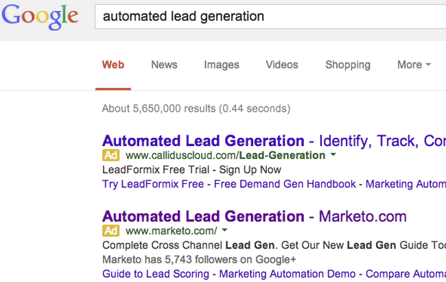

# SEO – Anzeigen von Keyword-Ergebnissen in einer Suchmaschine  {#seo-view-keyword-results-in-search-engine}

Wenn Sie sehen möchten, wie Ihre Inhalte in einer Suchmaschine aussehen, haben wir einen Tastaturbefehl hinzugefügt.

>[!IMPORTANT]
>
>Am 31. März 2026 wird Marketo Engage die Suchmaschinenoptimierungsfunktion einstellen. Bitte exportieren Sie alle relevanten Daten am oder vor dem 30. März. [Weitere Informationen](https://nation.marketo.com/t5/product-blogs/marketo-engage-seo-feature-deprecation/ba-p/359060){target="_blank"}.
>
>* [Exportprobleme](https://experienceleague.adobe.com/en/docs/marketo/using/product-docs/additional-apps/seo/pages/seo-export-issues-to-csv){target="_blank"}
>* [Exportieren von Keyword-Ergebnissen](https://experienceleague.adobe.com/en/docs/marketo/using/product-docs/additional-apps/seo/keywords/seo-exporting-keyword-results){target="_blank"}
>* [Export Keyword Trends](https://experienceleague.adobe.com/en/docs/marketo/using/product-docs/additional-apps/seo/reports/seo-use-the-keyword-trends-report#exporting-data){target="_blank"}
>* [Trends mit dem Konkurrenten-Keyword exportieren](https://experienceleague.adobe.com/en/docs/marketo/using/product-docs/additional-apps/seo/reports/seo-use-the-competitor-kw-trends-report#exporting-data){target="_blank"}

1. Navigieren Sie zum Abschnitt **[!UICONTROL Keywords]**.

   

1. Bewegen Sie den Mauszeiger über ein Keyword. Klicken Sie **[!UICONTROL Ergebnisse anzeigen]**.

   

1. Wählen Sie aus, in welcher Suchmaschine Sie Ihre Ergebnisse anzeigen möchten.

   

Sie sollten nun die Suchergebnisse für Ihr Keyword in einem neuen Fenster sehen.

