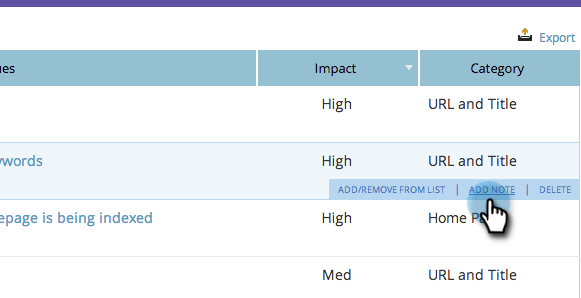

# SEO - Hinzufügen von Hinweisen zu Seitenproblemen {#seo-add-notes-to-page-issues}

Wussten Sie, dass Sie Hinweise zu Seitenproblemen als persönliche Erinnerungen oder Team-Nachrichten hinzufügen können?

## Hinzufügen von Hinweisen im Abschnitt „Seitenprobleme“ {#adding-notes-in-page-issues-section}

1. Navigieren Sie zum Abschnitt **[!UICONTROL Seiten]**.

   

1. Klicken Sie auf der Registerkarte „Seiten“ auf **[!UICONTROL Probleme]**.

   

1. Bewegen Sie den Mauszeiger über das Problem, dem Sie einen Hinweis hinzufügen möchten. Klicken Sie **[!UICONTROL Haftnotiz hinzufügen]**.

   

1. Geben Sie einen Hinweis in das gelbe Textfeld ein. Wenn Sie außerhalb des Textfelds klicken, wird die Anmerkung gespeichert.

>[!TIP]
>
>Sie können Ihre Notiz löschen, indem Sie auf das kleine **x** in der oberen linken Ecke klicken.

## Hinweise in der Drilldown-Liste „Seitendetails“ hinzufügen {#add-notes-in-page-detail-drill-down}

1. Navigieren Sie zum Abschnitt **[!UICONTROL Seiten]**.

   

1. Klicken Sie auf die Seite, für die Sie Details anzeigen möchten.

   

1. Bewegen Sie den Mauszeiger über das Seitenproblem, dem Sie eine Anmerkung hinzufügen möchten, und klicken Sie auf **[!UICONTROL Anmerkung hinzufügen]**.

   

1. Geben Sie Ihre Notiz ein. Klicken Sie auf **[!UICONTROL Speichern]**.

   

   Ihre Notiz wurde hinzugefügt!

   
