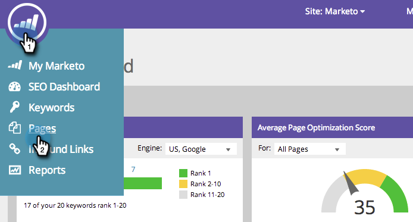
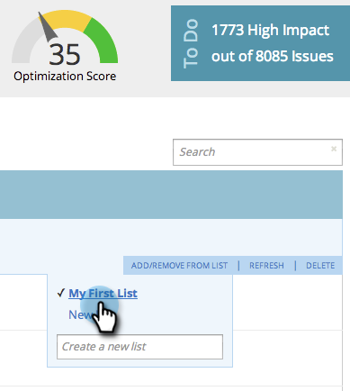

# SEO - Seite aus Liste hinzufügen/entfernen {#seo-add-remove-page-from-list}

Sie möchten Ihre Seiten verwalten? Erstellen Sie dazu einfach eine Liste. Sie können Listen verwenden, um Seiten zu organisieren oder Daten in Dashboards zu filtern.

## Seite zu Liste hinzufügen {#add-page-to-a-list}

1. Wechseln Sie zum Abschnitt **[!UICONTROL Seiten]** .

   

1. Bewegen Sie den Mauszeiger über die Seite, die Sie einer Liste hinzufügen möchten. Klicken Sie auf **[!UICONTROL Aus Liste hinzufügen/entfernen]**.

   

1. Klicken Sie auf die Liste, der Sie Ihre Seite hinzufügen möchten.

   

   >[!TIP]
   >
   >Sie können auch eine neue Liste für Ihre Seite erstellen. Geben Sie einfach Ihren gewünschten Namen in [!UICONTROL Neue Liste erstellen] ein.

1. Klicken Sie auf die Liste, der Sie Ihre Seite hinzugefügt haben.

   

Ja! Ihre Seite sollte nun der Liste hinzugefügt werden.

## Seite aus Liste entfernen {#remove-page-from-a-list}

1. Wechseln Sie zum Abschnitt **[!UICONTROL Seiten]** .

   

1. Klicken Sie auf der Registerkarte **[!UICONTROL Seiten]** auf die Liste, die Sie bereinigen möchten.

   

1. Bewegen Sie den Mauszeiger über die Seite, die Sie entfernen möchten. Klicken Sie auf **[!UICONTROL Aus Liste hinzufügen/entfernen]**.

   

1. Klicken Sie auf die Liste, aus der Sie sie entfernen möchten.

   >[!NOTE]
   >
   >Alle Listen, zu denen der Suchbegriff gehört, verfügen derzeit über ein Häkchen. Nach dem Entfernen aus der Liste verschwindet die Prüfung.

   

Fertig. Ihre Seite wird aus der Liste entfernt.
