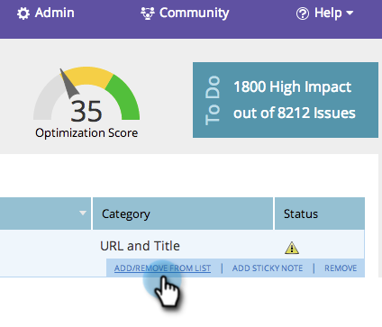
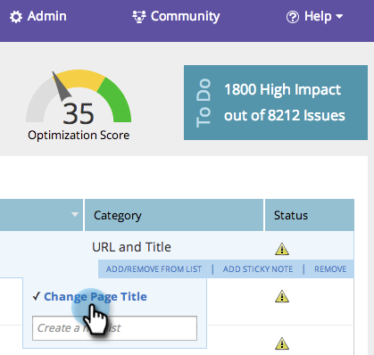

# SEO – Hinzufügen/Entfernen eines Seitenproblems aus einer Liste {#seo-add-remove-page-issue-from-a-list}

Sie können Ihre Seitenprobleme in Listen organisieren. Sie können Seitenprobleme auch aus einer Liste entfernen.

>[!IMPORTANT]
>
>Am 31. März 2026 wird Marketo Engage die Suchmaschinenoptimierungsfunktion einstellen. Bitte exportieren Sie alle relevanten Daten am oder vor dem 30. März. [Weitere Informationen](https://nation.marketo.com/t5/product-blogs/marketo-engage-seo-feature-deprecation/ba-p/359060){target="_blank"}.
>
>* [Exportprobleme](https://experienceleague.adobe.com/de/docs/marketo/using/product-docs/additional-apps/seo/pages/seo-export-issues-to-csv){target="_blank"}
>* [Exportieren von Keyword-Ergebnissen](https://experienceleague.adobe.com/de/docs/marketo/using/product-docs/additional-apps/seo/keywords/seo-exporting-keyword-results){target="_blank"}
>* [Export Keyword Trends](https://experienceleague.adobe.com/de/docs/marketo/using/product-docs/additional-apps/seo/reports/seo-use-the-keyword-trends-report#exporting-data){target="_blank"}
>* [Trends mit dem Konkurrenten-Keyword exportieren](https://experienceleague.adobe.com/de/docs/marketo/using/product-docs/additional-apps/seo/reports/seo-use-the-competitor-kw-trends-report#exporting-data){target="_blank"}

## Seitenprobleme zu einer Liste hinzufügen {#add-page-issues-to-a-list}

1. Navigieren Sie zum Abschnitt **[!UICONTROL Seiten]**.

   

1. Klicken Sie auf der **[!UICONTROL Seiten]** auf **[!UICONTROL Probleme]**.

   

1. Bewegen Sie den Mauszeiger über das Seitenproblem, das Sie hinzufügen möchten. Klicken Sie **[!UICONTROL Hinzufügen/Entfernen aus der Liste]**.

   

   Klicken Sie auf die Liste, der Sie Ihr Seitenproblem hinzufügen möchten.

   

   >[!TIP]
   >
   >Sie können auch eine neue Liste für Ihr Keyword erstellen. Geben Sie einfach Ihren gewünschten Namen in **[!UICONTROL Neue Liste erstellen]** ein.

## Problem „Seite“ aus einer Liste entfernen {#remove-page-issue-from-a-list}

1. Navigieren Sie zum Abschnitt **[!UICONTROL Seiten]**.

   

1. Klicken Sie auf der Registerkarte „Seiten“ auf **[!UICONTROL Probleme]**.

   

1. Klicken Sie auf die Liste, die Sie organisieren möchten.

   

1. Bewegen Sie den Mauszeiger über das Seitenproblem, das Sie entfernen möchten. Klicken Sie **[!UICONTROL Hinzufügen/Entfernen aus der Liste]**.

   

1. Die Liste, die Sie organisieren möchten, sollte überprüft werden. Klicken Sie auf den Namen der Liste, um das Problem der Seite aus dieser Liste zu entfernen.

   

Ausgezeichnet! Aktualisieren Sie Ihre Seite. Sie wird dann nicht mehr in der Liste angezeigt.
