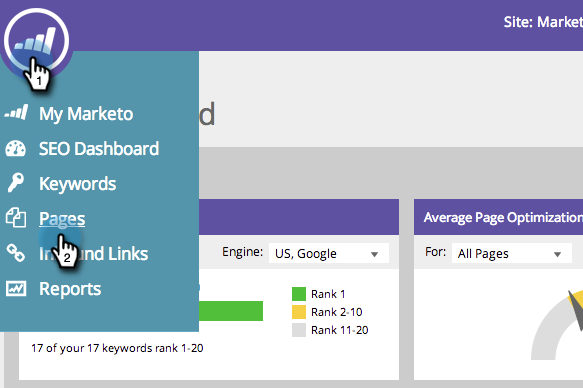
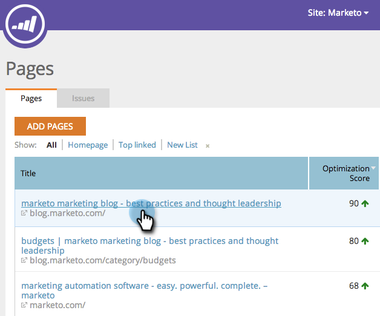
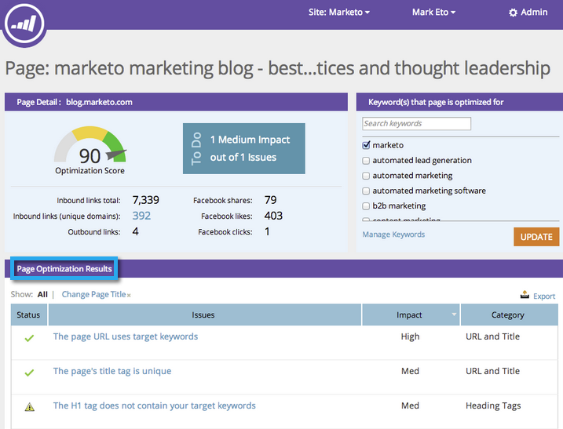
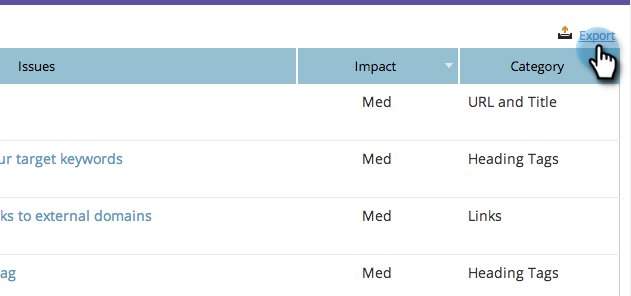

# SEO (Suchmaschinen-Optimierung) – Probleme in CSV exportieren {#seo-export-issues-to-csv}

Erfahren Sie, wie Sie Ihre Problemdaten für die Seite in eine CSV-Datei exportieren, wenn Sie diese Informationen für Personen außerhalb von Marketo freigeben möchten.

>[!IMPORTANT]
>
>Am 31. März 2026 hat Marketo Engage [Suchmaschinenoptimierung) &#x200B;](https://nation.marketo.com/t5/product-blogs/marketo-engage-seo-feature-deprecation/ba-p/359060){target="_blank"}. [seo.marketo.com](https://seo.marketo.com/) ist noch für eine begrenzte Zeit verfügbar. Gehen Sie wie in den folgenden Artikeln beschrieben vor, um Daten zu exportieren.
>
>* [Exportprobleme](https://experienceleague.adobe.com/en/docs/marketo/using/product-docs/additional-apps/seo/pages/seo-export-issues-to-csv){target="_blank"}
>* [Exportieren von Keyword-Ergebnissen](https://experienceleague.adobe.com/en/docs/marketo/using/product-docs/additional-apps/seo/keywords/seo-exporting-keyword-results){target="_blank"}
>* [Export Keyword Trends](https://experienceleague.adobe.com/en/docs/marketo/using/product-docs/additional-apps/seo/reports/seo-use-the-keyword-trends-report#exporting-data){target="_blank"}
>* [Trends mit dem Konkurrenten-Keyword exportieren](https://experienceleague.adobe.com/en/docs/marketo/using/product-docs/additional-apps/seo/reports/seo-use-the-competitor-kw-trends-report#exporting-data){target="_blank"}

1. Navigieren Sie zum Abschnitt **[!UICONTROL Seiten]**.

   

1. Klicken Sie auf die Seite, für die Details angezeigt werden sollen.

   

   Das Drilldown-Menü Seitendetails wird angezeigt. **[!UICONTROL Seitenoptimierungsergebnisse]** ist eine Liste aller Probleme mit dieser bestimmten Seite.

   

1. Klicken Sie **[!UICONTROL Exportieren]**.

   
