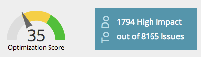

# SEO - Grundlagen zu Seiten {#seo-understanding-pages}

## Bewertung der Seitenoptimierung/Aufgaben eines Widgets {#page-optimization-score-to-do-widget}

Die Bewertung der Seitenoptimierung ist ein allgemeines Ranking der Optimierung Ihrer Seite für die Suche im Maßstab 1 bis 100. Es basiert auf Dutzenden von Best Practices in SEO.

* 0 - 35 = Nicht gut optimiert
* 35 - 70 = Auf dem richtigen Weg
* 70 - 100 = Tu großartig!

>[!TIP]
>
>Klicken Sie im Feld Aufgaben auf den Link Hohe Auswirkung . Daraufhin werden Sie auf die Registerkarte Probleme weitergeleitet, auf der Sie die zu lösenden Probleme mit hoher Priorität sehen.

## Registerkarte &quot;Seiten&quot; {#pages-tab}

Auf der Registerkarte Seiten wird angezeigt, wie gut einzelne Seiten Ihrer Site für die Suche optimiert sind.

| Spaltenname | Beschreibung |
|---|---|
| Titel | Titel und URL aller Seiten in Ihrer Domäne. Überprüfen Sie Ihre Domäne. |
| Optimierungsbewertung | Die geheime Soße, die Ihnen zeigt, wie gut Ihre Seite für die Suche auf einer Skala von 1 bis 100 optimiert ist. |
| Links | Anzahl der verschiedenen Domänen mit mindestens einem eingehenden Link zu Ihrer Site. |
| Target-Suchbegriffe | Die Suchbegriffe, für die Sie die einzelnen Seiten optimieren möchten. [Dies erfordert Ihre Eingabe](/help/marketo/product-docs/additional-apps/seo/pages/seo-using-the-page-detail-drill-down.md). |

## Registerkarte &quot;Probleme&quot; {#issues-tab}

Im Tab Probleme erfahren Sie, welche Verbesserungen Sie vornehmen können, um Ihren Optimierungswert und -rang zu erhöhen.

| Spaltenname | Beschreibung |
|---|---|
| Probleme | Liste der ausführbaren Elemente, die zur Verbesserung der Optimierungsbewertung beitragen. |
| Impact | Wie wichtig es für Ihr Gesamtergebnis ist. Korrigieren Sie zuerst die wirkungsvollen Elemente! |
| Kategorie | Die Art des gemeldeten Problems. |
| Status | Ist die Aufgabe abgeschlossen oder ist noch geöffnet. Sobald Sie und Ihr Webmaster das Problem auf Ihrer Site beheben, sollte sich der Status in behoben ändern (grüne Prüfung). |

Genial, jetzt, da Sie die Grundlagen der Seiten kennen, sehen Sie sich die [Artikel zum Drilldown von Seitendetails](/help/marketo/product-docs/additional-apps/seo/pages/seo-using-the-page-detail-drill-down.md) um mehr coole Dinge zu lernen, die Sie tun können.
