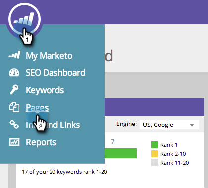
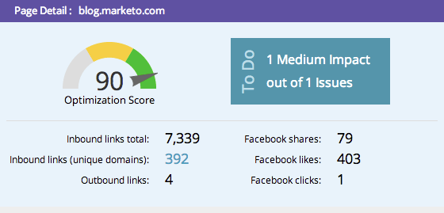

# SEO – Verwenden der Drill-down-Liste „Seitendetails“ {#seo-using-the-page-detail-drill-down}

Mithilfe der Drilldown-Liste „Seitendetails“ können Sie eine Vielzahl von Informationen zu Ihren Seiten anzeigen.

>[!IMPORTANT]
>
>Am 31. März 2026 wird Marketo Engage die Suchmaschinenoptimierungsfunktion einstellen. Bitte exportieren Sie alle relevanten Daten am oder vor dem 30. März. [Weitere Informationen](https://nation.marketo.com/t5/product-blogs/marketo-engage-seo-feature-deprecation/ba-p/359060){target="_blank"}.
>
>* [Exportprobleme](https://experienceleague.adobe.com/de/docs/marketo/using/product-docs/additional-apps/seo/pages/seo-export-issues-to-csv){target="_blank"}
>* [Exportieren von Keyword-Ergebnissen](https://experienceleague.adobe.com/de/docs/marketo/using/product-docs/additional-apps/seo/keywords/seo-exporting-keyword-results){target="_blank"}
>* [Export Keyword Trends](https://experienceleague.adobe.com/de/docs/marketo/using/product-docs/additional-apps/seo/reports/seo-use-the-keyword-trends-report#exporting-data){target="_blank"}
>* [Trends mit dem Konkurrenten-Keyword exportieren](https://experienceleague.adobe.com/de/docs/marketo/using/product-docs/additional-apps/seo/reports/seo-use-the-competitor-kw-trends-report#exporting-data){target="_blank"}

## Drilldown für Seite suchen {#find-page-drill-down}

1. Navigieren Sie zum Abschnitt **[!UICONTROL Seiten]**.

   

1. Klicken Sie auf die Seite, für die Sie Details anzeigen möchten.

   

   Siehe, das Seitendetail Drill Down!

   

## Abschnitt [!UICONTROL Seitendetails] {#page-detail-section}

| Element | Beschreibung |
|---|---|
| [!UICONTROL Optimierungsergebnis] | Die verwendete geheime Sauce, die zeigt, wie gut Ihre Seite für die Suche auf einer Skala von 1 bis 100 optimiert ist. |
| [!UICONTROL Aufgaben]Feld | Zeigt die Anzahl der offenen Probleme bezüglich der Seite an, auf der Sie sich befinden. |
| [!UICONTROL Eingehende Links insgesamt] | Die Gesamtzahl der eingehenden Links zu Ihrer Website. |
| [!UICONTROL Eingehende Links (eindeutige Domains)] | Die Anzahl der anderen Websites mit mindestens einem eingehenden Link zu Ihrer Site. |
| [!UICONTROL Ausgehende Links] | Die Anzahl der Links, die von dieser Seite zu anderen Websites verweisen. |
| [!UICONTROL Facebook-Freigaben] | Häufigkeit, in der diese Seite auf [!DNL Facebook] freigegeben wurde. |
| [!UICONTROL Facebook-Likes] | Anzahl der Verknüpfungen dieser Seitenfreigabe auf [!DNL Facebook]. |
| [!UICONTROL Facebook-Klicks] | Anzahl der Klicks aus dem [!DNL Facebook share]. |

## [!UICONTROL Keyword(s), für den diese Seite optimiert ist]  {#keyword-s-that-page-is-optimized-for}

Hier [&#x200B; Sie (wählen Sie das Keyword aus, für das Sie Ihre Seite optimieren möchten](/help/marketo/product-docs/additional-apps/seo/keywords/seo-optimize-specific-pages-with-targeted-keywords.md).

>[!NOTE]
>
>Dies ist ein wichtiger Schritt, um diese Funktion optimal zu nutzen. Es wird empfohlen, weniger als drei Keywords pro Seite zu verwenden. Idealerweise nur eine.

## [!UICONTROL Ergebnisse der Seitenoptimierung] {#page-optimization-results}

Die [!UICONTROL Ergebnisse der Seitenoptimierung] enthalten die genauen Schritte, die Sie durchführen müssen, um Ihren Optimierungswert zu erhöhen bzw. die Suche nach dieser Seite besser zu gestalten.

>[!MORELIKETHIS]
>
>[Optimieren Sie bestimmte Seiten mit zielgerichteten Keywords](/help/marketo/product-docs/additional-apps/seo/keywords/seo-optimize-specific-pages-with-targeted-keywords.md)
