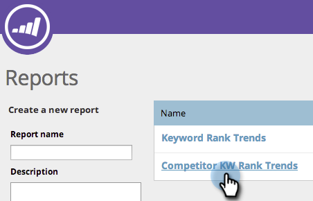

# SEO - Verwenden Sie den KW-Trendbericht des Konkurrenten {#seo-use-the-competitor-kw-trends-report}

In diesem Bericht können Sie sehen, wie Sie und Ihre Konkurrent im Zeitverlauf nach Suchbegriffen geordnet sind.

## Berichte suchen {#find-reports}

1. Gehen Sie zu **Berichte**.

   

1. Klicken Sie auf **Konkurrierende KW-Rangtrends**.

   

## KW Rank Trends Graph {#kw-rank-trends-graph}

Dieses Diagramm zeigt Ihnen, welcher Prozentsatz Ihrer Suchbegriffe in einem bestimmten Bereich eingestuft wird und wie Ihre Konkurrent stapeln.

| Posten | Beschreibung |
|---|---|
| Schlüsselwörter | Die Anzahl der Suchbegriffe, die Sie verfolgen. |
| Ranking-URLs | Die Anzahl der URLs auf Ihrer Site-Rangfolge in dem von Ihnen festgelegten Bereich. |
| % im Rang | Der Prozentsatz der Suchbegriffe, die in dem von Ihnen festgelegten Bereich eingestuft werden. |
| Durchschn. Suchvorgänge | Die durchschnittliche Anzahl der Suchen nach diesen Suchbegriffen, die während des von Ihnen festgelegten Zeitraums (in den letzten 30 Tagen bei der Google US-Suche) stattgefunden haben |

## Filtern von Daten {#filtering-data}

1. Klicken Sie auf die Dropdownliste und wählen Sie den gewünschten Zeitraum aus.

   

1. Klicken Sie auf die Dropdown-Liste **Rang**, um den Rangbereich auszuwählen, für den Sie Suchbegriffe Ansicht wünschen.

   

## Exportieren von Daten {#exporting-data}

>[!TIP]
>
>Sie können diesen Bericht auf Ihren Desktop exportieren.

1. Klicken Sie auf **CSV** oder **Export PDF** exportieren.

   

   A+ Arbeit!

