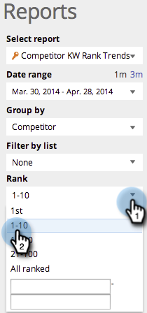

# SEO – Verwenden eines Berichts zu Keyword-Trends der Konkurrenz {#seo-use-the-competitor-kw-trends-report}

In diesem Bericht können Sie sehen, wie Sie und Ihre Konkurrenten im Laufe der Zeit in Keywords eingestuft werden.

>[!IMPORTANT]
>
>Am 31. März 2026 wird Marketo Engage die Suchmaschinenoptimierungsfunktion einstellen. Bitte exportieren Sie alle relevanten Daten am oder vor dem 30. März. [Weitere Informationen](https://nation.marketo.com/t5/product-blogs/marketo-engage-seo-feature-deprecation/ba-p/359060){target="_blank"}.
>
>* [Exportprobleme](https://experienceleague.adobe.com/en/docs/marketo/using/product-docs/additional-apps/seo/pages/seo-export-issues-to-csv){target="_blank"}
>* [Exportieren von Keyword-Ergebnissen](https://experienceleague.adobe.com/en/docs/marketo/using/product-docs/additional-apps/seo/keywords/seo-exporting-keyword-results){target="_blank"}
>* [Export Keyword Trends](https://experienceleague.adobe.com/en/docs/marketo/using/product-docs/additional-apps/seo/reports/seo-use-the-keyword-trends-report#exporting-data){target="_blank"}
>* [Trends mit dem Konkurrenten-Keyword exportieren](https://experienceleague.adobe.com/en/docs/marketo/using/product-docs/additional-apps/seo/reports/seo-use-the-competitor-kw-trends-report#exporting-data){target="_blank"}

## Berichte suchen {#find-reports}

1. Navigieren Sie zu **[!UICONTROL Berichte]**.

   

1. Klicken Sie auf **[!UICONTROL Konkurrenten-KW-Rangtrends]**.

   

## KW-Rangdiagramm für Trends {#kw-rank-trends-graph}

Dieses Diagramm zeigt Ihnen, welcher Prozentsatz Ihrer Keywords in einem bestimmten Bereich eingestuft wird und wie Ihre Konkurrenten abschneiden.

| Element | Beschreibung |
|---|---|
| [!UICONTROL Schlüsselwörter] | Die Anzahl der Keywords, die Sie verfolgen. |
| [!UICONTROL Rang-URLs] | Die Anzahl der URLs auf Ihrer Website, die in dem von Ihnen festgelegten Bereich nach Rang geordnet sind. |
| [!UICONTROL  % im Rang] | Der Prozentsatz der Keywords für die Rangfolge in dem von Ihnen festgelegten Bereich. |
| [!UICONTROL Durchschnitt Suchen] | Die durchschnittliche Anzahl der Suchen nach diesen Keywords, die während des von Ihnen festgelegten Bereichs stattgefunden haben (in den letzten 30 Tagen bei der Google US-Suche) |

## Filtern von Daten {#filtering-data}

1. Klicken Sie auf die Dropdown-Liste und wählen Sie den gewünschten Zeitraum aus.

   

1. Klicken Sie auf die **[!UICONTROL Rang]**-Dropdown-Liste, um den Rangbereich auszuwählen, für den Sie Schlüsselwörter anzeigen möchten.

   

## Daten werden exportiert {#exporting-data}

1. Klicken Sie **[!UICONTROL CSV exportieren]** oder **[!UICONTROL Export PDF]**.

   
