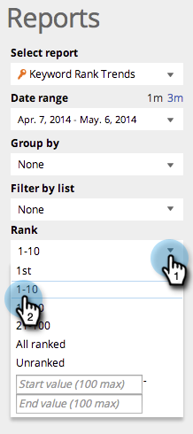

# SEO – Verwenden eines Berichts zu Keyword-Trends {#seo-use-the-keyword-trends-report}

In diesem Bericht können Sie sehen, wie Sie im Laufe der Zeit bei Schlüsselwörtern eingestuft werden.

## Bericht laden {#load-report}

1. Navigieren Sie zu **[!UICONTROL Berichte]**.

   

1. Klicken Sie auf **[!UICONTROL Trends beim Keyword-Rang]**.

   

   Hier ist er:

   

   Beschriebene Berichtselemente:

   | Element | Beschreibung |
   |---|---|
   | [!UICONTROL Schlüsselwörter] | Die Anzahl der Keywords, die Sie verfolgen. |
   | [!UICONTROL Rang-URLs] | Die Anzahl der URLs auf Ihrer Website, die in dem von Ihnen festgelegten Bereich nach Rang geordnet sind. |
   | [!UICONTROL Durchschnitt Rang] | Der durchschnittliche Rang der Keywords in dem von Ihnen festgelegten Bereich. |
   | [!UICONTROL Durchschnitt Suchen] | Die durchschnittliche Anzahl der Suchen nach diesen Keywords, die während des von Ihnen festgelegten Bereichs (in den letzten 30 Tagen) bei der Google US-Suche stattgefunden haben |

## Filtern von Daten {#filtering-data}

1. Klicken Sie auf die Dropdown-Liste und wählen Sie den gewünschten Zeitraum aus.

   

1. Klicken Sie auf die Dropdown-Liste Rang , um den Rangbereich auszuwählen, für den Sie Schlüsselwörter anzeigen möchten.

   

## Daten werden exportiert {#exporting-data}

1. Klicken Sie **[!UICONTROL CSV exportieren]** oder **[!UICONTROL Export PDF]**.

   

Sie können auch sehen, wie Sie im Keyword-Ranking mit Ihren Mitbewerbern vergleichen.

>[!NOTE]
>
>[Verwenden des Berichts „Trends beim Wettbewerbsrang von KW“](/help/marketo/product-docs/additional-apps/seo/reports/seo-use-the-competitor-kw-trends-report.md)
